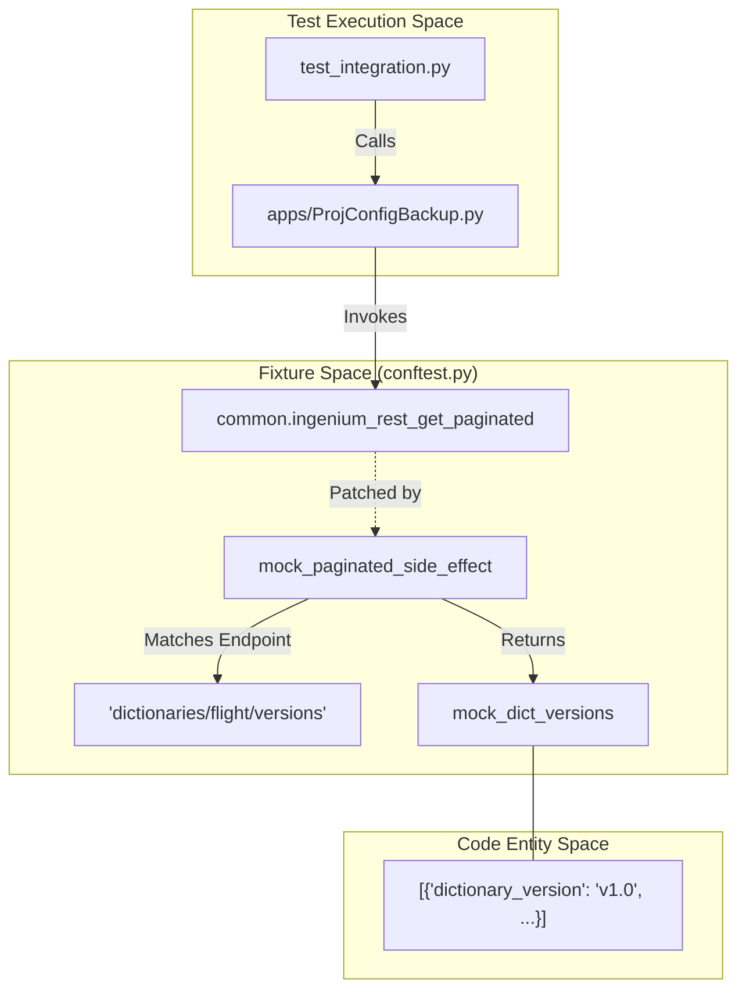
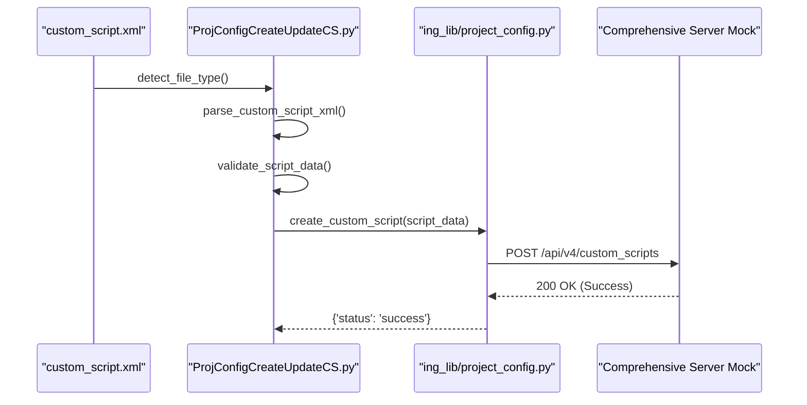

# Page: Integration Tests and Fixtures

# Integration Tests and Fixtures

<details>
<summary>Relevant source files</summary>

The following files were used as context for generating this wiki page:

- [ing_lib/pytest.ini](ing_lib/pytest.ini)
- [ing_lib/tests/conftest.py](ing_lib/tests/conftest.py)
- [ing_lib/tests/test_integration.py](ing_lib/tests/test_integration.py)

</details>


This page documents the integration testing framework for `ingenium-lib`, focusing on multi-component workflows, shared test fixtures, and the configuration required to simulate the Ingenium server environment.

## Overview

Integration tests in `ingenium-lib` are designed to verify the end-to-end functionality of the library's applications (`apps/`) and their interaction with the core `ing_lib` modules. Unlike unit tests, which isolate individual functions, integration tests exercise the data flow between multiple layers, such as parsing an XML definition, transforming it into a JSON payload, and simulating the REST API handshake with the Ingenium server.

The test suite is built on `pytest` and utilizes a comprehensive mocking strategy defined in `conftest.py` to simulate server responses without requiring a live Ingenium instance.

### Test Configuration
The test environment is governed by `ing_lib/pytest.ini` [ing_lib/pytest.ini:1-18](), which defines:
*   **Test Discovery**: Searches for `test_*.py` files in the `tests` directory [ing_lib/pytest.ini:2-3]().
*   **Markers**: Includes `unit`, `integration`, and `slow` markers to categorize test execution [ing_lib/pytest.ini:12-15]().
*   **Execution Defaults**: Verbose output (`-v`) and short traceback (`--tb=short`) are enabled by default [ing_lib/pytest.ini:6-11]().

Sources: [ing_lib/pytest.ini:1-18](), [ing_lib/tests/test_integration.py:1-13]()

---

## Shared Fixtures (conftest.py)

The `conftest.py` file provides a centralized repository of fixtures that simulate the Ingenium ecosystem. These fixtures allow developers to write tests that assume a logged-in state and a populated (or empty) server database.

### Authentication and Server Mocks
*   `mock_server`: Returns a dummy URL (`https://test-server.example.com`) for testing [ing_lib/tests/conftest.py:18-20]().
*   `mock_authentication`: Patches `common.authenticate` to always return `True`, bypassing LDAP/RSA checks [ing_lib/tests/conftest.py:23-26]().
*   `mock_common_globals`: Sets up the singleton state in `common.py`, including a mock JWT token and a valid refresh timestamp [ing_lib/tests/conftest.py:35-41]().

### Project Configuration Mocks
The library provides tiered mocks for the `project_config.py` API:
*   `mock_project_config_get_functions`: Simulates successful retrieval of dictionary versions, command stems, V&V Verification Items (VIs), and custom script definitions [ing_lib/tests/conftest.py:44-80]().
*   `mock_project_config_create_functions`: Simulates successful POST/PATCH requests for creating or updating server resources [ing_lib/tests/conftest.py:83-90]().
*   `comprehensive_server_mock`: A "meta-fixture" that combines authentication, globals, and all CRUD mocks into a single environment for integration testing [ing_lib/tests/conftest.py:168-178]().

### Dynamic Side Effects
To simulate realistic server behavior, `mock_common_http_functions` uses a `side_effect` handler. This allows the mock to return different data based on the endpoint string passed to `ingenium_rest_get_paginated` or `ingenium_rest_get` [ing_lib/tests/conftest.py:142-166]().

**Data Flow: Mocking the REST Interface**



Sources: [ing_lib/tests/conftest.py:17-178]()

---

## Integration Workflows (test_integration.py)

The `test_integration.py` module contains high-level tests that verify complex multi-step processes.

### Backup and Restore Workflow
The `test_backup_and_restore_workflow` validates the compatibility between `ProjConfigBackup.py` and `ProjConfigRestore.py`.
1.  It calls `get_source_dictionaries` to extract a full configuration from the mock server [ing_lib/tests/test_integration.py:25-27]().
2.  It verifies the resulting dictionary contains expected keys: `versions`, `flight`, `vis`, and `custom_scripts` [ing_lib/tests/test_integration.py:30-33]().
3.  It passes this data directly into `restore_dictionaries` to ensure the restoration logic can process the backup output [ing_lib/tests/test_integration.py:36]().

### Custom Script Creation Workflow
The `test_comprehensive_custom_script_workflow` simulates the lifecycle of a Custom Script from XML definition to server registration:
1.  **Detection**: Uses `detect_file_type` to identify the input as XML [ing_lib/tests/test_integration.py:148-149]().
2.  **Parsing**: Executes `parse_custom_script_xml` to convert the XML into the internal JSON structure used by the API [ing_lib/tests/test_integration.py:152]().
3.  **Validation**: Runs `validate_script_data` to check for required fields and layout integrity [ing_lib/tests/test_integration.py:163]().
4.  **Registration**: Mocks the `main` entry point of `ProjConfigCreateUpdateCS.py` to verify that the final HTTP POST/PATCH requests are triggered correctly [ing_lib/tests/test_integration.py:169-175]().

### Error Handling Chain
The `test_error_handling_chain` ensures that the library remains resilient during batch operations. For example, when clearing a project configuration, if one `DELETE` request fails, the system should log the error and continue with the remaining deletions rather than crashing [ing_lib/tests/test_integration.py:85-119]().

**Workflow: XML to Server Registration**



Sources: [ing_lib/tests/test_integration.py:15-177]()

---

## Adding New Tests

When adding new integration tests, follow these conventions:

1.  **Marking**: Always use the `@pytest.mark.integration` decorator [ing_lib/tests/test_integration.py:15]().
2.  **Fixtures**: Use the `comprehensive_server_mock` fixture to automatically set up authentication and API mocks [ing_lib/tests/test_integration.py:19]().
3.  **Temporary Files**: Use the `tempfile` module or existing fixtures like `temp_custom_script_xml` (provided in `conftest.py`) to manage filesystem cleanup [ing_lib/tests/test_integration.py:129-130]().
4.  **Mocking Side Effects**: If your test requires specific data not present in the default mocks, use `@patch` locally within the test function to override specific behaviors [ing_lib/tests/test_integration.py:38-40]().

### Example: Testing a New CLI Tool
```python
@pytest.mark.integration
def test_new_tool_workflow(self, comprehensive_server_mock):
    from apps.NewTool import main
    # Setup specific mock data if needed
    with patch('project_config.some_function', return_value={'data': 'value'}):
        # Execute tool
        main(['--arg1', 'val1'])
        # Assertions
```

Sources: [ing_lib/tests/test_integration.py:15-177](), [ing_lib/tests/conftest.py:168-178]()
