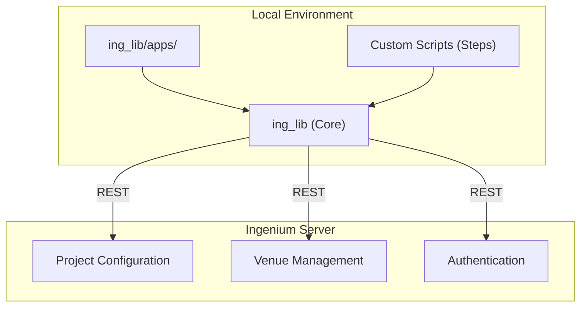
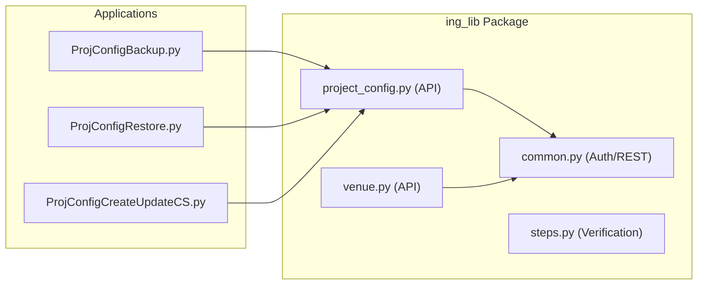

# Page: Overview

# Overview

Relevant source files

The following files were used as context for generating this wiki page:

- [LICENSE](LICENSE)
- [README.md](README.md)
- [ing_lib/__init__.py](ing_lib/__init__.py)
- [requirements.txt](requirements.txt)
- [setup.py](setup.py)

The `ingenium-lib` repository provides a Python client library and a suite of command-line tools designed to interact with the **Ingenium** spacecraft test procedure platform. Its primary purpose is to facilitate programmatic management of project configurations, venue operations, and the execution of automated test steps for complex engineering projects [README.md:1-7]().

The library serves as a bridge between local engineering workflows and the Ingenium server, offering structured access to telemetry verification, command dictionary management, and custom script registration.

### System Architecture Overview

The following diagram illustrates how the `ing-lib` package components map to the Ingenium platform's functional domains.

**Ingenium-Lib Component Mapping**

Sources: [README.md:12-26](), [setup.py:11-23]()

### Key Subsystems

The repository is organized into several functional areas that cover the lifecycle of spacecraft testing:

*   **Core Library (`ing_lib`)**: The foundational Python package providing common utilities, REST clients, and domain-specific modules for interacting with Ingenium [README.md:12-17]().
*   **Project Configuration Management**: Tools and APIs to manage command/telemetry dictionaries (AMPCS), custom script definitions, and V&V Verification Items [README.md:15-23]().
*   **Venue Management**: Interfaces for creating and querying "Venues" (logical test environments) and Venue Groups [README.md:14-14]().
*   **Step Execution Framework**: Utilities for telemetry verification, bitmask operations, and I/O handling for automated test procedures [ing_lib/steps.py]().
*   **Command-Line Applications**: A set of ready-to-use scripts for backing up, restoring, and updating Ingenium configurations [README.md:18-23]().

### Repository Organization

The codebase follows a modular structure to separate the core API from high-level applications and testing utilities.

| Directory | Purpose |
| :--- | :--- |
| `ing_lib/` | Main Python package containing the core API (`common.py`, `project_config.py`, `venue.py`) [README.md:12-17](). |
| `ing_lib/apps/` | CLI tools for project configuration lifecycle (Backup, Restore, Clear, Load) [README.md:18-23](). |
| `ing_lib/utils/` | Conversion utilities, such as migrating configurations between API versions [README.md:24-25](). |
| `ing_lib/tests/` | Pytest suite for unit and integration testing [README.md:26-26](). |

**Code Entity Relationship**

Sources: [README.md:12-26]()

### Next Steps

For detailed technical documentation, refer to the following child pages:

*   **[Getting Started: Installation and Configuration](#1.1)**: Covers environment setup, Python 3.13+ requirements, and authentication [README.md:30-38](), [setup.py:17-17]().
*   **[Repository Structure and Key Concepts](#1.2)**: Provides a deep dive into the domain model, including the distinction between Flight and Sim dictionaries and the organization of custom scripts.

Sources: [README.md:1-39](), [setup.py:1-23](), [ing_lib/__init__.py:1-18]()
