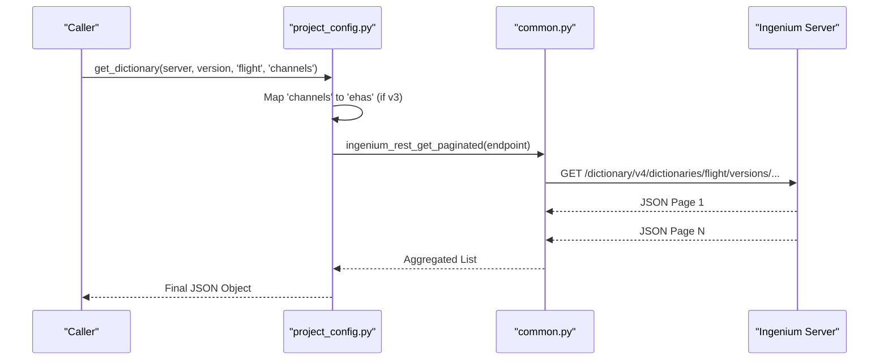

# Page: Project Configuration API (project_config.py)

# Project Configuration API (project_config.py)

<details>
<summary>Relevant source files</summary>

The following files were used as context for generating this wiki page:

- [ing_lib/project_config.py](ing_lib/project_config.py)
- [ing_lib/tests/test_project_config.py](ing_lib/tests/test_project_config.py)

</details>


The `project_config.py` module serves as the primary interface for managing and querying an Ingenium project's configuration metadata. This includes command and telemetry dictionaries (both Flight and SSE), V&V Verification Items (VIs), and Custom Script definitions. It abstracts the RESTful interactions with the Ingenium dictionary service, handling pagination and version-specific endpoint logic.

## Overview and Data Flow

The module interacts with the Ingenium server's dictionary service using the `common.py` REST utilities. It supports both `v3` (Ingenium 14.3.x) and `v4` (Ingenium 15.x) API versions, which is critical for maintaining compatibility across different server deployments [ing_lib/project_config.py:161-161]().

### Dictionary Content Mapping
The API distinguishes between two primary categories of data:
1.  **Flight/SSE Dictionaries**: Structural definitions for commands (`cmds`), events (`evrs`), channels (`channels`/`ehas`), and MIL-1553 bus traffic [ing_lib/project_config.py:111-112]().
2.  **Project Metadata**: Custom Scripts (CS) and V&V Verification Items (VIs) that define the procedural logic and verification requirements for the mission [ing_lib/project_config.py:187-216]().

### Logic Space to Code Entity Mapping

The following diagram illustrates how natural language concepts in the Ingenium domain map to specific functions and variables within `project_config.py`.

**Title: Domain Concept to Code Mapping**
```mermaid
graph TD
    subgraph "Natural Language Space"
        "Dictionary Version"
        "Telemetry Channel"
        "Verification Item (VI)"
        "Custom Script (CS)"
    end

    subgraph "Code Entity Space (project_config.py)"
        get_dict_ver["get_dictionary_versions()"]
        get_dict["get_dictionary()"]
        get_vi["get_vnv_vis()"]
        get_cs["get_custom_scripts()"]
        
        EP_DICT["dictionary_endpoint"]
    end

    "Dictionary Version" --> get_dict_ver
    "Telemetry Channel" --> get_dict
    "Verification Item (VI)" --> get_vi
    "Custom Script (CS)" --> get_cs

    get_dict_ver --> EP_DICT
    get_dict --> EP_DICT
    get_vi --> EP_DICT
    get_cs --> EP_DICT
```
**Sources:** [ing_lib/project_config.py:20-50](), [ing_lib/project_config.py:93-141](), [ing_lib/project_config.py:187-213](), [ing_lib/project_config.py:216-232]()

---

## Dictionary Management

The library provides granular access to dictionary metadata. A key feature is the handling of the `v3` vs `v4` transition, specifically the renaming of "ehas" to "channels" [ing_lib/project_config.py:130-132]().

### Version Control
Users can query available dictionary versions and, in `v4` environments, delete specific versions.

| Function | Purpose | API Support |
| :--- | :--- | :--- |
| `get_dictionary_versions` | Lists all versions for `flight` or `sse`. | v3, v4 |
| `delete_dictionary_version` | Removes a specific dictionary version. | v4 only |

### Content Querying
Dictionary content is retrieved using `ingenium_rest_get_paginated` to handle large datasets (e.g., thousands of telemetry channels) [ing_lib/project_config.py:139-139]().

*   **`get_dictionary`**: Returns a list of all elements of a specific type (e.g., all commands in version `v1.2.0`) [ing_lib/project_config.py:93-141]().
*   **`get_dictionary_element`**: Retrieves a single specific element by name (e.g., a specific opcode definition) [ing_lib/project_config.py:144-184]().

**Title: Dictionary Retrieval Flow**

**Sources:** [ing_lib/project_config.py:131-134](), [ing_lib/project_config.py:139-141](), [ing_lib/tests/test_project_config.py:69-81]()

---

## Custom Scripts and V&V Items

Beyond hardware dictionaries, `project_config.py` manages the "software" side of the project configuration.

### Custom Scripts (CS)
Custom scripts are the executable logic units in Ingenium. The `get_custom_scripts` function allows filtering and retrieving the definitions of these scripts [ing_lib/project_config.py:187-213](). These definitions include the XML layout, SHA256 hashes, and execution paths.

### V&V Verification Items (VIs)
Verification Items represent the requirements or test cases that must be satisfied. The `get_vnv_vis` function retrieves these items from the dictionary service [ing_lib/project_config.py:216-232]().

---

## Implementation Details

### Error Handling
The module utilizes a custom exception class, `IngeniumLibError`, defined in `common.py` [ing_lib/project_config.py:13-13](). This is raised during:
*   **Connection Failures**: When the server is unreachable [ing_lib/project_config.py:79-82]().
*   **Invalid Parameters**: When an unsupported dictionary type is requested [ing_lib/project_config.py:126-129]().
*   **API Failures**: When the server returns an error status code (e.g., 500) that `response_handler` identifies as a failure [ing_lib/project_config.py:87-90]().

### Integration with Common Store
The module relies on the singleton-like behavior of `common.py` for authentication headers and SSL verification settings:
*   `_auth_header()`: Provides the JWT token for every request [ing_lib/project_config.py:77-77]().
*   `get_ssl_verify()`: Determines if SSL certificates should be validated [ing_lib/project_config.py:78-78]().

**Sources:** [ing_lib/project_config.py:12-14](), [ing_lib/project_config.py:76-90](), [ing_lib/tests/test_project_config.py:53-67]()
