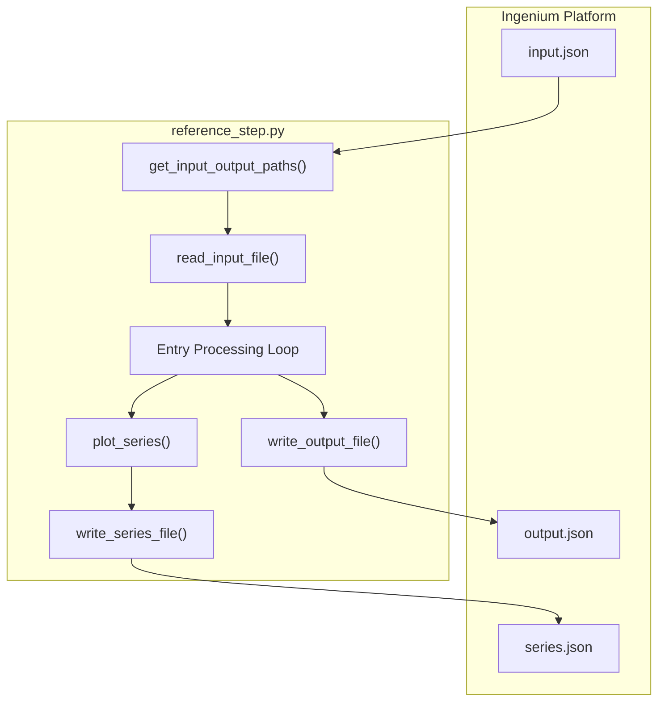
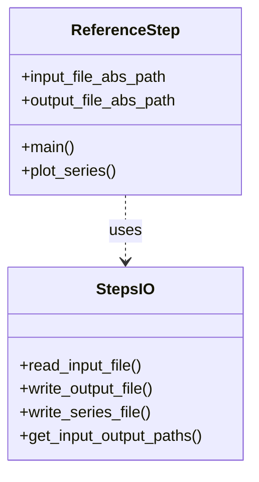

# Page: Reference Step Implementation (reference_step.py)

# Reference Step Implementation (reference_step.py)

Relevant source files

The following files were used as context for generating this wiki page:

- [steps/reference_step/reference_step.py](steps/reference_step/reference_step.py)
- [steps/reference_step/sample_file.txt](steps/reference_step/sample_file.txt)
- [steps/reference_step/sample_file_2.txt](steps/reference_step/sample_file_2.txt)
- [steps/reference_step/sample_graph.png](steps/reference_step/sample_graph.png)
- [steps/reference_step/sample_graph2.png](steps/reference_step/sample_graph2.png)

The `reference_step.py` script serves as the primary template and demonstration for implementing Ingenium Custom Scripts (Steps). It provides a concrete example of how to handle the execution lifecycle, process input data, generate telemetry visualizations, and produce the required JSON output artifacts for the Ingenium platform.

### CLI Invocation and Environment
The script is designed to be executed by the Ingenium runner as a subprocess. It follows a standard CLI pattern where the first two positional arguments are the absolute paths to the `input.json` and `output.json` files.

*   **Shebang**: The script specifies a virtual environment path `#!/home/swanchr/ing-venv/bin/python3` [steps/reference_step/reference_step.py:1]().
*   **Path Resolution**: It utilizes `get_input_output_paths()` from `ing_lib.steps` to extract and validate the CLI arguments [steps/reference_step/reference_step.py:197]().

### Step Execution Lifecycle
The script manages the transition of a step through its lifecycle, primarily moving from a `PENDING` state to a terminal state (`PASS`, `FAIL`, or `ERROR`).

#### Execution Flow
1.  **Initialization**: Initializes logging via `init_console_logger()` [steps/reference_step/reference_step.py:24]().
2.  **Input Parsing**: Reads the `input.json` file using `read_input_file()` [steps/reference_step/reference_step.py:202]().
3.  **Status Tracking**: Sets the initial `custom_script_status` to `PENDING` within the output dictionary [steps/reference_step/reference_step.py:205]().
4.  **Entry Processing**: Iterates through the `entries` list provided in the input. Each entry represents a repeating section of the step definition [steps/reference_step/reference_step.py:214-216]().
5.  **Finalization**: Writes the final `output.json` using `write_output_file()` [steps/reference_step/reference_step.py:261]().

### Telemetry Plotting and Series Generation
A core feature of the reference implementation is the generation of telemetry plots using `matplotlib`. The script supports two distinct types of data visualization: `HORIZONTAL` line plots and `VERTICAL` event markers.

#### Plotting Logic (`plot_series`)
The `plot_series` function [steps/reference_step/reference_step.py:40-191]() processes a series dictionary and saves a PNG image.

| Feature | Implementation Detail |
| :--- | :--- |
| **Time Parsing** | Handles `datetime` objects, floats, and ISO-like strings (`%Y-%jT%H:%M:%S.%f`) [steps/reference_step/reference_step.py:62-73](). |
| **HORIZONTAL Series** | Standard time-series data plotted with `ax.plot()` using circular markers [steps/reference_step/reference_step.py:132-156](). |
| **VERTICAL Series** | Event markers drawn using `ax.axvline()` with dashed lines. Labels are rotated 90 degrees and placed at the top of the plot [steps/reference_step/reference_step.py:103-125](). |
| **Formatting** | Uses `mdates.DateFormatter` for X-axis timestamps and `mticker.FormatStrFormatter` for numeric X-axes [steps/reference_step/reference_step.py:168-174](). |

#### Series File Generation
The script demonstrates creating a `series.json` file, which is used by the Ingenium UI to render interactive charts. It uses `write_series_file()` to save the structured telemetry data [steps/reference_step/reference_step.py:245]().

### Data Flow and Code Entity Map
The following diagram illustrates how data flows from the Ingenium platform into the script and back out as processed results.

**Step Data Flow Architecture**

Sources: [steps/reference_step/reference_step.py:192-261](), [ing_lib/steps.py]()

### Output Summary and Status Management
The script populates the `output_summary` field to provide a high-level text description of the execution results.

*   **Entry Results**: For each entry in the input, the script evaluates conditions and updates the `entry_verification_status` [steps/reference_step/reference_step.py:220]().
*   **Global Status**: After processing all entries, the `custom_script_status` is updated to `PASS` (unless logic dictates a `FAIL` or `ERROR`) [steps/reference_step/reference_step.py:255]().
*   **Artifact Links**: The script generates sample text files (`sample_file.txt`) and associates them with the output so they are retrievable via the UI [steps/reference_step/reference_step.py:230-240]().

**Entity Relationship: I/O Helpers**

Sources: [steps/reference_step/reference_step.py:27](), [steps/reference_step/reference_step.py:197-202]()

### Summary of Key Functions
| Function | File Location | Purpose |
| :--- | :--- | :--- |
| `get_input_output_paths` | `ing_lib/steps.py` | Extracts filesystem paths from `sys.argv` [steps/reference_step/reference_step.py:197](). |
| `read_input_file` | `ing_lib/steps.py` | Loads the `input.json` dictionary [steps/reference_step/reference_step.py:202](). |
| `plot_series` | `reference_step.py` | Generates Matplotlib PNGs from telemetry data [steps/reference_step/reference_step.py:40](). |
| `write_series_file` | `ing_lib/steps.py` | Serializes telemetry data for UI charting [steps/reference_step/reference_step.py:245](). |
| `write_output_file` | `ing_lib/steps.py` | Saves the final results and status to `output.json` [steps/reference_step/reference_step.py:261](). |

Sources: `steps/reference_step/reference_step.py`, `ing_lib/steps.py`
