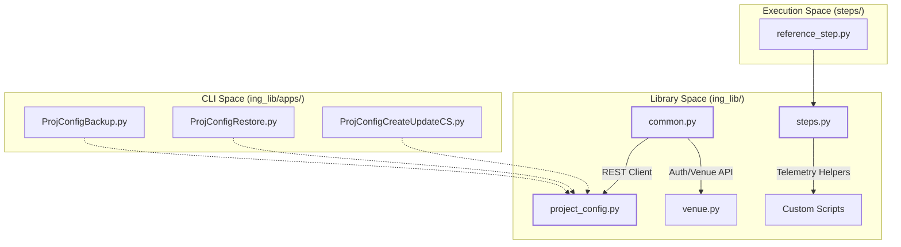
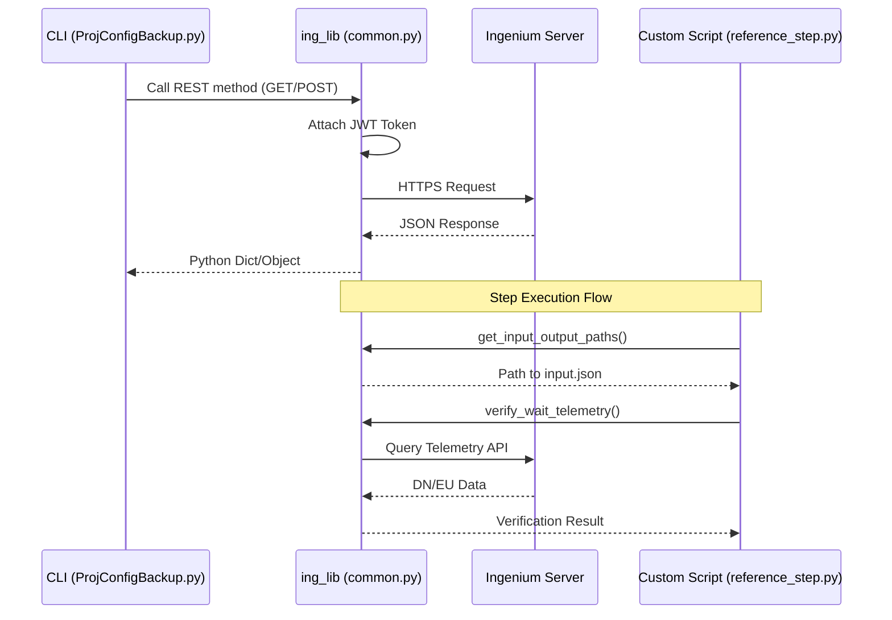

# Page: Repository Structure and Key Concepts

# Repository Structure and Key Concepts

Relevant source files

The following files were used as context for generating this wiki page:

- [LICENSE](LICENSE)
- [README.md](README.md)
- [ing_lib/__init__.py](ing_lib/__init__.py)
- [steps/reference_step/reference_step.py](steps/reference_step/reference_step.py)

This page provides a technical map of the `ingenium-lib` repository and introduces the core domain concepts required to interact with the Ingenium spacecraft test procedure platform. It defines the relationship between the Python library, the command-line applications, and the custom script execution environment.

## Repository Layout

The repository is structured to separate the core API logic, user-facing CLI tools, reference implementations for custom scripts, and the testing suite.

| Directory | Purpose | Key Components |
|:---|:---|:---|
| `ing_lib/` | Core Python package | `common.py`, `project_config.py`, `venue.py`, `steps.py` [README.md:12-17]() |
| `ing_lib/apps/` | CLI Management Tools | Backup, Restore, Clear, and Custom Script registration utilities [README.md:18-23]() |
| `ing_lib/utils/` | Data migration utilities | V3 to V4 configuration converters [README.md:24-25]() |
| `steps/` | Custom Script environment | Reference implementations and templates for test steps [steps/reference_step/reference_step.py:1-11]() |
| `ing_lib/tests/` | Test Suite | Pytest-based unit and integration tests [README.md:26]() |

### Code Entity Map: Repository Structure
The following diagram maps the physical file structure to the logical system components used by developers.

**Sources:** [README.md:8-29](), [steps/reference_step/reference_step.py:21-27]()

---

## Core Domain Concepts

### 1. Ingenium Server and Venues
The **Ingenium Server** is the central hub for managing spacecraft test procedures. A **Venue** represents a specific test environment (e.g., a hardware-in-the-loop lab or a software simulator). The `venue.py` module provides the interface for managing these environments.
*   **Venue Management:** Functions to create, query, and update venues and venue groups [ing_lib/venue.py:14-15]().
*   **Authentication:** Managed via `common.py`, supporting JWT lifecycles, LDAP, and RSA-based flows [ing_lib/common.py:16]().

### 2. Project Configurations
A Project Configuration defines the "brain" of a test project within Ingenium. It includes:
*   **Dictionaries:** Definitions for Commands, Channels (telemetry), EVRs (Event Records), and MIL-1553 bus traffic [README.md:23]().
*   **Custom Scripts:** Python-based logic (Steps) that perform specific test actions or verifications [README.md:22]().
*   **V&V Verification Items (VIs):** Objects used to track requirements verification.

### 3. Custom Scripts (Steps)
Custom scripts are the primary mechanism for extending Ingenium's capabilities. They follow a strict I/O contract:
*   **Input:** Received via `input.json` containing `variables` and `entries` [steps/reference_step/reference_step.py:197-202]().
*   **Execution:** Typically implemented in Python using `ing_lib.steps` for telemetry processing [steps/reference_step/reference_step.py:27]().
*   **Output:** Results are written to `output.json` (status, summaries) and `series.json` (plots/data) [steps/reference_step/reference_step.py:186-190]().

### 4. The Flight vs. Sim Dichotomy
The library distinguishes between two primary data sources:
*   **Flight:** Real spacecraft hardware or high-fidelity flight software (SSE).
*   **Sim:** Simulation environments used for procedure validation.
This distinction is reflected in the `project_config.py` logic, which handles different dictionary versions and telemetry query types for each [ing_lib/project_config.py:15]().

---

## Data Flow and Execution
The following diagram illustrates the flow from a CLI tool to the Ingenium Server, and how a Custom Script interacts with the library.

**Sources:** [ing_lib/common.py:16](), [steps/reference_step/reference_step.py:197-202](), [ing_lib/apps/ProjConfigBackup.py:19]()

## Summary of Key Classes and Functions
| Entity | Location | Role |
|:---|:---|:---|
| `get_logger` | `ing_lib/logs.py` | Standardized Rich-based logging [ing_lib/logs.py:21]() |
| `init_console_logger` | `ing_lib/logs.py` | Initializes console output with specific levels [ing_lib/logs.py:21]() |
| `get_input_output_paths` | `ing_lib/steps.py` | Parses CLI arguments for Step I/O [steps/reference_step/reference_step.py:197]() |
| `plot_series` | `reference_step.py` | Generates Matplotlib plots for `series.json` [steps/reference_step/reference_step.py:40]() |

**Sources:** [steps/reference_step/reference_step.py:21-40](), [README.md:12-29]()
