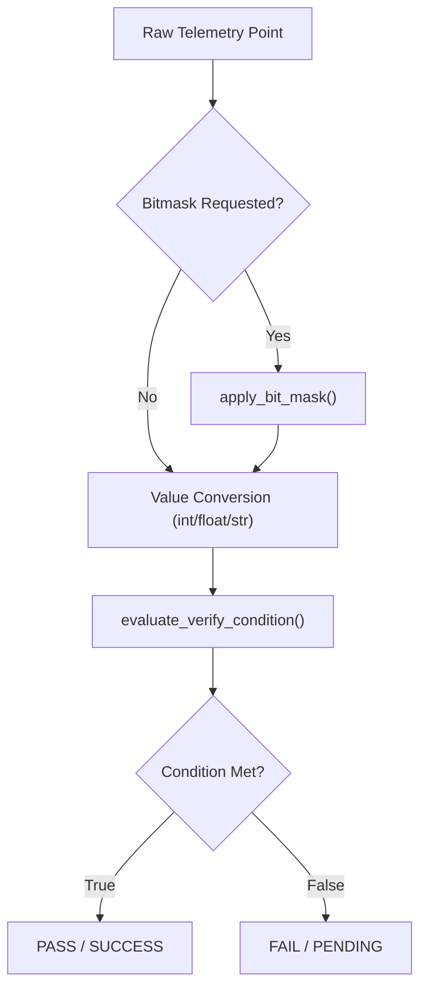
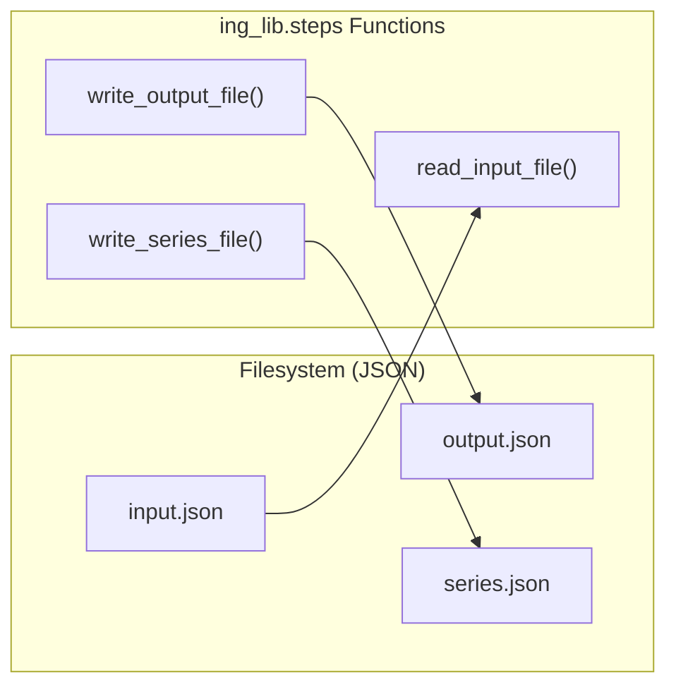

# Page: Step Execution Utilities (steps.py)

# Step Execution Utilities (steps.py)

Relevant source files

The following files were used as context for generating this wiki page:

- [ing_lib/steps.py](ing_lib/steps.py)
- [steps/reference_step/reference_step.py](steps/reference_step/reference_step.py)

The `ing_lib/steps.py` module provides a comprehensive framework for telemetry verification and I/O management within Ingenium custom scripts. It abstracts the complexity of querying telemetry, applying bitmasks, evaluating complex logical conditions, and managing the standard JSON data exchange formats required by the Ingenium platform.

### Core Telemetry Verification Framework

The framework is built around the concept of a "telemetry query," which defines how specific channels should be evaluated against expected values over a period of time.

#### Telemetry Query Structure
A telemetry query is a dictionary where keys are channel IDs and values are dictionaries defining the verification parameters [ing_lib/steps.py:115-135]().

| Parameter | Type | Description |
| :--- | :--- | :--- |
| `verify_wait` | `str` | Either `WAIT` (wait for condition to be met) or `VERIFY` (check if met) [ing_lib/steps.py:170-173](). |
| `dn_eu` | `str` | Data type to evaluate: `DN` (Digital Number/Raw) or `EU` (Engineering Units/Converted) [ing_lib/steps.py:164-167](). |
| `verification_condition` | `str` | The logical operator (e.g., `GREATER_THAN`, `INCLUSIVE_RANGE`) [ing_lib/steps.py:147-157](). |
| `verification_values` | `list` | List of strings representing the thresholds for the condition [ing_lib/steps.py:141-157](). |
| `bit_mask` | `str` | Optional: Binary (`0b`), Hex (`0x`), or Decimal string [ing_lib/steps.py:71-98](). |
| `bit_op` | `str` | Optional: `AND` or `OR` [ing_lib/steps.py:101-105](). |

#### Logic Flow: Telemetry Verification
The following diagram illustrates how the system transitions from a raw telemetry point to a verification result.

**Telemetry Evaluation Logic**

Sources: [ing_lib/steps.py:45-112](), [ing_lib/steps.py:202-280]().

### Key Functions

#### apply_bit_mask
This utility applies bitwise operations to integer telemetry values. It supports multiple input formats for masks:
*   **Binary**: Prefixed with `0b` [ing_lib/steps.py:72-74]().
*   **Hexadecimal**: Prefixed with `0x` [ing_lib/steps.py:82-84]().
*   **Decimal**: Standard numeric string [ing_lib/steps.py:92-94]().

It performs either an `AND` or `OR` operation and returns the resulting integer [ing_lib/steps.py:101-112]().

#### evaluate_verify_condition
The engine for logical comparison. It takes a telemetry value and a list of verification values, then applies the specified `verification_condition` [ing_lib/steps.py:202-212]().

Supported conditions include:
*   **Equality**: `EQUAL`, `NOT_EQUAL` [ing_lib/steps.py:228-233]().
*   **Comparison**: `GREATER_THAN`, `LESS_THAN`, etc [ing_lib/steps.py:234-245]().
*   **Ranges**: `INCLUSIVE_RANGE` (val1 <= x <= val2), `EXCLUSIVE_RANGE` (val1 < x < val2) [ing_lib/steps.py:246-255]().
*   **Presence**: `RECORD` (always True if data exists), `NOT_PRESENT` (True if no data) [ing_lib/steps.py:223-227]().

#### check_telemetry_query
A validation helper that ensures a query dictionary is well-formed before execution. It enforces rules such as:
*   `INCLUSIVE_RANGE` must have exactly two values [ing_lib/steps.py:153-157]().
*   `GREATER_THAN` must have exactly one value [ing_lib/steps.py:147-152]().
*   If a `bit_op` is provided, a `bit_mask` must also be present [ing_lib/steps.py:183-186]().

### Step I/O Helpers

Custom scripts interact with the Ingenium platform via JSON files. `steps.py` provides high-level wrappers for these operations.

**Code Entity to Data Format Mapping**

Sources: [ing_lib/steps.py:534-547](), [ing_lib/steps.py:567-580](), [ing_lib/steps.py:596-609]().

#### File Utilities
*   **`get_input_output_paths(error_msg)`**: Parses command-line arguments to retrieve the absolute paths for the input and output JSON files [ing_lib/steps.py:510-532]().
*   **`read_input_file(input_file_path)`**: Loads the `input.json` file into an `OrderedDict` to preserve the sequence of step entries [ing_lib/steps.py:534-547]().
*   **`write_output_file(output_file_path, output_dict)`**: Serializes the script results to `output.json` [ing_lib/steps.py:567-580]().
*   **`write_series_file(series_file_path, series_dict)`**: Serializes telemetry plot data or event markers to `series.json` [ing_lib/steps.py:596-609]().

### Constants and Enumerations
*   **`_TELEMETRY_QUERY_MARGIN`**: Set to 5 seconds. This is the buffer added to telemetry queries to ensure data at the edges of the requested window is captured [ing_lib/steps.py:41]().
*   **`ReturnOn` (Enum)**: Used in multi-channel waits to determine if the script should proceed when `ANY` condition is met or wait until `ALL` conditions are met [ing_lib/steps.py:35-37]().

Sources:
- `ing_lib/steps.py`
- `steps/reference_step/reference_step.py` (usage context)
