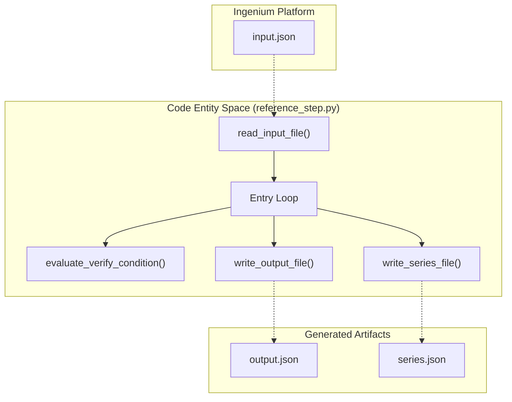
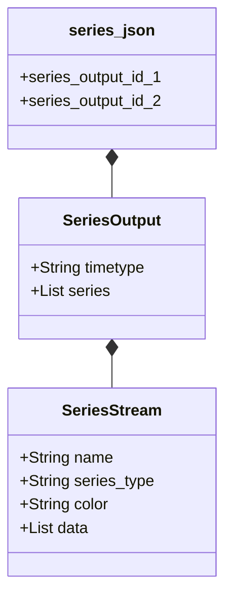

# Page: Step I/O Data Formats (input.json, output.json, series.json)

# Step I/O Data Formats (input.json, output.json, series.json)

Relevant source files

The following files were used as context for generating this wiki page:

- [steps/reference_step/input.json](steps/reference_step/input.json)
- [steps/reference_step/output.json](steps/reference_step/output.json)
- [steps/reference_step/series.json](steps/reference_step/series.json)

This page specifies the data contracts used for communication between the Ingenium platform and custom Python scripts (Steps). The execution environment relies on three primary JSON files to pass parameters, return results, and provide time-series data for visualization.

## Overview of Data Flow

When a Custom Script is executed, the Ingenium platform generates an `input.json` file in the script's working directory. The script processes this data and is responsible for generating an `output.json` file to report status and a `series.json` file if telemetry or event plots are required.

### I/O Entity Relationship
The following diagram illustrates how the JSON entities map to the execution logic found in `reference_step.py`.

**Custom Script Execution Data Mapping**

Sources: [steps/reference_step/input.json:1-36](), [steps/reference_step/output.json:1-108](), [steps/reference_step/series.json:1-180]()

---

## 1. input.json Specification

The `input.json` file contains all configuration parameters defined in the Custom Script XML. It is divided into top-level variables and a repeating list of entries.

### Structure
*   **`username`**: The ID of the test conductor executing the script [steps/reference_step/input.json:2-2]().
*   **`inputs`**: A dictionary of global variables (e.g., timeouts, start times, command strings) [steps/reference_step/input.json:3-11]().
*   **`entries`**: A list of objects, each containing an `entry_inputs` dictionary. This corresponds to the repeating "Script Entries" in the Ingenium UI [steps/reference_step/input.json:12-35]().

### Example Field Formats
| Field Type | Format Example | Description |
| :--- | :--- | :--- |
| `FLIGHT_COMMAND` | `"CMD-1234,ARG1,ARG2"` | Command mnemonic followed by comma-separated arguments [steps/reference_step/input.json:7-7](). |
| `SIM_TELEM` | `"SC-0010,CHANNEL_NAME"` | Channel ID and mnemonic [steps/reference_step/input.json:16-16](). |
| `VERIFICATION_COND`| `"GREATER_THAN,5,,"` | Operator and threshold values [steps/reference_step/input.json:21-21](). |

Sources: [steps/reference_step/input.json:1-36]()

---

## 2. output.json Specification

The `output.json` file is the primary contract for reporting the success or failure of a step. It includes summary text, specific output values, and array-based results.

### Core Components
*   **`custom_script_status`**: Must be one of `PASS`, `FAIL`, or `ERROR` [steps/reference_step/output.json:2-2]().
*   **`output_summary`**: A string (often multi-line) displayed in the Ingenium UI as the primary textual result [steps/reference_step/output.json:107-107]().
*   **`outputs`**: Dictionary mapping output keys (defined in XML) to their final values (e.g., file paths, timestamps) [steps/reference_step/output.json:78-86]().
*   **`output_array`**: A list of dictionaries used to populate tables in the "Global Results" section [steps/reference_step/output.json:87-106]().

### Entry-Level Results
For every entry provided in `input.json`, the script should provide a corresponding result in the `entries` list of `output.json`:
*   **`verification_status`**: Individual status for that specific entry [steps/reference_step/output.json:23-23]().
*   **`entry_outputs`**: Key-value pairs for the entry's specific output fields [steps/reference_step/output.json:24-31]().
*   **`entry_output_array`**: Data for tables nested within a specific entry [steps/reference_step/output.json:32-41]().

Sources: [steps/reference_step/output.json:1-108]()

---

## 3. series.json Specification

The `series.json` file defines time-series data for plotting. It supports multiple "series outputs," each containing one or more data streams.

### Time Types
The `timetype` field determines how the X-axis is interpreted:
*   **`SCLK`**: Spacecraft Clock (numeric/float) [steps/reference_step/series.json:3-3]().
*   **`SCET`**: Spacecraft Event Time (ISO-8601 strings like `YYYY-DOYTHH:MM:SS.ffffff`) [steps/reference_step/series.json:181-181]().

### Series Types
| Type | Description | Data Format |
| :--- | :--- | :--- |
| **`HORIZONTAL`** | Continuous or discrete telemetry values plotted on a Y-axis [steps/reference_step/series.json:7-7](). | `[time, value]` where value is numeric [steps/reference_step/series.json:10-13](). |
| **`VERTICAL`** | Discrete events (EVRs) plotted as vertical markers [steps/reference_step/series.json:165-165](). | `[time, "LABEL"]` where label is a string [steps/reference_step/series.json:168-171](). |

### Logical Schema
**Series Data Hierarchy**

Sources: [steps/reference_step/series.json:1-182](), [steps/reference_step/series.json:185-187]()

---

## Data Flow Implementation

The `ing_lib.steps` module provides helper functions to manage these files.

| Task | Function | Description |
| :--- | :--- | :--- |
| **Reading** | `read_input_file()` | Loads `input.json` into a Python dictionary. |
| **Writing Results** | `write_output_file()` | Serializes the result dictionary to `output.json`. |
| **Writing Plots** | `write_series_file()` | Serializes plot data to `series.json`. |

**Execution Logic Flow**
1.  **Ingenium** invokes the script via CLI.
2.  Script calls `read_input_file()`.
3.  Script iterates through `entries`.
4.  Script performs telemetry checks (e.g., `verify_wait_telemetry`).
5.  Script populates an internal dictionary mirroring the `output.json` structure.
6.  Script populates an internal dictionary mirroring the `series.json` structure.
7.  Script calls `write_output_file()` and `write_series_file()` before exiting.

Sources: [steps/reference_step/reference_step.py:1-100]() (Reference for logic flow), [steps/reference_step/output.json:1-108](), [steps/reference_step/series.json:1-180]()
