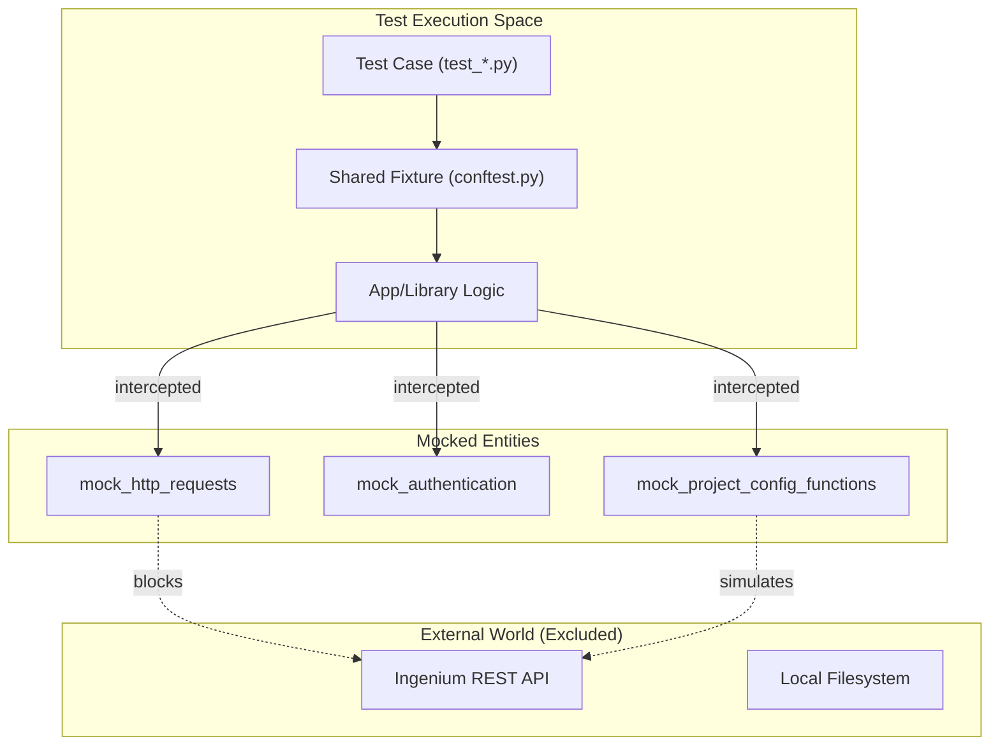
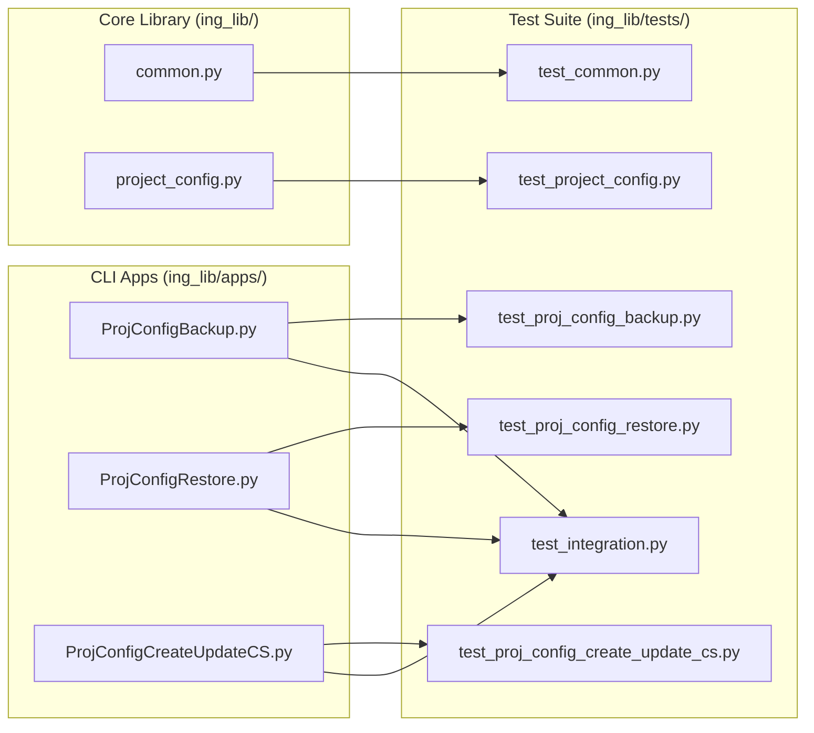

# Page: Testing

# Testing

Relevant source files

The following files were used as context for generating this wiki page:

- [ing_lib/pytest.ini](ing_lib/pytest.ini)
- [ing_lib/tests/README.md](ing_lib/tests/README.md)
- [ing_lib/tests/__init__.py](ing_lib/tests/__init__.py)
- [ing_lib/tests/conftest.py](ing_lib/tests/conftest.py)

The `ingenium-lib` test suite is built using `pytest` and is designed to validate the core library modules and the command-line applications. The suite emphasizes a robust mocking strategy to simulate Ingenium server responses and filesystem operations, allowing tests to run without a live environment.

### Test Configuration and Execution

The test suite is configured via `ing_lib/pytest.ini`, which defines test discovery patterns and custom markers for categorizing tests.

| Feature | Configuration |
| :--- | :--- |
| **Test Discovery** | Files matching `test_*.py`, classes matching `Test*`, and functions matching `test_*` [ing_lib/pytest.ini:3-5](). |
| **Markers** | `unit` (individual functions), `integration` (workflows), and `slow` [ing_lib/pytest.ini:12-15](). |
| **Output** | Verbose mode with short traceback and colored output enabled by default [ing_lib/pytest.ini:7-11](). |

To run the tests, navigate to the `ing-lib` directory and use the following commands:
*   **All tests:** `python -m pytest tests/` [ing_lib/tests/README.md:30]()
*   **Unit tests only:** `python -m pytest -m "unit" tests/` [ing_lib/tests/README.md:50]()
*   **Integration tests only:** `python -m pytest -m "integration" tests/` [ing_lib/tests/README.md:55]()

**Sources:** [ing_lib/pytest.ini:1-18](), [ing_lib/tests/README.md:1-57]()

---

### Mocking Strategy and Shared Fixtures

The suite relies heavily on `unittest.mock` to isolate code under test from external dependencies like HTTP requests and the local filesystem [ing_lib/tests/README.md:60-63](). Centralized fixtures are defined in `conftest.py` to provide consistent mock states across different test modules.

#### Key Fixtures in conftest.py
*   **`mock_authentication`**: Patches `common.authenticate` to always return `True`, bypassing actual credential validation [ing_lib/tests/conftest.py:23-26]().
*   **`mock_common_http_functions`**: Provides side effects for `ingenium_rest_get_paginated` and `ingenium_rest_get`, returning sample dictionary versions, VIs, and custom scripts [ing_lib/tests/conftest.py:111-166]().
*   **`mock_project_config_functions`**: A suite of fixtures (`mock_project_config_get_functions`, `create_functions`, `delete_functions`) that patch high-level API calls in `project_config.py` [ing_lib/tests/conftest.py:44-98]().
*   **`comprehensive_server_mock`**: A "mega-fixture" that combines authentication, global state, and HTTP mocks to simulate a fully functional Ingenium server [ing_lib/tests/conftest.py:169-178]().

#### Mocking Architecture
The following diagram illustrates how fixtures intercept calls between the Library/Apps and the external Ingenium Server.

**Test Interception Layer**

**Sources:** [ing_lib/tests/conftest.py:17-190](), [ing_lib/tests/README.md:65-72]()

---

### Test Categories

The suite is divided into two primary categories to ensure both granular correctness and system-level reliability.

#### Unit Tests
Unit tests focus on the logic within individual modules. This includes validating the `common.py` REST client's handling of tokens and pagination, the `project_config.py` wrapper's ability to format API requests correctly, and the complex layout validation logic in `ProjConfigCreateUpdateCS.py`.
For details, see [Unit Tests](#5.1).

#### Integration Tests
Integration tests verify the end-to-end workflows of the CLI applications. These tests ensure that components work together—for example, verifying that `ProjConfigBackup.py` correctly authenticates via `common.py`, retrieves all project data via `project_config.py`, and writes the result to a file.
For details, see [Integration Tests and Fixtures](#5.2).

**Sources:** [ing_lib/tests/README.md:73-78](), [ing_lib/pytest.ini:12-14]()

---

### Component-to-Test Mapping

This diagram maps core system components to their corresponding test modules in the `tests/` directory.

**System Component Mapping**

**Sources:** [ing_lib/tests/README.md:14-24](), [ing_lib/pytest.ini:2-5]()
