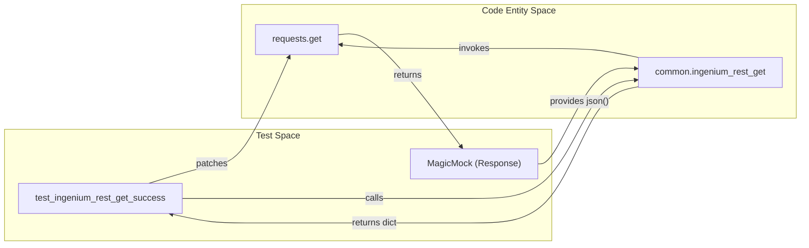
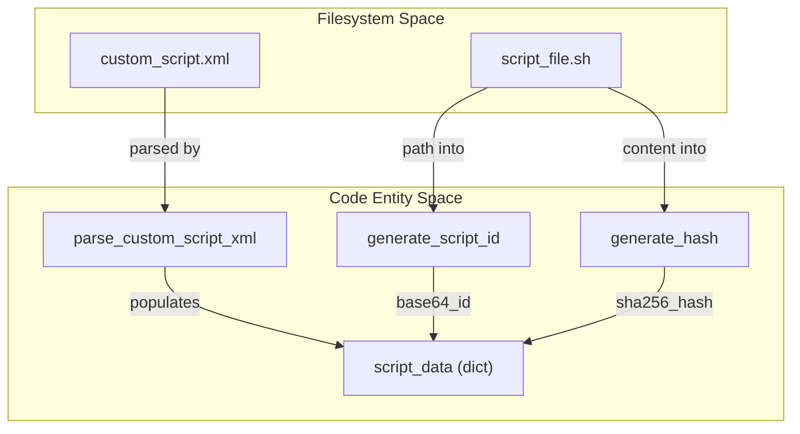

# Page: Unit Tests

# Unit Tests

Relevant source files

The following files were used as context for generating this wiki page:

- [ing_lib/tests/test_advanced_layout_parsing.py](ing_lib/tests/test_advanced_layout_parsing.py)
- [ing_lib/tests/test_common.py](ing_lib/tests/test_common.py)
- [ing_lib/tests/test_proj_config_backup.py](ing_lib/tests/test_proj_config_backup.py)
- [ing_lib/tests/test_proj_config_clear.py](ing_lib/tests/test_proj_config_clear.py)
- [ing_lib/tests/test_proj_config_create_update_cs.py](ing_lib/tests/test_proj_config_create_update_cs.py)
- [ing_lib/tests/test_proj_config_load_ampcs_dict.py](ing_lib/tests/test_proj_config_load_ampcs_dict.py)
- [ing_lib/tests/test_proj_config_restore.py](ing_lib/tests/test_proj_config_restore.py)
- [ing_lib/tests/test_project_config.py](ing_lib/tests/test_project_config.py)

The `ingenium-lib` test suite utilizes `pytest` to ensure the reliability of the core library and its associated CLI applications. The unit tests focus on isolating components through extensive mocking of HTTP requests via the `requests` library and filesystem operations.

## REST Client and Authentication (test_common.py)

The `test_common.py` module validates the foundational communication layer of the library. It tests the `common.py` module's ability to handle RESTful interactions, manage authentication tokens, and process server responses.

### Key Implementation Details
- **Response Handling**: Tests verify that `response_handler` correctly interprets HTTP status codes (200, 201, 202, 204 as success; 400, 404 as failure) [ing_lib/tests/test_common.py:30-84]().
- **Request Mocking**: Uses `@patch('requests.get')` to simulate server responses, ensuring that headers (including `Authorization` tokens) and SSL verification settings are passed correctly to the underlying `requests` calls [ing_lib/tests/test_common.py:86-107]().
- **Error Propagation**: Ensures that `IngeniumLibError` is raised when the server returns non-successful status codes or when JSON decoding fails [ing_lib/tests/test_common.py:109-127]().

**REST Interaction Flow**
The following diagram illustrates how the test suite mocks the interaction between the library and the Ingenium API.

"Mocking REST Client Interactions"

Sources: [ing_lib/tests/test_common.py:86-107](), [ing_lib/tests/test_common.py:18-29]()

---

## Project Configuration API (test_project_config.py)

This module tests the wrappers for the Ingenium Project Configuration API. It ensures that the library can correctly query, create, and delete dictionary versions and V&V Verification Items (VIs).

- **Pagination**: Validates that `get_dictionary_versions` and `get_dictionary` correctly utilize the paginated GET helper to retrieve full datasets [ing_lib/tests/test_project_config.py:16-34]().
- **Resource Deletion**: Confirms that `delete_dictionary_version` properly constructs the deletion URL and handles both 204 No Content (success) and 500 Internal Server Error (failure) scenarios [ing_lib/tests/test_project_config.py:35-67]().

Sources: [ing_lib/tests/test_project_config.py:1-92]()

---

## CLI Application Tests

The unit tests for the `apps/` directory focus on argument parsing, data transformation, and the orchestration of multiple API calls.

### Backup and Restore
- **test_proj_config_backup.py**: Tests the logic for extracting a full project state. It verifies that `get_source_dictionaries` correctly filters retired dictionaries when the `--filter_retired` flag is set [ing_lib/tests/test_proj_config_backup.py:74-105]().
- **test_proj_config_restore.py**: Validates the restoration workflow. It uses `sample_backup_data` to ensure that `restore_dictionaries` iterates through flight/SSE versions, commands, channels, and VIs, calling the appropriate creation functions for each [ing_lib/tests/test_proj_config_restore.py:58-100]().

### Configuration Management
- **test_proj_config_clear.py**: Ensures that the `clear_project_configuration` function can safely handle deletions across all categories. It specifically tests the "confirm" prompt logic and ensures that if one deletion fails, the script continues to attempt the rest [ing_lib/tests/test_proj_config_clear.py:49-68]().
- **test_proj_config_load_ampcs_dict.py**: Focuses on XML parsing. It tests `detect_dictionary_type` by providing snippets of Command, Channel, EVR, and MIL-1553 XML to ensure the parser routes data to the correct upload logic [ing_lib/tests/test_proj_config_load_ampcs_dict.py:22-109]().

Sources: [ing_lib/tests/test_proj_config_backup.py:16-191](), [ing_lib/tests/test_proj_config_restore.py:17-180](), [ing_lib/tests/test_proj_config_clear.py:10-140](), [ing_lib/tests/test_proj_config_load_ampcs_dict.py:19-200]()

---

## Custom Script and Layout Parsing

The tests for Custom Script (CS) management are the most complex due to the heavy use of filesystem mocking and cryptographic hash verification.

### Script Registration (test_proj_config_create_update_cs.py)
- **ID and Hash Generation**: Validates that `generate_script_id` creates a Base64 encoded version of the path and `generate_hash` produces a valid SHA256 hex string of the script file content [ing_lib/tests/test_proj_config_create_update_cs.py:91-112]().
- **XML/JSON Parsing**: Ensures that `parse_custom_script_xml` correctly extracts input fields (INT, STRING, FLOAT, etc.) and attributes like `input_required` and `default_value` [ing_lib/tests/test_proj_config_create_update_cs.py:154-182]().

### Advanced Layout (test_advanced_layout_parsing.py)
- **Grid Validation**: Tests the parsing of the 12-column grid layout from JSON definitions.
- **Component Mapping**: Specifically verifies that `IMAGE` and `SERIES` layout types are correctly associated with their respective field names within the `contentlayout` and `resultslayout` blocks [ing_lib/tests/test_advanced_layout_parsing.py:57-80]().

**Custom Script Data Flow**
The following diagram bridges the file-based script definitions to the internal data structures used during registration.

"Custom Script Metadata Extraction"

Sources: [ing_lib/tests/test_proj_config_create_update_cs.py:13-17](), [ing_lib/tests/test_proj_config_create_update_cs.py:154-168](), [ing_lib/tests/test_advanced_layout_parsing.py:57-80]()

## Mocking Patterns

The test suite relies on two primary mocking strategies:

1.  **HTTP Mocking**: Using `unittest.mock.patch` on `requests.get`, `requests.post`, and `requests.delete` to return `MagicMock` objects that simulate the `Response` class, including `status_code`, `json()`, and `text` attributes [ing_lib/tests/test_common.py:86-107]().
2.  **Filesystem Mocking**: Using `tempfile.NamedTemporaryFile` and `tempfile.TemporaryDirectory` to create real, ephemeral files on disk for testing XML/JSON parsers, combined with `mock_open` for cases where actual disk I/O is not required [ing_lib/tests/test_proj_config_create_update_cs.py:55-78](), [ing_lib/tests/test_advanced_layout_parsing.py:45-55]().

Sources: [ing_lib/tests/test_common.py:18-192](), [ing_lib/tests/test_proj_config_create_update_cs.py:20-182]()
