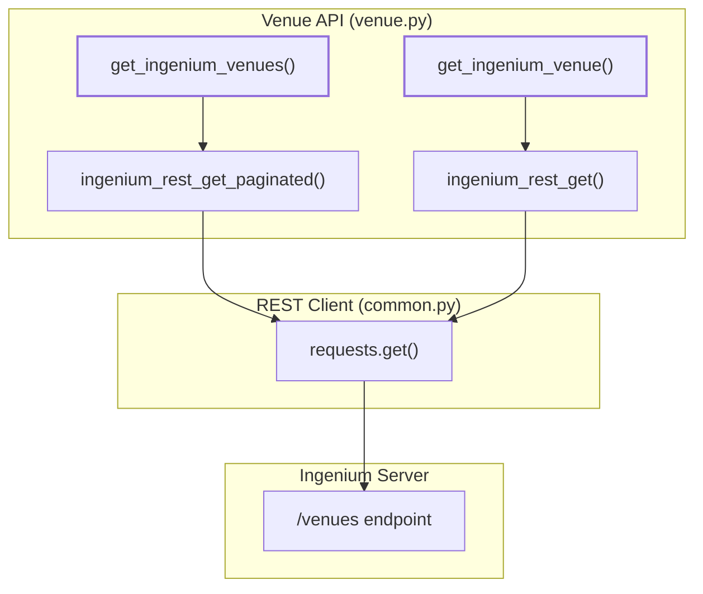

# Page: Venue Management (venue.py) and Logging (logs.py)

# Venue Management (venue.py) and Logging (logs.py)

Relevant source files

The following files were used as context for generating this wiki page:

- [ing_lib/logs.py](ing_lib/logs.py)
- [ing_lib/venue.py](ing_lib/venue.py)

This page provides technical documentation for the venue management and logging subsystems within `ing_lib`. These modules handle interactions with the Ingenium server's venue/resource hierarchy and provide a standardized, Rich-enhanced logging interface for all library components and CLI applications.

## 1. Venue Management (venue.py)

The `ing_lib/venue.py` module provides a functional interface for managing **Venues** and **Venue Groups**. Venues in Ingenium represent specific test environments or spacecraft resources, while Venue Groups allow for logical categorization of these resources [ing_lib/venue.py:1-7]().

### 1.1 Implementation Details
The module relies on `common.py` for REST communication, utilizing the global `token` for authentication and `ssl_verify` for secure connections [ing_lib/venue.py:10,38-39](). It implements standard CRUD operations (Create, Read, Update) using `POST`, `GET`, and `PATCH` methods.

| Function | Method | Endpoint | Description |
| :--- | :--- | :--- | :--- |
| `create_venue_group` | `POST` | `/venue-groups` | Creates a new venue group [ing_lib/venue.py:17-53](). |
| `get_venue_groups` | `GET` | `/venue-groups` | Retrieves a paginated list of groups [ing_lib/venue.py:56-77](). |
| `get_venue_group` | `GET` | `/venue-groups/{id}` | Retrieves a single group by UUID [ing_lib/venue.py:80-101](). |
| `update_venue_group` | `PATCH` | `/venue-groups/{id}` | Updates an existing group definition [ing_lib/venue.py:104-143](). |
| `create_ingenium_venue` | `POST` | `/venues` | Creates a new venue [ing_lib/venue.py:188-225](). |
| `get_ingenium_venues` | `GET` | `/venues` | Retrieves a paginated list of venues [ing_lib/venue.py:228-250](). |
| `update_ingenium_venue` | `PATCH` | `/venues/{id}` | Updates an existing venue [ing_lib/venue.py:146-185](). |

### 1.2 Data Flow: Venue Query
The following diagram illustrates the relationship between the high-level venue functions and the underlying REST client.

**Venue Retrieval Logic**

**Sources:** [ing_lib/venue.py:228-250](), [ing_lib/venue.py:253-275](), [ing_lib/venue.py:10]()

## 2. Logging System (logs.py)

The `ing_lib/logs.py` module provides a unified logging framework. It wraps the standard Python `logging` library with `rich` for high-fidelity console output, including formatted tracebacks and color-coded levels [ing_lib/logs.py:1-4]().

### 2.1 Configuration and Initialization
The logger is designed as a singleton-style engine. The root logger name is defined as `"ingenium"` [ing_lib/logs.py:8]().

*   **`init_console_logger(level)`**: Configures a `RichHandler` on the root logger. It sets `rich_tracebacks=True` and a fixed console width of 255 for consistent output across different terminal sizes [ing_lib/logs.py:28-49]().
*   **Environment Override**: The `ING_LOG_LEVEL` environment variable can override the provided `level` parameter [ing_lib/logs.py:55-60]().
*   **`init_file_logger(level, file_path)`**: Attaches a `FileHandler` to the existing logger. If the console logger hasn't been initialized yet, it calls `init_console_logger()` first to ensure output is not lost [ing_lib/logs.py:74-83]().

### 2.2 Logger Hierarchy
The system uses a hierarchical naming convention. The function `get_logger(name)` returns either the base `"ingenium"` logger or a child (e.g., `"ingenium.my_module"`) [ing_lib/logs.py:99-107]().

**Logging Architecture**

```mermaid
graph TD
    subgraph "Public Interface"
        GL["get_logger(name)"]
        ICL["init_console_logger(level)"]
        IFL["init_file_logger(level, path)"]
    end

    subgraph "Internal State"
        IL["_ingen_logger (Logger: 'ingenium')"]
        EC["_engine_configured (bool)"]
    end

    subgraph "Handlers"
        RH["RichHandler (Console)"]
        FH["FileHandler (File)"]
    end

    ICL --> RH
    IFL --> FH
    RH --> IL
    FH --> IL
    GL --> IL
    
    style IL stroke-dasharray: 5 5
```

**Sources:** [ing_lib/logs.py:15-19](), [ing_lib/logs.py:28-50](), [ing_lib/logs.py:74-92](), [ing_lib/logs.py:99-107]()

### 2.3 Formatting Constants
The module defines specific formats for different output targets:
*   **Console**: `[%(funcName)s] %(message)s` [ing_lib/logs.py:9]().
*   **File**: `%(asctime)s %(levelname)s [%(funcName)s] %(message)s [%(filename)s:%(lineno)d]` [ing_lib/logs.py:10]().
*   **Date Format**: `ISO8601` (`%Y-%m-%dT%H:%M:%S`) [ing_lib/logs.py:11]().

## 3. Implementation Summary Table

| Entity | Type | File | Description |
| :--- | :--- | :--- | :--- |
| `venue_group_endpoint` | Variable | `common.py` | Inherited constant for venue group REST path [ing_lib/venue.py:35](). |
| `venue_endpoint` | Variable | `common.py` | Inherited constant for venue REST path [ing_lib/venue.py:167](). |
| `_engine_configured` | Global Flag | `logs.py` | Tracks if the logging system has been initialized [ing_lib/logs.py:15](). |
| `IngeniumLibError` | Exception | `common.py` | Raised on communication failures or invalid responses [ing_lib/venue.py:44,51](). |
| `RichHandler` | Class | `rich.logging` | Used for terminal output with formatted tracebacks [ing_lib/logs.py:3,41](). |

**Sources:** [ing_lib/venue.py:35,167,44,51](), [ing_lib/logs.py:15,3,41]()
