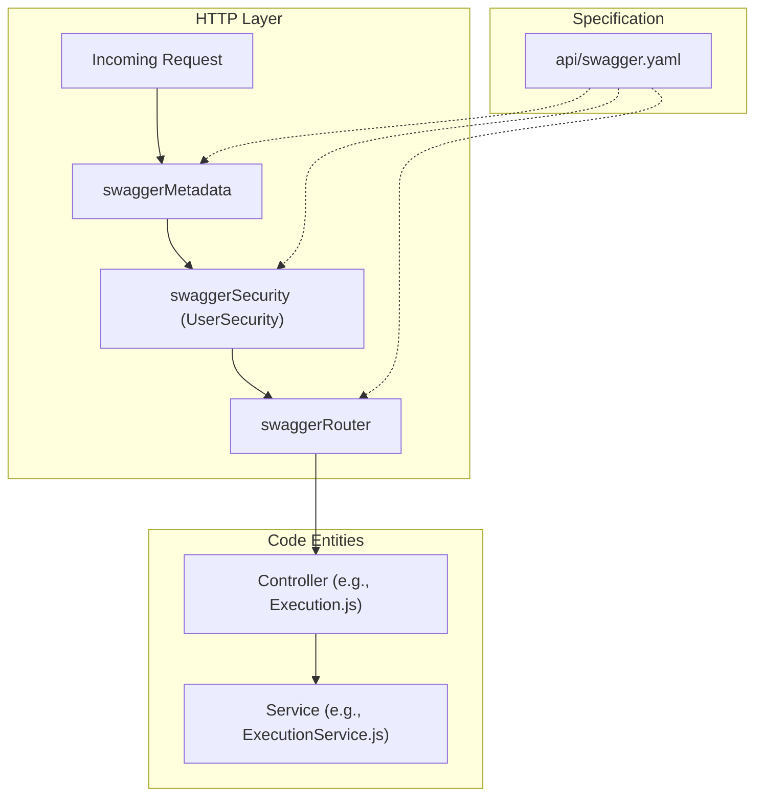
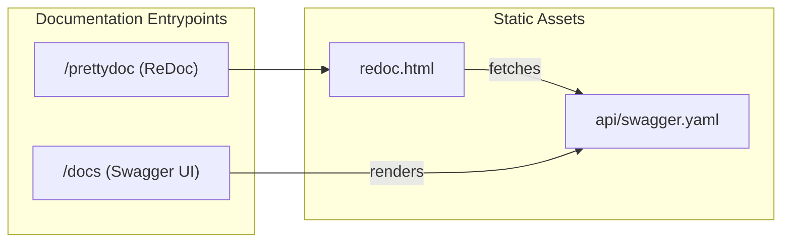

# Page: API Specification (Swagger / OpenAPI)

# API Specification (Swagger / OpenAPI)

Relevant source files

The following files were used as context for generating this wiki page:

- [api/swagger.yaml](api/swagger.yaml)
- [index.js](index.js)
- [redoc.html](redoc.html)

The Ingenium Archive Service utilizes an OpenAPI 2.0 (Swagger) specification to define its RESTful interface. This specification serves as the single source of truth for route registration, request validation, and security enforcement. By leveraging `swagger-tools`, the service automatically maps incoming HTTP requests to the appropriate controller logic based on the `operationId` and `x-swagger-router-controller` extensions defined in the YAML.

## Specification and Routing

The core of the API definition resides in `api/swagger.yaml` [api/swagger.yaml:1-5](). This file defines the base path as `/api/v5` [api/swagger.yaml:7-7]() and lists all available endpoints, their expected parameters, and response schemas.

### Route Registration Flow
The service initializes the Swagger middleware during startup in `index.js`. It reads the YAML file, converts it to a JavaScript object, and passes it to `swaggerTools.initializeMiddleware` [index.js:141-145]().

1.  **Metadata Attachment**: `middleware.swaggerMetadata()` attaches Swagger-related information (like parameters and operation definitions) to the `req.swagger` object [index.js:147-147]().
2.  **Security Enforcement**: `middleware.swaggerSecurity()` processes the `UserSecurity` scheme defined in the spec [index.js:149-150]().
3.  **Routing**: `middleware.swaggerRouter()` routes requests to the files in the `controllers/` directory based on the `x-swagger-router-controller` property [index.js:192-192]().

### Request Handling Diagram

**Sources:** [index.js:141-192](), [api/swagger.yaml:1-192]()

## UserSecurity Scheme

The service implements a JWT-based security scheme labeled `UserSecurity`. While technically using RS256 JWTs, the specification defines it as an `oauth2` type with `implicit` flow to leverage Swagger's native support for scopes [api/swagger.yaml:16-25]().

| Scope | Description |
| :--- | :--- |
| `admin` | Administrative permissions (venues, users) |
| `author` | Authoring procedures |
| `execute:*` | Execution permissions segmented by venue type (wsts, testbed, sit, other) |
| `basic` | Basic permissions, such as adding comments |

For a detailed breakdown of how JWTs are verified against the `PUBLIC_PEM` and how scopes are validated, see [Authentication and Authorization](#4.1).

**Sources:** [api/swagger.yaml:15-39](), [index.js:149-189]()

## Documentation Endpoints

The service provides two primary ways to consume the API documentation at runtime:

1.  **Raw Swagger UI**: Accessible via the `middleware.swaggerUi()` middleware, which provides the standard Swagger interactive interface [index.js:194-194]().
2.  **ReDoc (Pretty Doc)**: A more readable, three-panel documentation view is provided via the `/prettydoc` endpoint. This serves the `redoc.html` file [index.js:203-205](), which fetches the spec from the `/api-docs` (or configured `swaggerUi`) endpoint [redoc.html:19-20]().

**Sources:** [index.js:194-205](), [redoc.html:1-22]()

## Extending the Specification

To add a new endpoint or modify an existing one:
1.  **Update `api/swagger.yaml`**: Define the path, method, parameters, and security requirements.
2.  **Assign Controller**: Ensure the `x-swagger-router-controller` matches a filename in the `controllers/` directory (e.g., `MyResource`).
3.  **Set Operation ID**: The `operationId` (e.g., `get_my_data`) must correspond to an exported function in `controllers/MyResource.js`.
4.  **Payload Limits**: Note that the service overrides default body-parser limits to `500mb` to accommodate large execution/procedure imports [index.js:31-32]().

## Related Pages

- [Authentication and Authorization](#4.1) — Details on JWT RS256 validation and scope-based access control.
- [Audit Logging Middleware](#4.2) — Details on how the `express-interceptor` captures API interactions for the audit log.
- [HTTP Controllers Layer](#3) — Overview of the JS files that implement the logic defined in the Swagger spec.

**Sources:** [index.js:31-32](), [api/swagger.yaml:41-210]()
