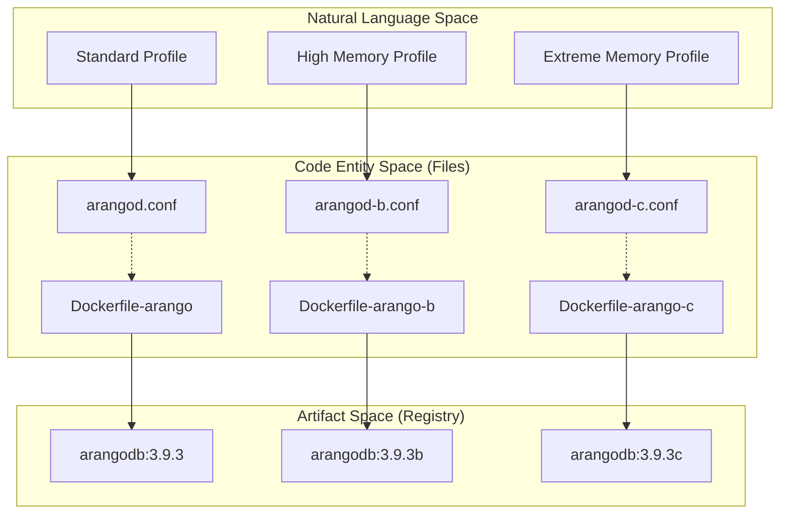
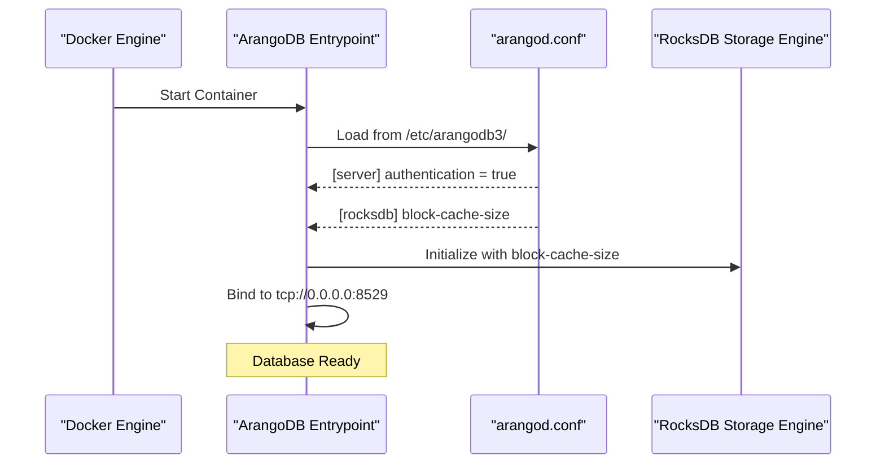

# Page: ArangoDB Configuration and Docker Images

# ArangoDB Configuration and Docker Images

Relevant source files

The following files were used as context for generating this wiki page:

- [Dockerfile-arango](Dockerfile-arango)
- [Dockerfile-arango-b](Dockerfile-arango-b)
- [Dockerfile-arango-c](Dockerfile-arango-c)
- [arangod-b.conf](arangod-b.conf)
- [arangod-c.conf](arangod-c.conf)
- [arangod.conf](arangod.conf)

This page details the configuration and containerization of the ArangoDB instances used by the Ingenium Archive Service. The service utilizes custom ArangoDB configurations tailored for different memory footprints and performance requirements, specifically focusing on RocksDB storage engine tuning and JPL Artifactory integration.

## Configuration Profiles

The codebase maintains three distinct ArangoDB configuration files (`arangod.conf`, `arangod-b.conf`, and `arangod-c.conf`). These profiles allow the service to scale based on available system resources, particularly regarding the RocksDB block cache and global cache sizes.

### Core Settings
Across all profiles, several settings remain constant to ensure consistency in connectivity and security:
*   **Endpoint**: Listens on `tcp://0.0.0.0:8529` [arangod.conf:26]().
*   **Authentication**: Enabled by default (`authentication = true`) [arangod.conf:32]().
*   **Storage Engine**: Set to `auto`, which defaults to RocksDB in ArangoDB 3.x [arangod.conf:27]().
*   **Logging**: Configured to `info` level and outputs to stdout (`file = -`) [arangod.conf:65-66]().

### RocksDB and Cache Tuning
The primary difference between the profiles is the memory allocation for the `[cache]` and `[rocksdb]` sections.

| Parameter | `arangod.conf` | `arangod-b.conf` | `arangod-c.conf` |
| :--- | :--- | :--- | :--- |
| `[cache] size` | 20GiB [arangod.conf:71]() | 30GiB [arangod-b.conf:71]() | 30GiB [arangod-c.conf:71]() |
| `[rocksdb] block-cache-size` | 20GiB [arangod.conf:74]() | 30GiB [arangod-b.conf:74]() | 50GiB [arangod-c.conf:74]() |
| `[rocksdb] write-buffer-size` | 128MiB [arangod.conf:75]() | 128MiB [arangod-b.conf:75]() | 128MiB [arangod-c.conf:75]() |
| `[rocksdb] max-write-buffer-number` | 4 [arangod.conf:76]() | 4 [arangod-b.conf:76]() | 4 [arangod-c.conf:76]() |

**Sources:** [arangod.conf:70-78](), [arangod-b.conf:70-78](), [arangod-c.conf:70-78]()

## Docker Lifecycle and Registry Integration

Each configuration file is paired with a specific Dockerfile to create specialized images. These images are based on the official `arangodb/arangodb:3.9.3` image and inject the corresponding configuration file into the container's `/etc/arangodb3/` directory.

### Dockerfile Mapping

| Dockerfile | Base Image | Config Copied | Target Tag |
| :--- | :--- | :--- | :--- |
| `Dockerfile-arango` | `arangodb:3.9.3` | `arangod.conf` | `ingenium/arangodb:3.9.3` |
| `Dockerfile-arango-b` | `arangodb:3.9.3` | `arangod-b.conf` | `ingenium/arangodb:3.9.3b` |
| `Dockerfile-arango-c` | `arangodb:3.9.3` | `arangod-c.conf` | `ingenium/arangodb:3.9.3c` |

**Sources:** [Dockerfile-arango:6-7](), [Dockerfile-arango-b:6-7](), [Dockerfile-arango-c:6-7]()

### Image Build and Distribution
The project follows a specific tagging convention for the JPL Artifactory registry. Images are built locally, tagged with the registry URL, and pushed to the internal JPL infrastructure.

**Build and Push Logic:**
1.  **Build**: `docker build -f Dockerfile-arango -t ingenium/arangodb:3.9.3 .` [Dockerfile-arango:2]()
2.  **Tag**: `docker tag ingenium/arangodb:3.9.3 artifactory.jpl.nasa.gov:16003/gov/nasa/jpl/ingenium/arangodb:3.9.3` [Dockerfile-arango:4]()
3.  **Push**: `docker push artifactory.jpl.nasa.gov:16003/gov/nasa/jpl/ingenium/arangodb:3.9.3` [Dockerfile-arango:5]()

**Sources:** [Dockerfile-arango:1-5](), [Dockerfile-arango-b:1-5](), [Dockerfile-arango-c:1-5]()

## System Architecture Diagrams

### Configuration to Image Mapping
The following diagram illustrates how the natural language "Configuration Profiles" map to specific code entities and Docker artifacts.

"Configuration to Code Mapping"

**Sources:** [Dockerfile-arango:1-7](), [Dockerfile-arango-b:1-7](), [Dockerfile-arango-c:1-7]()

### Database Initialization Flow
This diagram shows how the ArangoDB process (`arangod`) consumes the configuration during the container startup sequence.

"ArangoDB Startup and Configuration Flow"

**Sources:** [arangod.conf:26-32](), [arangod.conf:73-77](), [Dockerfile-arango:7]()

## Technical Details: RocksDB Tuning

The choice of `rocksdb` parameters is critical for the performance of the Ingenium Archive's graph traversals.

*   **`block-cache-size`**: This parameter determines how much uncompressed data RocksDB keeps in memory. For the Ingenium Archive, this is scaled up to 50GiB in the `c` profile to ensure that large execution graphs can be traversed without frequent disk I/O [arangod-c.conf:74]().
*   **`write-buffer-size`**: Set to 128MiB across all profiles. This controls the size of the memtable before it is flushed to an SST file on disk [arangod.conf:75]().
*   **`max-write-buffer-number`**: Set to 4, allowing up to 512MiB (4 * 128MiB) of data to be held in memory across multiple memtables before stalling writes [arangod.conf:76]().
*   **`rocksdb.max-total-wal-size`**: Set to 160MiB to manage the Write Ahead Log (WAL) footprint [arangod.conf:77]().

**Sources:** [arangod.conf:73-77](), [arangod-b.conf:73-77](), [arangod-c.conf:73-77]()
