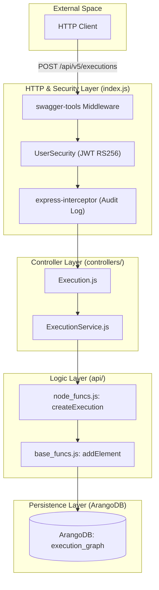
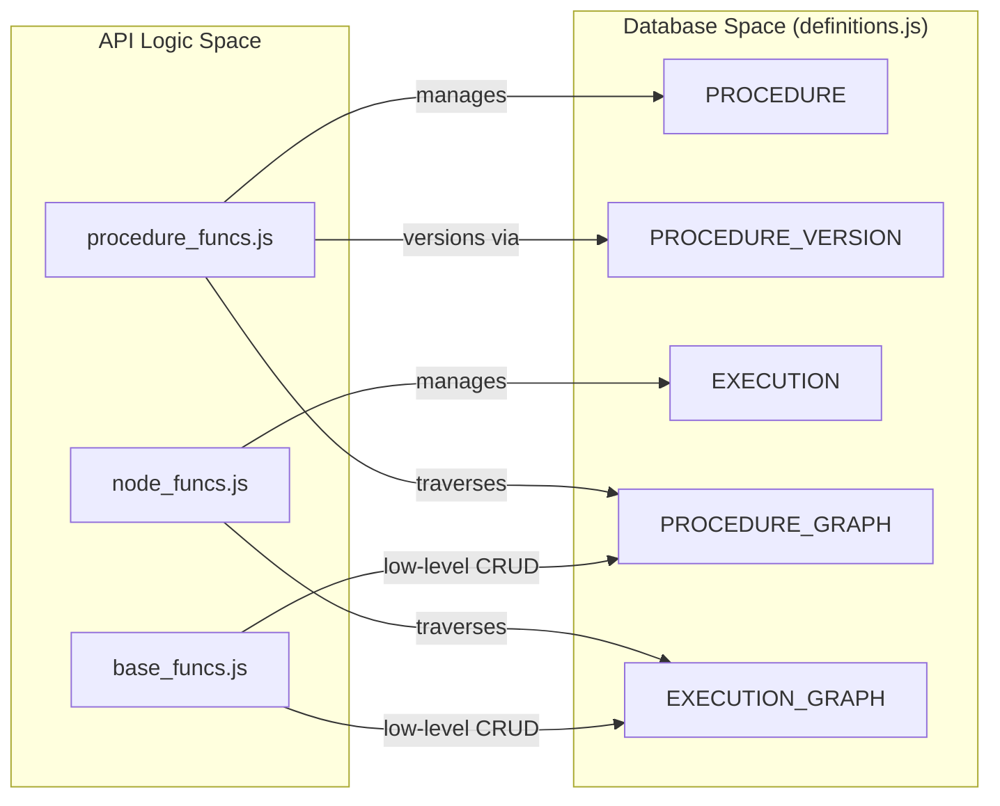

# Page: Architecture Overview

# Architecture Overview

Relevant source files

The following files were used as context for generating this wiki page:

- [api/swagger.yaml](api/swagger.yaml)
- [config.js](config.js)
- [definitions.js](definitions.js)
- [index.js](index.js)

The Ingenium Archive Service is built on a layered architecture that transitions from high-level HTTP RESTful interfaces to low-level graph database operations in ArangoDB. The system is designed to handle complex hierarchical data for procedures and executions, utilizing a "Controller-Service-Logic" pattern.

## System Layering and Data Flow

The service follows a strict downward dependency flow:
1.  **HTTP Layer (Express/Swagger):** Handles incoming requests, performs JWT validation, and routes requests based on the OpenAPI specification [api/swagger.yaml:1-41]().
2.  **Controller Layer (`controllers/`):** Receives requests from the router. Controllers (e.g., `Execution.js`) delegate business logic to their corresponding Service files (e.g., `ExecutionService.js`) [index.js:135-138]().
3.  **API Logic Layer (`api/`):** Contains the core business rules. This is split into `base_funcs.js` (DB primitives), `node_funcs.js` (Execution/Venue logic), and `procedure_funcs.js` (Procedure authoring/versioning) [index.js:12-13]().
4.  **Database Layer (ArangoDB):** Persists data in specialized collections and manages relationships through named graphs like `execution_graph` and `procedure_graph` [definitions.js:14-28]().

### Request Lifecycle Diagram
The following diagram illustrates how a request (e.g., `POST /executions`) flows through the system entities.

**Diagram: Request Processing Pipeline**

**Sources:** [index.js:25-150](), [api/swagger.yaml:43-50](), [definitions.js:15-28]()

---

## Core Components

### Entry Point and Wiring (`index.js`)
The `index.js` file serves as the application bootstrap. It performs the following critical tasks:
*   **Database Initialization:** Calls `base_funcs.init_db()` to ensure collections and graphs exist before starting the server [index.js:25-26]().
*   **Middleware Integration:** Configures `body-parser` with high limits (500MB) to support large procedure/execution imports [index.js:31-32]().
*   **Swagger Integration:** Uses `swagger-tools` to initialize metadata, security, and routing based on the `api/swagger.yaml` definition [index.js:145-149]().

### Authentication Middleware
The system implements a `UserSecurity` scheme using JWT with RS256 asymmetric signing.
*   **Public Key:** The `PUBLIC_PEM` is loaded from environment variables via `config.js` [config.js:12]().
*   **Scope Validation:** The middleware extracts `scopes` from the decoded JWT and compares them against the `required_scopes` defined for the specific endpoint in the Swagger file [index.js:168-181]().
*   **Bypass:** Endpoints with an empty scope list (like `/health`) bypass token checks [index.js:154-157]().

### Audit Logging Interceptor
A global `express-interceptor` captures all mutating requests (`POST`, `PUT`, `PATCH`, `DELETE`) [index.js:34-45]().
*   **Identity Extraction:** It parses the `user_name` from either the Bearer token or Basic auth [index.js:71-79]().
*   **Context Capture:** It automatically extracts `execution_id`, `procedure_id`, and `elem_id` from request parameters or the body to provide rich context in the logs [index.js:94-105]().
*   **Output:** Logs are emitted via `winston` (as `base_funcs.log`) in JSON format, including the status code and any error data [index.js:122-127]().

**Sources:** [index.js:34-131](), [index.js:149-190](), [config.js:12]()

---

## Data Architecture Mapping

The service maps complex hierarchical procedure and execution structures into a graph database. The `definitions.js` file acts as the single source of truth for collection and graph names used across the logic layers.

| System Name | Code Entity (Collection/Graph) | Purpose |
| :--- | :--- | :--- |
| **Execution Elements** | `element` | Nodes representing steps, sections, or paragraphs in an execution [definitions.js:7](). |
| **Procedure Elements** | `procedureElement` | Nodes for procedure templates [definitions.js:20](). |
| **Step Ordering** | `stepOrder` / `procedureStepOrder` | Edge collections defining the sequence of elements [definitions.js:8, 21](). |
| **Execution Graph** | `execution_graph` | Named graph for traversing execution hierarchies [definitions.js:15](). |
| **Procedure Graph** | `procedure_graph` | Named graph for traversing procedure versions [definitions.js:28](). |

**Diagram: Entity Relationship and Logic Mapping**

**Sources:** [definitions.js:1-28](), [index.js:12-13](), [api/swagger.yaml:192]()

---

## Configuration Management
Configuration is centralized in `config.js`, which aggregates environment variables for:
*   **Database Connectivity:** `ARANGODBURL`, `ARANGO_ROOT_PASSWORD`, and `ARANGO_USER` [config.js:7-9]().
*   **Naming Conventions:** Prefixes for IDs (e.g., `clipper-ingenium-` for executions) [config.js:10-11]().
*   **Security:** `PUBLIC_PEM` for JWT verification [config.js:12]().
*   **Version Tracking:** Extracts the service version from the Docker image tag [config.js:4]().

**Sources:** [config.js:1-12]()
