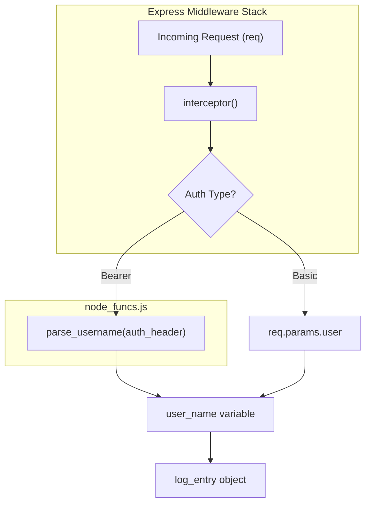
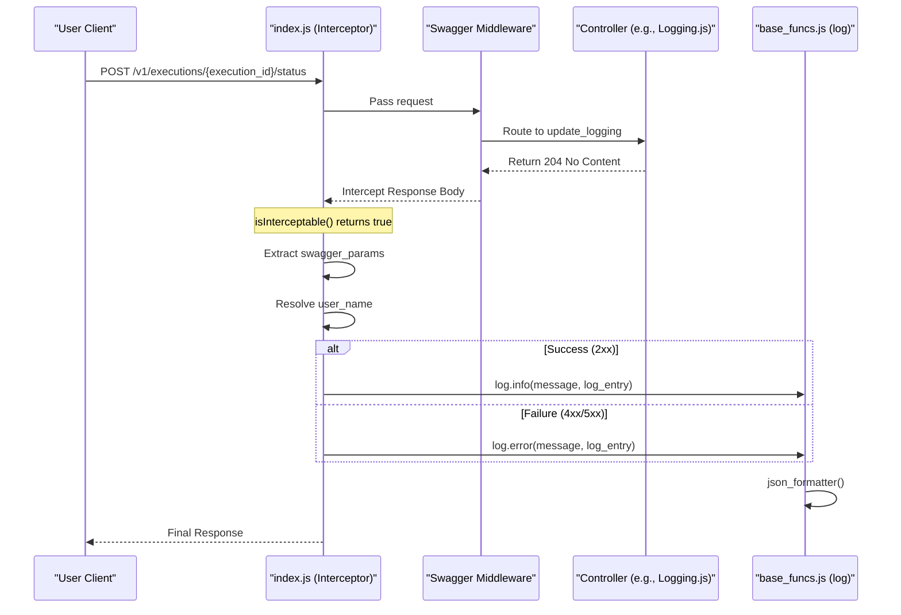

# Page: Audit Logging Middleware

# Audit Logging Middleware

<details>
<summary>Relevant source files</summary>

The following files were used as context for generating this wiki page:

- [api/base_funcs.js](api/base_funcs.js)
- [controllers/Logging.js](controllers/Logging.js)
- [controllers/LoggingService.js](controllers/LoggingService.js)
- [index.js](index.js)

</details>


The Ingenium Archive Service implements an audit logging mechanism using an Express interceptor. This middleware captures every mutating API call (POST, PUT, PATCH, and DELETE) to ensure a complete audit trail of changes to procedures, executions, and system configurations. It extracts metadata from the request context and the Swagger specification to produce structured JSON logs via the Winston logging library.

## Implementation Overview

The middleware is implemented in `index.js` using the `express-interceptor` package. It is registered early in the Express application stack to wrap the response cycle of API endpoints [index.js:34-131]().

### Interceptor Logic Flow

The interceptor consists of two primary functions: `isInterceptable` and `intercept`.

1.  **`isInterceptable`**: Determines if the current request should be logged. It returns `true` if the HTTP method is `POST`, `PUT`, `PATCH`, or `DELETE`, and if the request has been successfully matched to a Swagger API path [index.js:36-46]().
2.  **`intercept`**: Executes after the response has been generated. It captures the response body, extracts user identity, identifies relevant entity IDs (like `execution_id` or `procedure_id`), and sends the structured data to the `base_funcs.log` utility [index.js:48-129]().

### Data Extraction and Mapping

The middleware extracts several key pieces of information to build the audit log entry:

| Field | Source | Description |
| :--- | :--- | :--- |
| `user_name` | Authorization Header | Extracted from JWT (Bearer) or Basic auth [index.js:68-80](). |
| `event` | `req.swagger.operation.operationId` | The unique ID of the API operation defined in `swagger.yaml` [index.js:111-111](). |
| `execution_id` | `swagger_params` or `req.body` | The ID of the execution being modified [index.js:94-99](). |
| `procedure_id` | `swagger_params` | The ID of the procedure being modified [index.js:103-103](). |
| `elem_id` | `swagger_params` | The specific element ID (step, section, etc.) involved [index.js:104-104](). |
| `data` | Response Body | Captured only on error (HTTP 4xx or 5xx) to assist in debugging [index.js:122-124](). |

**Sources:** [index.js:34-131](), [api/base_funcs.js:112-117]()

## User Identification

The middleware supports two methods of user identification from the `Authorization` header:

*   **JWT (Bearer Token)**: The middleware calls `node_funcs.parse_username()` to decode the token and extract the user identity [index.js:71-76]().
*   **Basic Auth**: It attempts to retrieve the user from `req.params.user` if basic authentication is detected [index.js:77-79]().

### Identity Extraction Diagram

This diagram shows how the `index.js` interceptor interacts with `node_funcs.js` to resolve the `user_name`.

"User Identity Extraction"

**Sources:** [index.js:68-80](), [api/node_funcs.js:1-10]() (implied reference to parse_username)

## Log Format and Winston Integration

Logs are processed by a custom `json_formatter` defined in `api/base_funcs.js`. This formatter ensures that every log entry is a valid JSON object, which is essential for ingestion by log aggregation tools.

### JSON Log Structure

The formatter transforms the log entry into the following JSON structure:

```json
{
  "timestamp": "2023-10-27T10:00:00.000Z",
  "level": "INFO",
  "message": "Update an execution status",
  "user_name": "jdoe",
  "service": "archive_ing",
  "event": "updateExecutionStatus",
  "execution_id": "exec-123",
  "procedure_id": "proc-456"
}
```

### Logging Configuration

The logger is configured with:
*   **Levels**: Custom levels including `critical`, `error`, `warning`, `info`, `debug`, and `trace` [api/base_funcs.js:61-65]().
*   **Transports**: Always logs to `Console`. If the `LOG_FILE_PATH` environment variable is set, it also logs to a rotating `File` transport [api/base_funcs.js:100-110]().
*   **Format**: Combines `splat`, `simple`, and the custom `json_formatter` [api/base_funcs.js:115-115]().

**Sources:** [api/base_funcs.js:61-117]()

## Request Interception Process

The following diagram bridges the "Natural Language Space" of an API request to the "Code Entity Space" of the interceptor implementation.

"API Mutation Interception"

**Sources:** [index.js:34-131](), [controllers/Logging.js:11-13](), [api/base_funcs.js:67-97]()
