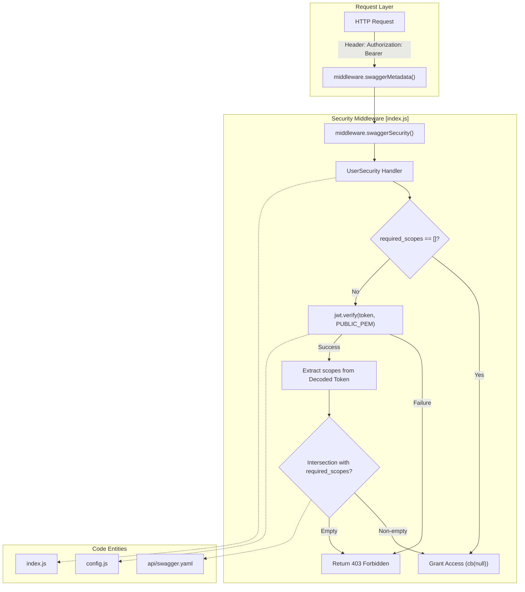
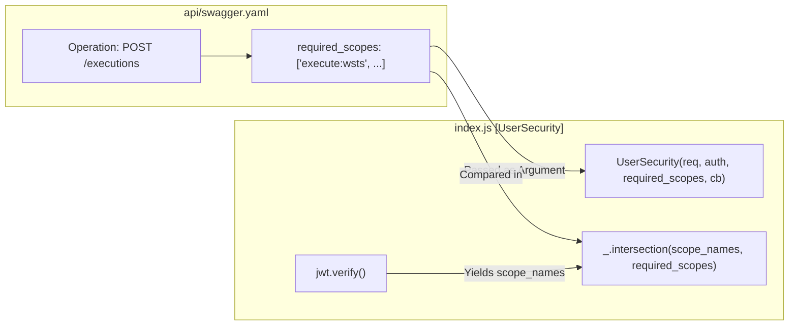

# Page: Authentication and Authorization

# Authentication and Authorization

Relevant source files

The following files were used as context for generating this wiki page:

- [api/swagger.yaml](api/swagger.yaml)
- [config.js](config.js)
- [index.js](index.js)

This page describes the security implementation for the Ingenium Archive Service. The service utilizes a **JWT RS256 bearer-token** flow for authenticating requests and an RBAC (Role-Based Access Control) model for authorizing operations based on scopes defined in the OpenAPI specification.

## Overview of Authentication Flow

The authentication mechanism is integrated into the Express application via `swagger-tools` middleware. Every request targeting a protected endpoint must include an `Authorization` header containing a JSON Web Token (JWT).

### Data Flow Diagram: Token Validation
This diagram illustrates how a request is processed from the `Authorization` header to the final permission check.

**Sources:**
- `index.js` logic for `UserSecurity` [index.js:149-191]()
- `config.js` for `public_pem` [config.js:12-12]()
- `api/swagger.yaml` for security definitions [api/swagger.yaml:15-36]()

---

## Configuration and Public Key (RS256)

The service uses the **RS256** (RSA Signature with SHA-256) algorithm, which is an asymmetric signing algorithm. This requires a public key to verify tokens that were signed by an external Identity Provider (IdP).

- **Configuration**: The public key is loaded from the `PUBLIC_PEM` environment variable via `config.js` [config.js:12-12]().
- **Implementation**: Inside `index.js`, the `jwt.verify` function uses this `public_pem` to validate the token's signature [index.js:168-170]().

| Variable | Source | Description |
| :--- | :--- | :--- |
| `public_pem` | `process.env.PUBLIC_PEM` | The RSA public key in PEM format used to verify JWT signatures. |
| `algorithms` | Hardcoded `['RS256']` | The specific algorithm enforced during verification. |

**Sources:**
- `config.js` [config.js:12-12]()
- `index.js` [index.js:23-23](), [index.js:168-170]()

---

## Scopes and Authorization

The service maps JWT "scopes" to API operations. These scopes are defined in the `securityDefinitions` section of the Swagger file.

### Swagger Definition
The service uses a "practical get-around" by defining the security type as `oauth2` with an `implicit` flow in the Swagger spec to enable scope-based validation within `swagger-tools`, even though the underlying transport is a standard JWT Bearer token [api/swagger.yaml:16-22]().

### Scope Extraction and Matching
1. **Extraction**: The middleware extracts the `scopes` array from the decoded JWT payload. It handles both simple string arrays and arrays of objects (e.g., `{ scope: "admin" }`) [index.js:177-179]().
2. **Intersection**: It performs a set intersection between the scopes present in the token and the `required_scopes` defined for that specific route in `swagger.yaml` [index.js:181-182]().
3. **Grant/Deny**: If the intersection is non-empty (the user has at least one required scope), access is granted via `cb(null)`. Otherwise, a `403 Forbidden` response is returned [index.js:184-189]().

### Code-to-Spec Mapping
This diagram shows how code entities in `index.js` interact with definitions in `swagger.yaml`.

**Sources:**
- `api/swagger.yaml` security scopes [api/swagger.yaml:25-35]()
- `index.js` scope intersection logic [index.js:179-184]()

---

## Public Endpoints and Bypass

Certain endpoints, such as health checks, must be accessible without a valid JWT. The system implements a special bypass for these cases.

- **Mechanism**: If a route is defined in `swagger.yaml` with an empty security scope list (`[]`), the `UserSecurity` middleware skips token verification entirely [index.js:155-157]().
- **Example**: The `/health` endpoint (though truncated in provided snippets) typically utilizes this bypass to allow monitoring tools to check service status without credentials.

**Sources:**
- `index.js` bypass logic [index.js:155-157]()

---

## Summary of Security Scopes

The following table lists key scopes defined in the system and their intended roles:

| Scope | Description |
| :--- | :--- |
| `admin` | Administrative permissions (venues, users). |
| `execute:*` | Permission to run procedures on specific venue types (wsts, testbed, sit, other). |
| `author` | Permission for authoring procedures. |
| `imcm` | Information Management Configuration Management (releasing procedures). |
| `basic` | Basic level permissions, such as adding comments. |

**Sources:**
- `api/swagger.yaml` [api/swagger.yaml:26-35]()
