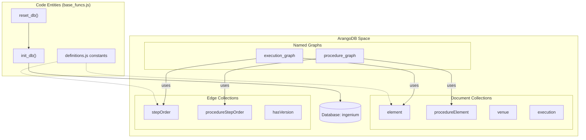
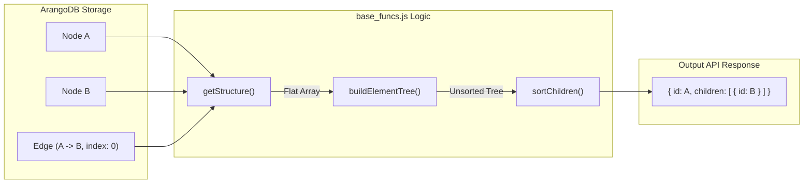

# Page: base_funcs.js — Database Utilities and Graph Primitives

# base_funcs.js — Database Utilities and Graph Primitives

Relevant source files

The following files were used as context for generating this wiki page:

- [api/base_funcs.js](api/base_funcs.js)
- [definitions.js](definitions.js)
- [drop_db.js](drop_db.js)
- [reset_db.js](reset_db.js)

`base_funcs.js` serves as the foundational data access and utility layer for the Ingenium Archive Service. It encapsulates ArangoDB connection management, schema initialization, core graph traversal algorithms, and the fundamental CRUD operations for elements. It also provides the system-wide logging and error handling infrastructure.

### 1. Database Initialization and Lifecycle

The module manages the lifecycle of the ArangoDB instance, including the creation of databases, collections, and named graphs. The schema is defined in `definitions.js` and applied through `init_db`.

#### Key Functions
*   **`init_db()`**: Checks for the existence of the database specified in `config.js`. If it doesn't exist, it creates the database, all required document/edge collections, and the three primary named graphs (`execution_graph`, `history_graph`, `procedure_graph`) [api/base_funcs.js:1010-1127]().
*   **`reset_db()`**: Drops the existing database and calls `init_db()` to perform a clean setup [api/base_funcs.js:1001-1008](). This is frequently used by the `reset_db.js` utility script [reset_db.js:3-8]().
*   **`sanitize_internal_attrs()`**: A utility to strip ArangoDB-specific metadata (`_id`, `_key`, `_rev`) from objects before returning them via the API [api/base_funcs.js:164-170]().

#### Database Setup Flow
The following diagram illustrates the relationship between the initialization logic and the ArangoDB entities.

**Database Entity Mapping**

Sources: [api/base_funcs.js:38-60](), [api/base_funcs.js:1010-1127](), [definitions.js:4-28]()

---

### 2. Element CRUD Operations

Elements (Steps, Sections, Paragraphs, etc.) are the primary nodes in both Procedure and Execution graphs. `base_funcs.js` provides low-level primitives to manipulate these nodes and their relationships.

*   **`addElement(collection, element, parent_id)`**: Creates a new element. If a `parent_id` is provided, it creates an edge in the corresponding `stepOrder` or `procedureStepOrder` collection to establish the hierarchy [api/base_funcs.js:400-445]().
*   **`deleteElement(collection, edge_collection, element_id)`**: Performs a recursive deletion. It finds all descendants of the target element and removes both the nodes and their associated edges [api/base_funcs.js:498-540]().
*   **`moveElement(collection, edge_collection, element_id, new_parent_id, index)`**: Updates the graph structure by removing the old parent edge and creating a new one. It also triggers `update_number` to maintain the logical sequence [api/base_funcs.js:450-494]().
*   **`copyElement(collection, edge_collection, element_id, new_parent_id, index)`**: Deep-copies an element and its entire subtree, generating new UUIDs for all cloned entities [api/base_funcs.js:542-585]().

Sources: [api/base_funcs.js:400-585]()

---

### 3. Graph Traversal and Tree Reconstruction

Since ArangoDB stores the hierarchy as flat nodes connected by edges, `base_funcs.js` is responsible for reconstructing the nested JSON tree structure required by the frontend.

#### The Reconstruction Pipeline
1.  **`getStructure(graph_name, start_vertex_id)`**: Executes an AQL (ArangoDB Query Language) traversal. It uses a `FOR vertex, edge, path IN 0..100 OUTBOUND` query to fetch all descendants in a flat array [api/base_funcs.js:640-675]().
2.  **`buildElementTree(flat_list)`**: Converts the flat array of vertices and edges into a nested object. It uses a map-based approach to associate children with their parents based on the `_from` and `_to` attributes of the edges [api/base_funcs.js:710-755]().
3.  **`sortChildren(node)`**: Recursively ensures that the `children` array of every node is sorted according to the `index` property stored on the edges [api/base_funcs.js:760-775]().

**Data Flow: Graph to Tree**

Sources: [api/base_funcs.js:640-775]()

---

### 4. Element Numbering Logic (`update_number`)

The `update_number` function is a critical utility that maintains the "Step Number" (e.g., 1.1, 1.2.1) throughout the hierarchy.

*   **Trigger**: It is called whenever an element is added, moved, or deleted [api/base_funcs.js:440](), [api/base_funcs.js:490]().
*   **Implementation**: It performs a depth-first traversal of the subtree. For each child at a given level, it concatenates the parent's number with the child's index (e.g., parent "2" + index "1" = "2.1") [api/base_funcs.js:800-840]().
*   **Persistence**: The resulting string is saved directly into the `number` attribute of the element document in the database [api/base_funcs.js:835]().

Sources: [api/base_funcs.js:800-840]()

---

### 5. Logging and Error Utilities

The service uses `winston` for structured JSON logging, configured to handle different environments and log levels.

#### Logging Configuration
*   **Custom Levels**: Supports `critical`, `error`, `warning`, `info`, `debug`, and `trace` [api/base_funcs.js:61-65]().
*   **`json_formatter`**: A custom formatter that ensures all log entries include a timestamp, uppercase level, and properly inspected metadata/details. It handles circular references using `util.inspect` [api/base_funcs.js:67-97]().
*   **Transports**: Always logs to the `Console`. If `LOG_FILE_PATH` is defined in the environment, it also writes to a rotating file (max 5MB, 2 files) [api/base_funcs.js:100-110]().

#### Error Handling
*   **`push_error(message, err)`**: A standardized wrapper for generating error objects. It attempts to stringify the incoming error and ensures the output has a `message` and a `details` array, preventing circular dependencies during serialization [api/base_funcs.js:120-158]().

Sources: [api/base_funcs.js:61-158]()
