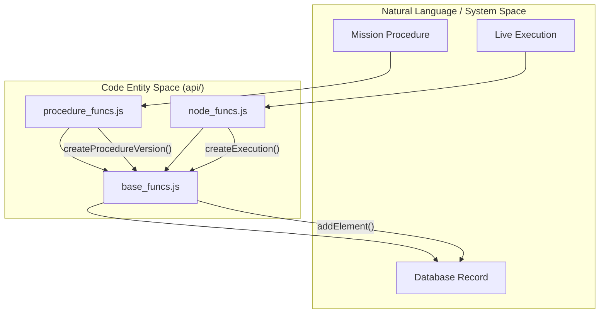
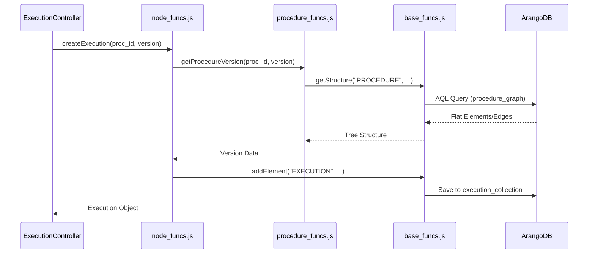

# Page: Core API Logic

# Core API Logic

Relevant source files

The following files were used as context for generating this wiki page:

- [api/base_funcs.js](api/base_funcs.js)
- [api/node_funcs.js](api/node_funcs.js)
- [api/procedure_funcs.js](api/procedure_funcs.js)

The Core API Logic layer represents the central business logic of the Ingenium Archive Service. It is divided into three primary modules located in the `api/` directory. These modules handle everything from low-level ArangoDB graph operations to high-level lifecycle management for procedures and mission executions.

### Module Interaction Overview

The three modules are designed with a clear hierarchy of concerns:
1.  **`base_funcs.js`**: Provides the foundational "Graph Primitives." It handles direct database communication, generic element CRUD, and tree traversal logic.
2.  **`node_funcs.js`**: Built on top of base functions to manage **Executions**. It handles the state of live runs, venue assignments, and the "As-Run" record.
3.  **`procedure_funcs.js`**: Built on top of base functions to manage **Procedures**. It handles authoring, versioning pipelines (SUBMIT/APPROVE/RELEASE), and template management.

The following diagram illustrates how these modules bridge the gap between high-level system concepts and the underlying code entities.

**System Concepts to Code Entity Mapping**

Sources: [api/node_funcs.js:12-13](), [api/procedure_funcs.js:9-10]()

---

### 2.1 base_funcs.js — Database Utilities and Graph Primitives

`base_funcs.js` is the lowest level of the logic layer. It initializes the ArangoDB connection and defines the core operations for manipulating the graph. It treats every node in the system (Steps, Sections, Paragraphs) as a generic "Element."

*   **Database Setup**: Handles initialization via `init_db` and destructive resets via `reset_db` [api/base_funcs.js:1341-1400]().
*   **Element CRUD**: Functions like `addElement`, `moveElement`, and `deleteElement` manage the `element` and `procedureElement` collections [api/base_funcs.js:520-650]().
*   **Graph Traversal**: Uses AQL (ArangoDB Query Language) to reconstruct hierarchical trees from flat edge collections via `getStructure` and `buildElementTree` [api/base_funcs.js:280-350]().
*   **Logging**: Implements a unified `winston` logger with custom levels (critical, error, warning, info, debug, trace) [api/base_funcs.js:61-117]().

For details, see [base_funcs.js — Database Utilities and Graph Primitives](#2.1).

---

### 2.2 node_funcs.js — Execution Lifecycle and Venue Management

`node_funcs.js` implements the logic for "Executions"—the actual running of a procedure in a specific venue (e.g., a test bench or spacecraft).

*   **Execution Lifecycle**: Manages statuses such as `IDLE`, `RUNNING`, `PAUSED`, and `FINALIZED` [api/node_funcs.js:38-39]().
*   **Procedure Import**: The `importProcedureSection` function clones elements from a static Procedure Version into an active Execution graph, remapping UUIDs to ensure uniqueness [api/node_funcs.js:61-186]().
*   **Redlining**: Supports real-time modifications to execution steps (bluelining/redlining) via `modifyElement` and `discardElements` [api/node_funcs.js:1200-1350]().
*   **Venues**: Manages the association between executions and `Venues` or `VenueGroups` [api/node_funcs.js:28-29]().

For details, see [node_funcs.js — Execution Lifecycle and Venue Management](#2.2).

---

### 2.3 procedure_funcs.js — Procedure Authoring and Versioning

`procedure_funcs.js` manages the "Procedures" library. It focuses on the authoring phase, where templates are created and matured through a formal versioning process.

*   **Versioning Pipeline**: Handles the transition of procedures through states: `createProcedureVersion` generates a new snapshot of the graph [api/procedure_funcs.js:186-250]().
*   **UUID Remapping**: When a new version is created, `_reassignTagIds` and similar utilities ensure that the new version's elements are decoupled from the previous version [api/procedure_funcs.js:196-209]().
*   **Integrity Checks**: Includes logic to prevent circular references in `PROCEDURE_SECTION` elements [api/procedure_funcs.js:450-500]().
*   **Collaboration**: Manages comments and conversations attached to specific procedure elements [api/procedure_funcs.js:1200-1250]().

For details, see [procedure_funcs.js — Procedure Authoring and Versioning](#2.3).

---

### Business Logic Flow Diagram

This diagram shows how a user request flows through the logic modules to perform a complex task, such as starting an execution from a procedure.

**Execution Initialization Flow**

Sources: [api/node_funcs.js:46-48](), [api/procedure_funcs.js:120-122](), [api/base_funcs.js:280-285]()
