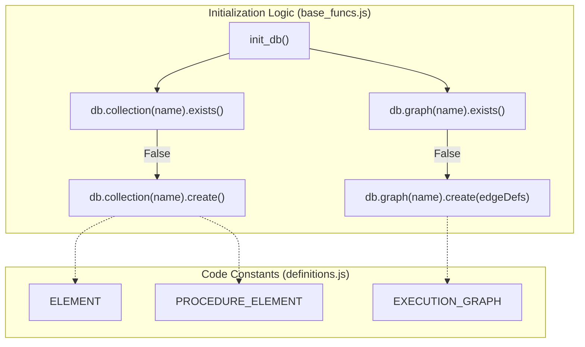
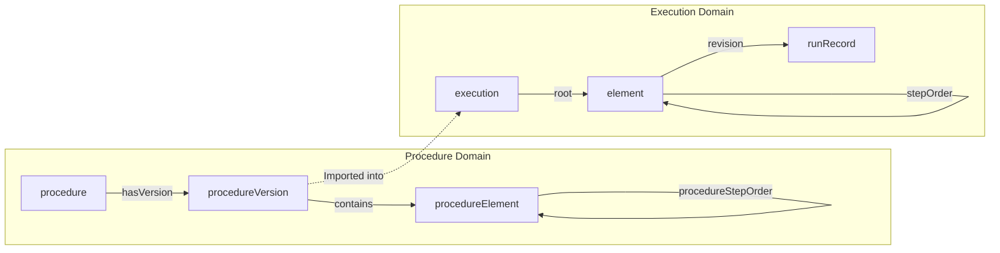
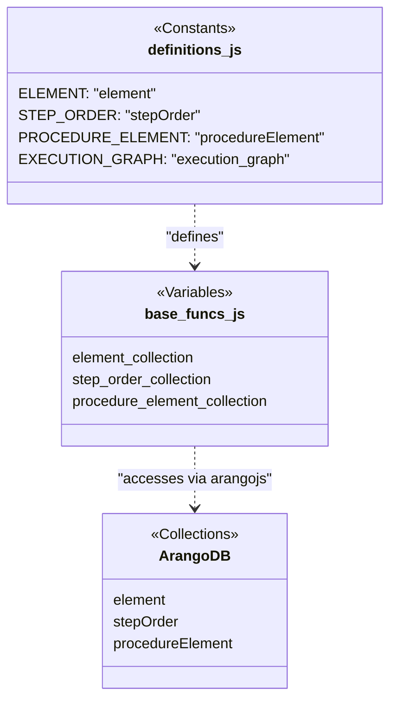

# Page: Data Model: Collections and Graphs

# Data Model: Collections and Graphs

Relevant source files

The following files were used as context for generating this wiki page:

- [api/base_funcs.js](api/base_funcs.js)
- [data.json](data.json)
- [definitions.js](definitions.js)

This page documents the ArangoDB schema for the Ingenium Archive Service. The data model is partitioned into two primary domains: **Procedures** (authoring and versioning) and **Executions** (runtime instances and history). The schema is defined in `definitions.js` and instantiated during database initialization in `base_funcs.js`.

## Database Initialization

The database schema is programmatically defined and initialized. The `base_funcs.init_db()` function is responsible for creating all document collections, edge collections, and named graphs if they do not already exist.

**Key Initialization Functions:**
*   `base_funcs.init_db()`: Iterates through defined collections and graphs to ensure the ArangoDB state matches the codebase requirements [api/base_funcs.js:314-436]().
*   `base_funcs.reset_db()`: Drops the existing database and calls `init_db()` to start from a clean state [api/base_funcs.js:438-446]().

### Natural Language to Code Entity Mapping: Initialization
The following diagram shows how the system's conceptual collections map to the variables and constants used in the initialization logic.

**Database Setup Flow**

Sources: [api/base_funcs.js:314-436](), [definitions.js:1-28]()

---

## Execution Domain Collections

The Execution domain handles the lifecycle of a procedure being run in a specific venue. It tracks real-time status, step results, and redline/blueline modifications.

| Collection Name | Type | Description |
| :--- | :--- | :--- |
| `element` | Document | Stores the hierarchy of an execution (Sections, Steps, Paragraphs) [definitions.js:7](). |
| `stepOrder` | Edge | Defines the parent-child and sibling relationships between execution elements [definitions.js:8](). |
| `execution` | Document | Metadata for a specific procedure run instance (e.g., status, start time) [definitions.js:10](). |
| `runRecord` | Document | Captures the history of results for a specific step (multiple runs per step) [definitions.js:12](). |
| `venue` | Document | Defines a physical or virtual location where an execution occurs [definitions.js:5](). |
| `venueGroup` | Document | Logical grouping of venues [definitions.js:4](). |
| `execution_id_gen` | Document | A single-document collection used to generate auto-incrementing IDs [definitions.js:11](). |

Sources: [definitions.js:4-12](), [api/base_funcs.js:40-48]()

---

## Procedure Domain Collections

The Procedure domain handles the authoring of procedure templates, version control, and the "Working Copy" vs. "Released" lifecycle.

| Collection Name | Type | Description |
| :--- | :--- | :--- |
| `procedure` | Document | Top-level container for a procedure series [definitions.js:19](). |
| `procedureVersion` | Document | Metadata for a specific version (e.g., version number, status: DRAFT/RELEASED) [definitions.js:22](). |
| `procedureElement` | Document | The structural elements (Steps, Sections) belonging to a procedure version [definitions.js:20](). |
| `procedureStepOrder` | Edge | The graph edges defining the hierarchy of procedure elements [definitions.js:21](). |
| `hasVersion` | Edge | Links a `procedure` document to its various `procedureVersion` documents [definitions.js:23](). |
| `procedureLabel` | Document | Tags/Labels that can be applied to procedures [definitions.js:25](). |

Sources: [definitions.js:19-25](), [api/base_funcs.js:51-56]()

---

## Named Graphs and Edge Definitions

The service utilizes ArangoDB's Graph module to manage complex hierarchies. Three named graphs are defined in `base_funcs.init_db()`.

### 1. procedure_graph
Manages the template structure for procedure authoring.
*   **Edge Collection**: `procedureStepOrder` [definitions.js:21]()
*   **From Nodes**: `procedureElement` [definitions.js:20]()
*   **To Nodes**: `procedureElement` [definitions.js:20]()

### 2. execution_graph
Manages the active runtime structure of an execution.
*   **Edge Collection**: `stepOrder` [definitions.js:8]()
*   **From Nodes**: `element` [definitions.js:7]()
*   **To Nodes**: `element` [definitions.js:7]()

### 3. history_graph
Used to track the relationship between execution elements and their historical `runRecord` entries.
*   **Edge Collection**: `revision` [definitions.js:9]()
*   **From Nodes**: `element` [definitions.js:7]()
*   **To Nodes**: `runRecord` [definitions.js:12]()

**Graph Relationship Diagram**

Sources: [api/base_funcs.js:397-434](), [definitions.js:14-28]()

---

## Entity Mapping: Code to Database

This diagram bridges the internal JavaScript variables used in the API logic to the physical ArangoDB collections.

**Logical to Physical Mapping**

Sources: [api/base_funcs.js:40-56](), [definitions.js:1-28]()

## Data Flow: Element Modification

When an element is modified (e.g., during a Redline operation in an execution), the system follows a specific pattern of status updates defined in `definitions.js`.

1.  **Original State**: Elements start as `PMS.ORIGINAL` [definitions.js:33]().
2.  **Modifying**: During an active edit, status becomes `PMS.MODIFYING` [definitions.js:35]().
3.  **Completion**: Upon saving, the old element is marked `PMS.MODIFYING_OLD` and the new element becomes `PMS.MODIFIED` [definitions.js:34-36]().

Sources: [definitions.js:31-39](), [api/node_funcs.js:754-810]() (referenced for context on PMS usage).
