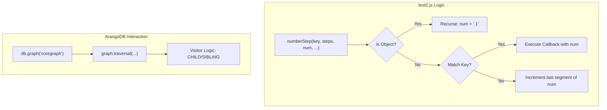

# Page: Database Administration Scripts

# Database Administration Scripts

Relevant source files

The following files were used as context for generating this wiki page:

- [check_elem_order.js](check_elem_order.js)
- [drop_db.js](drop_db.js)
- [reset_db.js](reset_db.js)
- [test2.js](test2.js)

Database administration scripts are standalone utility files used to manage the lifecycle of the ArangoDB instance, validate data integrity, and perform low-level maintenance tasks. These scripts interact directly with the database using the `arangojs` driver and the core logic defined in the `api/` directory.

## Core Lifecycle Scripts

These scripts are used to initialize, reset, or completely remove the database instance. They are primarily used during development, CI/CD pipelines, and initial deployment.

### reset_db.js
The `reset_db.js` script is a wrapper for the `base_funcs.reset_db()` function. It performs a destructive reset of the database by dropping all existing collections and re-initializing them according to the schema defined in the codebase.

*   **Implementation**: It imports `api/base_funcs.js` and invokes the `reset_db` method [reset_db.js:1-3]().
*   **Data Flow**: 
    1.  The script triggers `base_funcs.reset_db()`.
    2.  `base_funcs.reset_db()` drops the database named in `config.database_name`.
    3.  It then calls `init_db()` to recreate the database, collections, and graphs.
*   **Usage**: `node reset_db.js`

### drop_db.js
The `drop_db.js` script is a utility to completely remove the database from the ArangoDB server. Unlike `reset_db.js`, it does not perform re-initialization.

*   **Implementation**: It connects to the ArangoDB server using credentials defined in the script [drop_db.js:10-13](), lists all databases, and drops the one matching `database_name` (defaulting to 'ingenium') [drop_db.js:15-19]().
*   **Usage**: `node drop_db.js`

**Sources:** [reset_db.js:1-9](), [drop_db.js:9-25]()

---

## Data Integrity and Validation

As the Archive Service manages complex hierarchical graphs (Procedures and Executions), maintaining the integrity of element ordering and numbering is critical.

### check_elem_order.js
This script validates the integrity of the element hierarchy and their assigned "numbers" (e.g., 1.2.1) against their actual physical order in the database edges.

**Key Components:**
*   **Number Parsing**: It contains logic to split and pad hierarchical numbers (e.g., "1-2.10") into sortable segments to ensure "1.10" correctly follows "1.9" [check_elem_order.js:18-38]().
*   **Validation Logic (`get_off_elems`)**:
    1.  Performs an AQL traversal starting from a root (Execution or Procedure) [check_elem_order.js:190-199]().
    2.  Calculates a "derived number" based on the `idx` property stored on edges [check_elem_order.js:237-238]().
    3.  Compares the `derived_number` with the `number` attribute stored on the vertex [check_elem_order.js:254-255]().
    4.  Identifies "off elements" where the stored number does not match the graph position [check_elem_order.js:261-272]().

**Entity Association Diagram: Order Validation**

| Natural Language Concept | Code Entity | File |
| :--- | :--- | :--- |
| **Edge Index** | `rel.e.idx` | [check_elem_order.js:241]() |
| **Stored Number** | `rel.v.number` | [check_elem_order.js:246]() |
| **Root ID** | `target_parent_idd` | [check_elem_order.js:180]() |
| **Graph Traversal** | `db.query` (AQL) | [check_elem_order.js:186]() |

**Sources:** [check_elem_order.js:18-47](), [check_elem_order.js:176-210](), [check_elem_order.js:237-272]()

---

## Experimental and Legacy Scripts

### test2.js
`test2.js` is a legacy development script used for prototyping graph traversals and complex numbering logic outside of the main API structure.

*   **Prototyping**: It includes custom visitor functions for ArangoDB traversals that attempt to calculate element numbers on-the-fly based on relationship types (`CHILD` vs `SIBLING`) [test2.js:33-62]().
*   **Step Numbering**: Contains a recursive `numberStep` function to navigate through a `step_list` (a JSON representation of procedure steps) and assign hierarchical dot-notation numbers [test2.js:114-171]().
*   **List Manipulation**: Implements `addToList`, which prototypes how elements are moved or replaced within the JSON structure of a procedure [test2.js:199-234]().

**Data Flow: Legacy Numbering Prototype**

**Sources:** [test2.js:22-31](), [test2.js:40-62](), [test2.js:114-125](), [test2.js:160-171]()

---

## Summary Table of Scripts

| Script | Primary Function | Core Code Dependency |
| :--- | :--- | :--- |
| `reset_db.js` | Drops and recreates the entire database schema. | `base_funcs.reset_db` |
| `drop_db.js` | Deletes the database without recreation. | `arangojs` driver |
| `check_elem_order.js` | Validates that element numbers match their graph indices. | `base_funcs.get_root_specific_variables` |
| `test2.js` | Legacy/Experimental playground for numbering and traversals. | `arangojs` driver |

**Sources:** [reset_db.js:1-3](), [drop_db.js:11-18](), [check_elem_order.js:176-180](), [test2.js:15-20]()
