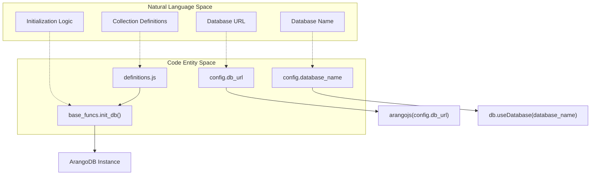
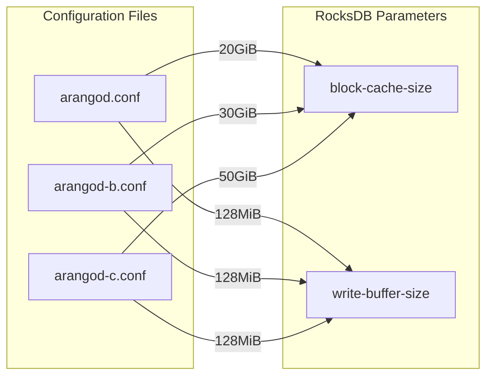

# Page: Database Layer

# Database Layer

Relevant source files

The following files were used as context for generating this wiki page:

- [api/base_funcs.js](api/base_funcs.js)
- [arangod-b.conf](arangod-b.conf)
- [arangod-c.conf](arangod-c.conf)
- [arangod.conf](arangod.conf)
- [definitions.js](definitions.js)

The Ingenium Archive Service utilizes **ArangoDB**, a multi-model graph database, to store and manage complex hierarchical data structures for procedures and executions. The database layer is responsible for maintaining the integrity of procedure versions, execution runs, and the parent-child relationships between various elements (steps, sections, etc.).

### Database Architecture

The service interacts with ArangoDB using the `arangojs` driver [api/base_funcs.js:7-7](). It organizes data into document collections and manages relationships through edge collections and named graphs. This approach allows for efficient recursive traversals of procedure and execution trees.

#### Natural Language to Code Entity Mapping: Database Setup

The following diagram illustrates how high-level database concepts map to specific code entities and configurations within the service.

**Database Initialization and Connectivity**

Sources: [api/base_funcs.js:12-14](), [api/base_funcs.js:38-38](), [api/base_funcs.js:58-58](), [definitions.js:1-29]()

---

### Data Model: Collections and Graphs
The data model is split into two primary domains: **Procedures** (authoring templates) and **Executions** (active or completed runs). Each domain uses a dedicated set of collections and a named graph for traversals.

*   **Execution Collections**: Includes `element` [definitions.js:7](), `stepOrder` [definitions.js:8](), and `execution` [definitions.js:10]().
*   **Procedure Collections**: Includes `procedureElement` [definitions.js:20](), `procedureStepOrder` [definitions.js:21](), and `procedureVersion` [definitions.js:22]().
*   **Graphs**: Three main graphs are defined: `execution_graph`, `history_graph`, and `procedure_graph` [definitions.js:15-28]().

For details on the schema and edge definitions, see [Data Model: Collections and Graphs](#5.1).

Sources: [definitions.js:3-28](), [api/base_funcs.js:40-56]()

---

### ArangoDB Configuration and Docker Images
The service provides optimized ArangoDB configurations for different environments (Development, Testing, Production). These configurations primarily tune the **RocksDB** storage engine to handle large-scale graph data efficiently.

**Storage Engine Tuning**

Sources: [arangod.conf:73-75](), [arangod-b.conf:73-75](), [arangod-c.conf:73-75]()

The database is deployed via custom Dockerfiles (`Dockerfile-arango*`) that bake these configurations into the image. For details on tuning parameters and image management, see [ArangoDB Configuration and Docker Images](#5.2).

---

### Database Administration Scripts
A suite of administrative scripts is provided in the root and `tests/db/` directories to manage the database lifecycle. These scripts leverage the primitives defined in `base_funcs.js`.

*   **Lifecycle Management**: `reset_db.js` and `drop_db.js` are used to clear and re-initialize the environment.
*   **Integrity Checks**: `check_elem_order.js` ensures that the linked-list structure of steps within a procedure or execution remains valid.
*   **Development Utilities**: Standalone scripts like `etest.js` and `ptest.js` allow for targeted testing of database operations outside the Express API context.

For details on usage and script descriptions, see [Database Administration Scripts](#5.3).

Sources: [api/base_funcs.js:1-12]() (Note: Scripts utilize these exports).
