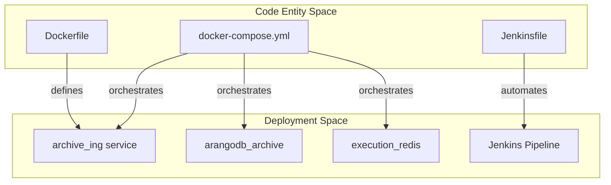
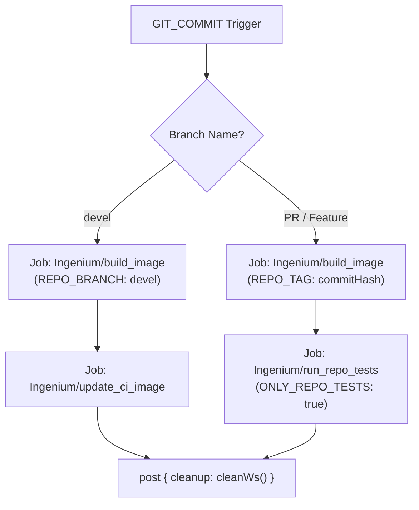

# Page: Deployment and CI/CD

# Deployment and CI/CD

Relevant source files

The following files were used as context for generating this wiki page:

- [Dockerfile](Dockerfile)
- [Jenkinsfile](Jenkinsfile)
- [docker-compose.yml](docker-compose.yml)

This section provides a high-level overview of how the Ingenium Archive Service is containerized, orchestrated, and integrated into the automated delivery pipeline. The service utilizes Docker for environment consistency and a declarative Jenkins pipeline for continuous integration and image management.

## Containerization Strategy

The application is containerized using a standard `Dockerfile` that ensures a reproducible runtime environment. It leverages a node base image and follows security best practices by running under a non-privileged user.

### Application Dockerfile
The `Dockerfile` defines the build process for the `archive_ing` service. It uses a specific Node.js version from the JPL Artifactory, installs dependencies via `npm ci` for deterministic builds, and sets the entrypoint to the application's `index.js`.

*   **Base Image**: `cae-artifactory.jpl.nasa.gov:17001/node:16.17.0` [[Dockerfile:1-1]()]
*   **Security**: The container switches to `USER node` before execution to minimize the attack surface [[Dockerfile:5-5]()]
*   **Entrypoint**: `node index.js` [[Dockerfile:6-6]()]

### Service Topology (Docker Compose)
For local development and integrated environments, `docker-compose.yml` defines the multi-container topology. The `archive_ing` service depends on `arangodb` and interacts with other ecosystem components like `venue_config` and `redis`.

| Service Name | Role | Image / Source |
| :--- | :--- | :--- |
| `archive_ing` | Primary API Service | `./Dockerfile` [[docker-compose.yml:16-17]()] |
| `arangodb` | Graph Database | `arangodb/arangodb` [[docker-compose.yml:4-6]()] |
| `venue_config` | Configuration Management | `dep/venue_config` [[docker-compose.yml:29-31]()] |
| `redis` | Caching/State | `redis:4` [[docker-compose.yml:42-43]()] |

For details, see [Docker Containerization](#6.1).

**Sources:**
- [Dockerfile:1-6]()
- [docker-compose.yml:3-52]()

## CI/CD Pipeline

The project uses a Jenkins declarative pipeline defined in the `Jenkinsfile`. This pipeline automates the building of images and the execution of integration tests based on the branch being processed.

### Workflow Logic
The pipeline distinguishes between the stable `devel` branch and feature/PR branches to manage how images are tagged and promoted.

*   **Devel Branch**: Triggers a full build and updates the CI image used by other services [[Jenkinsfile:13-29]()]
*   **Feature/PR Branches**: Builds a temporary image tagged with the `GIT_COMMIT` hash and runs the repository's test suite [[Jenkinsfile:35-53]()]

### Pipeline Stages and Jobs
The pipeline delegates actual work to downstream Jenkins jobs:
1.  **`Ingenium/build_image`**: Compiles the Docker image [[Jenkinsfile:15-15]()]
2.  **`Ingenium/update_ci_image`**: Promotes the image for the `devel` environment [[Jenkinsfile:24-24]()]
3.  **`Ingenium/run_repo_tests`**: Executes the integration tests against the newly built image [[Jenkinsfile:46-46]()]

For details, see [Jenkins CI/CD Pipeline](#6.2).

**Sources:**
- [Jenkinsfile:1-58]()

## Deployment Component Relationships

The following diagrams illustrate how the deployment entities in the code relate to the operational environment.

### Deployment Entity Mapping
This diagram bridges the "Code Entities" (files and services) to their roles in the "Deployment Space."

**Sources:**
- [Dockerfile:1-6]()
- [docker-compose.yml:3-52]()
- [Jenkinsfile:1-58]()

### CI/CD Logic Flow
This diagram maps the conditional logic in the `Jenkinsfile` to the resulting pipeline actions.

**Sources:**
- [Jenkinsfile:9-54]()
- [Jenkinsfile:87-91]()
