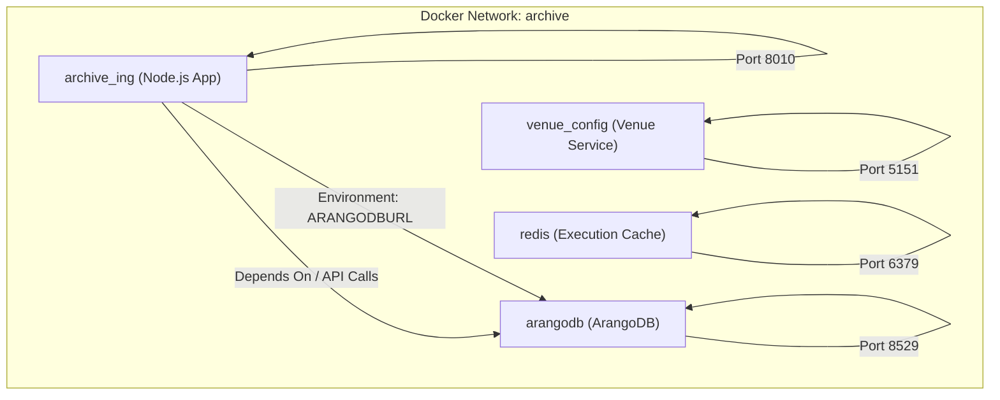
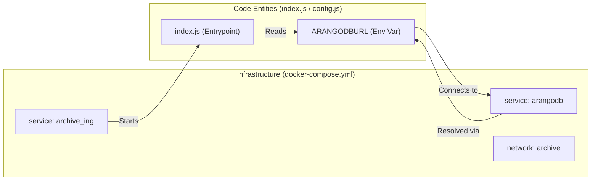

# Page: Docker Containerization

# Docker Containerization

Relevant source files

The following files were used as context for generating this wiki page:

- [Dockerfile](Dockerfile)
- [docker-compose.yml](docker-compose.yml)

This section details the containerization strategy for the Ingenium Archive Service, focusing on the application's `Dockerfile` construction and the multi-container orchestration defined in `docker-compose.yml`. The service is designed to run in a containerized environment to ensure consistency across development, testing, and production deployments.

## Application Dockerfile

The application is containerized using a `Dockerfile` that emphasizes security, reliability, and the use of approved JPL base images.

### Base Image and Environment
The build process starts from a Node.js 16.17.0 image hosted on the internal JPL CAE Artifactory `[Dockerfile:1-1]()`. This ensures that the base environment complies with institutional security and availability requirements. The working directory within the container is set to `/app` `[Dockerfile:2-2]()`.

### Dependency Management
To ensure reproducible builds, the `Dockerfile` utilizes `npm ci` `[Dockerfile:4-4]()`. Unlike `npm install`, `npm ci` (Clean Install) requires a `package-lock.json` file and provides faster, more reliable installs by deleting the `node_modules` folder and installing the exact versions specified in the lockfile.

### Security Context
Following security best practices, the container switches to a non-root user context. The `USER node` instruction `[Dockerfile:5-5]()` ensures that the application process does not have administrative privileges on the host or within the container filesystem, mitigating potential escalation vulnerabilities.

### Entrypoint
The service is initialized by executing the `index.js` file via the Node.js runtime `[Dockerfile:6-6]()`. This file serves as the main entry point, responsible for initializing the Express server and connecting to the database.

**Sources:**
- `[Dockerfile:1-6]()`

---

## Service Topology (Docker Compose)

The `docker-compose.yml` file defines the local development and testing environment, orchestrating four primary services within a dedicated bridge network named `archive` `[docker-compose.yml:53-55]()`.

### Service Interconnectivity
The following diagram illustrates the network topology and dependency requirements between the containerized services.

**Diagram: Container Network and Dependency Topology**

**Sources:**
- `[docker-compose.yml:1-55]()`

### Service Definitions

| Service Name | Image/Build Source | Purpose | Key Configurations |
| :--- | :--- | :--- | :--- |
| `archive_ing` | `./` (Local Build) | The main Ingenium Archive API service. | Depends on `arangodb`. Restarts on failure. Mounts local directory to `/opt` `[docker-compose.yml:16-28]()`. |
| `arangodb` | `arangodb/arangodb` | Primary graph database for storing procedures and executions. | Persists data to `./arangodb/data`. Root password configured via env `[docker-compose.yml:4-15]()`. |
| `venue_config` | `dep/venue_config` | External dependency for venue and logging configuration. | Mounts `./venue_stuff` for data persistence. Port 5151 `[docker-compose.yml:29-41]()`. |
| `redis` | `redis:4` | Cache for execution-related data. | Named `execution_redis`. Port 6379. Log rotation enabled (10m) `[docker-compose.yml:42-51]()`. |

### Data Flow and Environment Mapping
The `archive_ing` service communicates with the database using the `ARANGODBURL` environment variable, which points to the `arangodb` service name on the internal bridge network `[docker-compose.yml:21-21]()`.

**Diagram: Infrastructure to Code Mapping**

**Sources:**
- `[docker-compose.yml:4-15]()` (arangodb)
- `[docker-compose.yml:16-28]()` (archive_ing)
- `[docker-compose.yml:29-41]()` (venue_config)
- `[docker-compose.yml:42-51]()` (redis)
- `[Dockerfile:6-6]()` (index.js Entrypoint)
