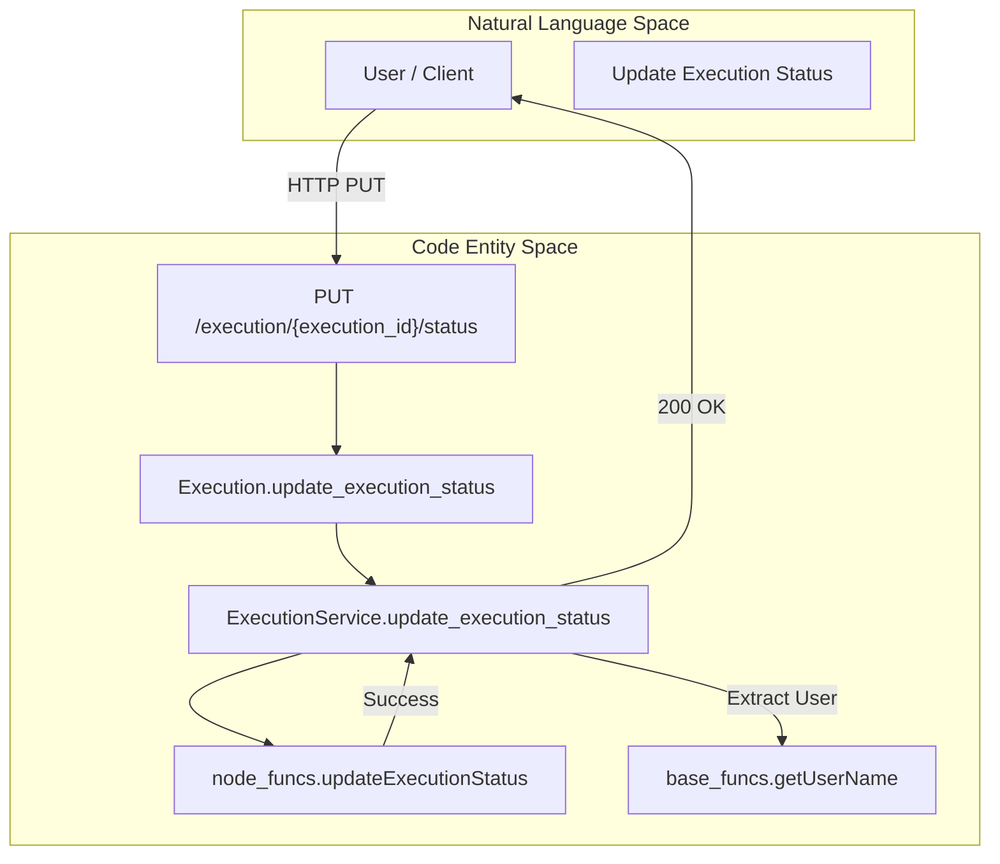
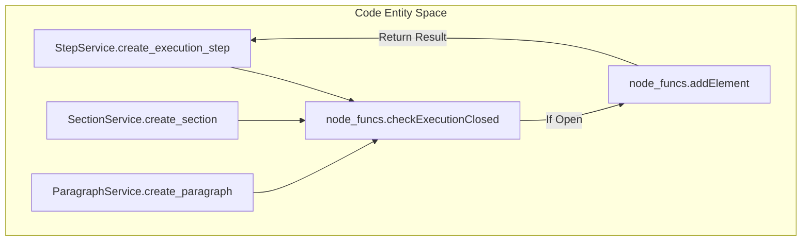

# Page: Execution Controllers

# Execution Controllers

Relevant source files

The following files were used as context for generating this wiki page:

- [controllers/Comment.js](controllers/Comment.js)
- [controllers/CommentService.js](controllers/CommentService.js)
- [controllers/Execution.js](controllers/Execution.js)
- [controllers/ExecutionService.js](controllers/ExecutionService.js)
- [controllers/File.js](controllers/File.js)
- [controllers/FileService.js](controllers/FileService.js)
- [controllers/Paragraph.js](controllers/Paragraph.js)
- [controllers/ParagraphService.js](controllers/ParagraphService.js)
- [controllers/ProcSection.js](controllers/ProcSection.js)
- [controllers/ProcSectionService.js](controllers/ProcSectionService.js)
- [controllers/Section.js](controllers/Section.js)
- [controllers/SectionService.js](controllers/SectionService.js)
- [controllers/Step.js](controllers/Step.js)
- [controllers/StepService.js](controllers/StepService.js)

The Execution Controllers layer provides the HTTP interface for managing the lifecycle of procedure executions and their constituent elements. This layer follows a pattern where a `Controller.js` file (generated from Swagger) handles the initial request and delegates to a corresponding `*Service.js` file, which contains the business logic orchestration and interacts with `node_funcs.js` or `base_funcs.js`.

## Execution Management

The `Execution.js` and `ExecutionService.js` pair manages the top-level execution entity. This includes creating executions, retrieving full execution graphs, and managing the state (status) of an execution.

### Execution Lifecycle Flow
The following diagram illustrates how a request to update an execution status moves through the system.

**Title: Execution Status Update Flow**

Sources: [controllers/Execution.js:95-97](), [controllers/ExecutionService.js:207-228](), [api/node_funcs.js:342-411]()

### Key Execution Methods
| Method | Endpoint | node_funcs.js Mapping | Success Code |
| :--- | :--- | :--- | :--- |
| `create_execution` | `POST /execution` | `createExecution` | 200 |
| `get_execution` | `GET /execution/{id}` | `getExecutionFull` | 200 |
| `delete_execution` | `DELETE /execution/{id}` | `deleteExecution` | 204 |
| `update_execution_status` | `PUT /execution/{id}/status` | `updateExecutionStatus` | 200 |
| `get_execution_as_run` | `GET /execution/{id}/as_run` | `getAsRun` | 200 |

Sources: [controllers/ExecutionService.js:7-23](), [controllers/ExecutionService.js:50-66](), [controllers/ExecutionService.js:68-85](), [controllers/ExecutionService.js:87-110](), [controllers/ExecutionService.js:207-228]()

## Element Controllers

Executions are composed of various element types: `Step`, `Section`, `Paragraph`, and `ProcSection`. Each has a dedicated controller pair that maps to generic element functions in `node_funcs.js` while providing type-specific validation and processing.

### Element Creation and Validation
Before adding elements, services typically verify that the execution is not closed using `node_funcs.checkExecutionClosed`.

**Title: Element Creation Logic**

Sources: [controllers/ExecutionService.js:41-42](), [controllers/SectionService.js:24-25](), [controllers/ParagraphService.js:23-24]()

### ProcSection Specifics
The `ProcSection` element represents a referenced procedure within an execution. It includes a specific `import_procedure_section` method that triggers `node_funcs.importProcedureSection` to pull in the full structure of the linked procedure.

*   **Venue Logic**: When creating a `ProcSection`, the service checks the venue type. If the venue is `ATLO` or `Testbed`, it defaults `run_for_score` to `true`.
*   **Structure Retrieval**: Uses `procedure_funcs.getProcedureSectionStructure` to build the nested tree of elements.

Sources: [controllers/ProcSectionService.js:31-41](), [controllers/ProcSectionService.js:117-120](), [controllers/ProcSectionService.js:165-169]()

## Comments and Conversations

The `CommentService.js` handles threaded discussions attached to execution elements. It distinguishes between a "Conversation" (the thread header) and "Comments" (individual posts within that thread).

*   **User Attribution**: All adding/updating operations extract the `user_name` from the `authorization` header using `base_funcs.getUserName`.
*   **Pagination**: Methods like `element_get_conversations` and `element_get_comments` support `offset` and `limit` parameters, returning the total count in the `x-total-count` header.

Sources: [controllers/CommentService.js:20-24](), [controllers/CommentService.js:40-49](), [controllers/CommentService.js:145-149]()

## File Attachments

The `FileService.js` manages binary attachments at three levels: Execution, Element, and Comment.

| Operation | Execution Level | Element Level | Comment Level |
| :--- | :--- | :--- | :--- |
| **Upload** | `addFileExec` | `addFile` | `addFileComment` |
| **Download** | `getExecFile` | `getFile` | `getCommentFile` |
| **List** | `getExecFiles` | `getFiles` | `getCommentFiles` |
| **Delete** | `deleteExecFile` | `deleteFile` | `deleteCommentFile` |

Sources: [controllers/FileService.js:19-20](), [controllers/FileService.js:84-85](), [controllers/FileService.js:104-105](), [controllers/FileService.js:169-170](), [controllers/FileService.js:196-197]()

## Error Handling and Status Codes

The controllers follow a standardized error handling pattern:
1.  **Try-Catch Blocks**: All service methods wrap logic in `try...catch`.
2.  **Error Logging**: Errors are processed via `base_funcs.push_error`, which logs the stack trace and returns a structured error object.
3.  **HTTP 400**: Most functional errors (validation, database constraints) return a `400 Bad Request`.
4.  **HTTP 200/204**: Successful mutations return `200 OK` (with data) or `204 No Content` (for deletions).

Sources: [controllers/ExecutionService.js:19-22](), [controllers/ExecutionService.js:61-64](), [controllers/SectionService.js:28-30]()
