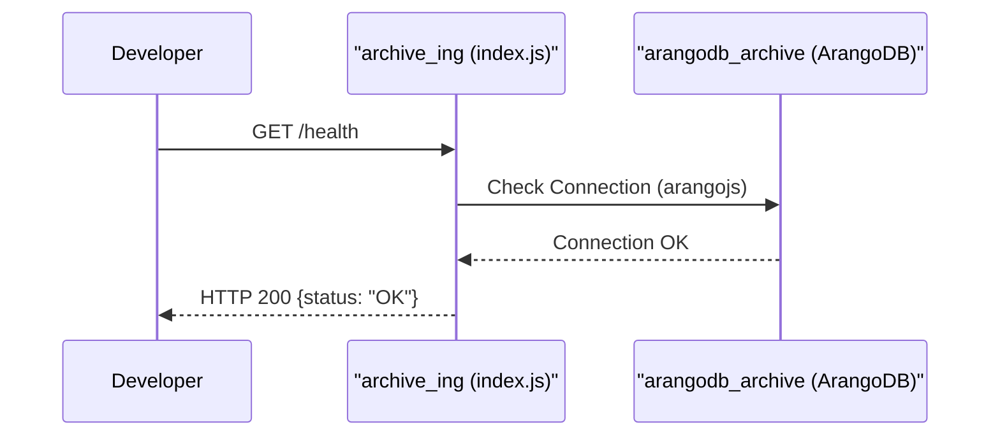

# Page: Getting Started

# Getting Started

<details>
<summary>Relevant source files</summary>

The following files were used as context for generating this wiki page:

- [README.md](README.md)
- [config.js](config.js)
- [docker-compose.yml](docker-compose.yml)
- [package.json](package.json)

</details>


The Ingenium Archive Service is a Node.js application that utilizes ArangoDB to manage procedure structures and execution data within a graph database [README.md:1-5](). This page provides the technical requirements and procedures for setting up a local development environment using Docker Compose.

## Prerequisites

Before starting the service, ensure the following are installed on your host machine:
*   **Docker** and **Docker Compose**
*   **Node.js** (optional, for local execution without containers) [README.md:49-51]()
*   **Python 3** (for running integration tests) [README.md:37-43]()

## Configuration and Environment Variables

The service configuration is managed via `config.js`. This file defines default values that can be overridden by environment variables, typically injected through the `docker-compose.yml` file [config.js:1-12](), [README.md:16-19]().

### Key Configuration Parameters

| Variable | Config Property | Default Value | Description |
| :--- | :--- | :--- | :--- |
| `ARANGODBURL` | `db_url` | `http://localhost:8529` | Connection string for the ArangoDB instance [config.js:7](). |
| `ARANGO_ROOT_PASSWORD` | `db_password` | `somepassword` | Password for the database user [config.js:8](). |
| `ARANGO_USER` | `db_user` | `root` | Database username [config.js:9](). |
| `EXECUTION_ID_PREFIX` | `execution_id_prefix` | `clipper-ingenium-` | Prefix used for generating execution identifiers [config.js:10](). |
| `PROCEDURE_ID_PREFIX` | `procedure_id_prefix` | `clipper-procedure-` | Prefix used for generating procedure identifiers [config.js:11](). |
| `PUBLIC_PEM` | `public_pem` | `''` | Public key for JWT RS256 signature verification [config.js:12](). |

**Sources:** [config.js:1-12](), [README.md:16-23]()

## Service Topology

The local development environment is orchestrated by `docker-compose.yml`, which defines a bridge network named `archive` and connects four primary services [docker-compose.yml:53-55]().

### Container Architecture

The following diagram illustrates the service dependencies and port mappings defined in the compose file.

**Service Topology Diagram**
```mermaid
graph TD
    subgraph "External Network"
        "Host:8010"
        "Host:8529"
        "Host:5151"
        "Host:6379"
    end

    subgraph "Archive Network"
        ["archive_ing"] -- "depends_on" --> ["arangodb_archive"]
        ["archive_ing"] -- "connects" --> ["execution_redis"]
        ["archive_ing"] -- "interacts" --> ["venue_config"]
    end

    "Host:8010" --> ["archive_ing"]
    "Host:8529" --> ["arangodb_archive"]
    "Host:5151" --> ["venue_config"]
    "Host:6379" --> ["execution_redis"]

    style ["archive_ing"] stroke-dasharray: 5 5
```
**Sources:** [docker-compose.yml:1-52]()

### Service Definitions

1.  **arangodb (`arangodb_archive`)**: The primary graph database. It persists data to `./arangodb/data` on the host and exposes port `8529` [docker-compose.yml:4-15]().
2.  **archive_ing**: The Node.js application service. It builds from the local directory and maps the source code to `/opt` for live development [docker-compose.yml:16-28]().
3.  **venue_config**: A supporting service for venue management, exposing port `5151` [docker-compose.yml:29-41]().
4.  **redis (`execution_redis`)**: Used for caching or session management during execution, exposing port `6379` [docker-compose.yml:42-52]().

## Local Setup Steps

### 1. Clone and Build
Navigate to the repository root and use Docker Compose to build and start the containers in detached mode:
```bash
docker-compose up --build -d
```
**Sources:** [README.md:27-28]()

### 2. Verify Health and Documentation
Once the containers are running, the service exposes an interactive API documentation interface.
*   **Swagger UI (Standard):** `http://localhost:8010/docs` [README.md:7]()
*   **ReDoc (Pretty):** `http://localhost:8010/prettydoc` [README.md:9]()

### 3. Running Locally (Non-Docker)
If you prefer to run the API directly on your host (e.g., for debugging with a debugger), you must still have a reachable ArangoDB instance.
```bash
npm install
npm start
```
This executes `node index.js` as defined in `package.json` [package.json:7](), [README.md:49-54]().

## Verification of Health

To verify the service is operational and correctly connected to its dependencies, check the health and logs.

**Data Flow: Health Check & Initialization**

**Sources:** [README.md:29](), [package.json:15](), [docker-compose.yml:21]()

### Running Integration Tests
The service includes a Python-based test suite to verify core functionality.
```bash
cd tests
virtualenv ve
source ve/bin/activate
pip install -r requirements.txt
python venues_test.py
python executions_test.py
```
**Sources:** [README.md:37-46]()
