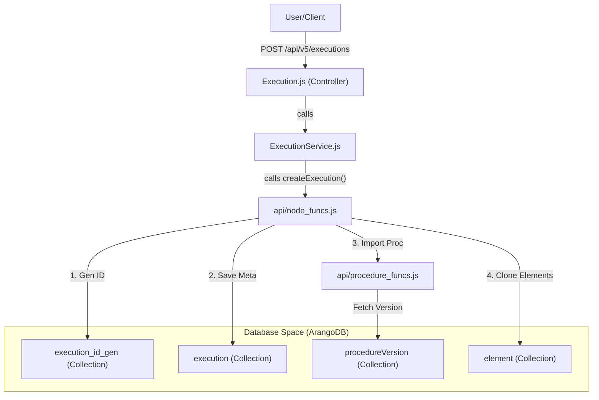
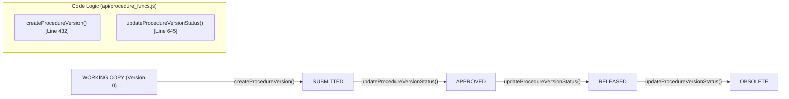

# Page: Glossary

# Glossary

Relevant source files

The following files were used as context for generating this wiki page:

- [Jenkinsfile](Jenkinsfile)
- [README.md](README.md)
- [api/base_funcs.js](api/base_funcs.js)
- [api/node_funcs.js](api/node_funcs.js)
- [api/procedure_funcs.js](api/procedure_funcs.js)
- [api/swagger.yaml](api/swagger.yaml)
- [config.js](config.js)
- [definitions.js](definitions.js)

This page provides definitions for codebase-specific terms, domain concepts, and technical jargon used within the Ingenium Archive Service. It serves as a reference for onboarding engineers to understand the mapping between high-level requirements and the underlying implementation.

## Core Concepts

### Element
The fundamental unit of data in the Ingenium Archive. Both Procedures and Executions are composed of trees of elements. Common `elem_type` values include `STEP`, `SECTION`, `PARAGRAPH`, and `PROCEDURE_SECTION`.
*   **Implementation**: Elements are stored in the `element` collection for executions and `procedureElement` for procedures [definitions.js:7-20]().
*   **Logic**: Managed primarily via `addElement`, `moveElement`, and `deleteElement` in [api/base_funcs.js:338-842]().

### Execution
A specific instance of running a procedure. It tracks the status of steps, user inputs, and timing data.
*   **Implementation**: Metadata is stored in the `execution` collection [definitions.js:10]().
*   **Status**: Possible states include `IDLE`, `RUNNING`, `PAUSED`, `HALTED`, `SUSPENDED`, `CLOSED`, `IN_REVIEW`, and `FINALIZED` [api/node_funcs.js:38]().

### Procedure Versioning
Procedures follow a strict versioning pipeline. A `procedure` document tracks the latest version numbers, while `procedureVersion` documents contain the specific snapshot of the element tree at that point in time.
*   **Key Transitions**: `SUBMIT` → `APPROVE` → `RELEASE` → `OBSOLETE` [api/procedure_funcs.js:28-189]().
*   **UUID Remapping**: When a new version is created, all elements are deep-copied and assigned new UUIDs to maintain immutability of historical versions [api/procedure_funcs.js:191-209]().

### Redlining and Bluelining
Terms used for modifying an execution's procedure structure after the execution has started.
*   **Redline**: A modification that requires formal justification, typically used when the procedure structure itself must change during a run [definitions.js:44]().
*   **Blueline**: Minor adjustments or corrections [definitions.js:45]().
*   **Implementation**: Handled via `modifyElement` and `discardElements` in [api/node_funcs.js:23-24]().

---

## Technical Terminology

| Term | Definition | Code Reference |
| :--- | :--- | :--- |
| **ArangoDB** | The multi-model graph database used to store hierarchical procedure and execution data. | [config.js:7-9]() |
| **Edge Collection** | ArangoDB collections that store relationships between elements (e.g., `stepOrder`, `hasVersion`). | [definitions.js:8-23]() |
| **AQL** | ArangoDB Query Language, used for complex graph traversals. | [api/base_funcs.js:1016-1050]() |
| **JWT (JSON Web Token)** | Used for authentication. The service verifies tokens using a `PUBLIC_PEM`. | [config.js:12]() |
| **Sanitization** | The process of removing internal database attributes (like `_key`, `_id`, `_rev`) before returning data to the client. | [api/base_funcs.js:164-194]() |

---

## Data Flow Diagrams

### From Request to Database
This diagram illustrates how a Natural Language request (e.g., "Create a new execution") maps to specific code entities and database collections.

**Execution Creation Flow**

**Sources**: [api/swagger.yaml:43-67](), [api/node_funcs.js:35](), [api/procedure_funcs.js:22]()

### Procedure Versioning Lifecycle
This diagram maps the logical states of a procedure to the internal functions that handle the transitions.

**Procedure State Machine**

**Sources**: [api/procedure_funcs.js:432-645](), [definitions.js:19-25]()

---

## Abbreviations & Jargon

*   **PMS (Procedure Modification Status)**: Tracks whether an element in an execution is `ORIGINAL`, `MODIFIED`, `ADDED`, or `DELETED` [definitions.js:31-39]().
*   **PMT (Procedure Modification Type)**: Distinguishes between `REDLINE` and `BLUELINE` [definitions.js:42-46]().
*   **Venue**: A physical or virtual location where an execution takes place (e.g., "Testbed", "WSTS") [definitions.js:5]().
*   **Run Record**: A log entry recording the outcome of a specific step execution [definitions.js:12]().
*   **Step Order**: The edge collection defining the sequence and hierarchy of elements in the graph [definitions.js:8]().

**Sources**: [definitions.js:1-82](), [api/base_funcs.js:1-158](), [api/node_funcs.js:1-38](), [api/procedure_funcs.js:1-30]()