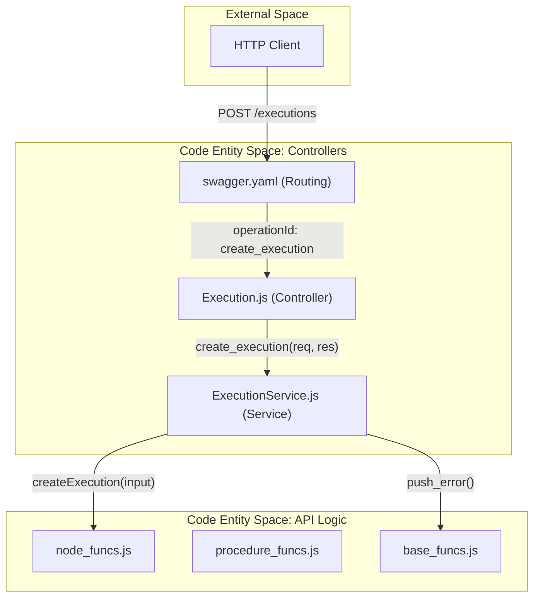
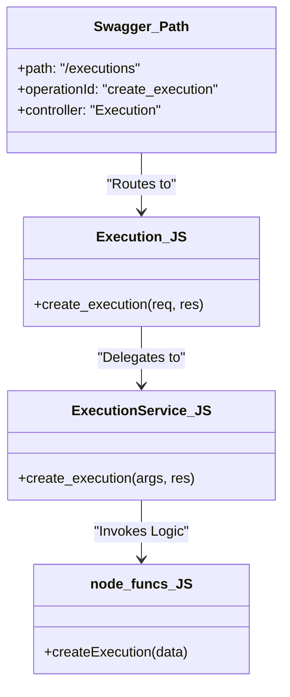

# Page: HTTP Controllers Layer

# HTTP Controllers Layer

Relevant source files

The following files were used as context for generating this wiki page:

- [api/swagger.yaml](api/swagger.yaml)
- [controllers/Execution.js](controllers/Execution.js)
- [controllers/ExecutionService.js](controllers/ExecutionService.js)
- [controllers/Procedures.js](controllers/Procedures.js)
- [controllers/ProceduresService.js](controllers/ProceduresService.js)

The **HTTP Controllers Layer** serves as the entry point for all external requests to the Ingenium Archive Service. This layer is responsible for routing, request validation via Swagger (OpenAPI), and delegating business logic to the underlying API functions.

## Overview

The controller layer is structured using a strict naming convention and a delegation pattern. Each resource domain defined in the `api/swagger.yaml` file corresponds to a pair of JavaScript files in the `controllers/` directory:

1.  **`Controller.js`**: The entry point for the route. It extracts the request parameters and immediately passes them to the corresponding service method [controllers/Execution.js:7-9]().
2.  **`ControllerService.js`**: Contains the glue logic. It extracts specific values from the Swagger parameters, invokes functions from `node_funcs.js`, `procedure_funcs.js`, or `base_funcs.js`, and manages the HTTP response (status codes and JSON body) [controllers/ExecutionService.js:14-22]().

### Request Delegation Flow

The following diagram illustrates how a request flows from the network into the core logic.

**Request Routing and Delegation**

**Sources:** [api/swagger.yaml:43-48](), [controllers/Execution.js:7-9](), [controllers/ExecutionService.js:17-21]()

## Resource Domains

The API is divided into several major resource domains. Each domain handles a specific subset of the Ingenium data model.

### Execution Domain
Handles the lifecycle of procedure executions, including real-time status updates, step results, and as-run reporting.
*   **Key Files**: `Execution.js`, `ExecutionService.js`, and element-specific controllers (Step, Section, etc.).
*   **Primary Logic**: Delegated to `node_funcs.js`.
*   **For details, see [Execution Controllers](#3.1)**.

### Procedure Domain
Manages the authoring environment, including procedure versions, working copies, and the transition of versions from "Draft" to "Released".
*   **Key Files**: `Procedures.js`, `ProceduresService.js`, and procedure-element controllers.
*   **Primary Logic**: Delegated to `procedure_funcs.js`.
*   **For details, see [Procedure Controllers](#3.2)**.

### System and Infrastructure Domain
Provides utility endpoints for system health, logging levels, and physical venue/testbed management.
*   **Key Files**: `Venue.js`, `Health.js`, `Logging.js`.
*   **For details, see [Venue, Health, and Logging Controllers](#3.3)**.

## Controller Mapping Pattern

The controllers utilize a standardized pattern for handling asynchronous operations and error reporting.

| Component | Responsibility | Example Code |
| :--- | :--- | :--- |
| **Swagger Spec** | Defines `operationId` and `x-swagger-router-controller` | [api/swagger.yaml:192-199]() |
| **Controller** | Maps the `operationId` to a Service function | [controllers/Procedures.js:11-13]() |
| **Service** | Unpacks `args`, calls API logic, and handles `res.status()` | [controllers/ProceduresService.js:87-95]() |

### Code Entity Association

This diagram shows the relationship between the Swagger definitions and the physical file structure.

**Swagger to Code Mapping**

**Sources:** [api/swagger.yaml:192](), [controllers/Execution.js:5-9](), [controllers/ExecutionService.js:17]()

## Error Handling and Sanitization

The `*Service.js` files are responsible for consistent error responses. They wrap logic calls in `try/catch` blocks and use `base_funcs.push_error` to format the error object before sending it to the client with a 400-series status code [controllers/ExecutionService.js:19-22]().

Additionally, the services perform data sanitization to ensure internal ArangoDB attributes (like `_rev` or `_id`) are removed from the JSON response using `base_funcs.sanitize_internal_attrs` [controllers/ProceduresService.js:112]().

**Sources:** [controllers/ExecutionService.js:1-23](), [controllers/ProceduresService.js:1-117](), [api/swagger.yaml:1-192]()
