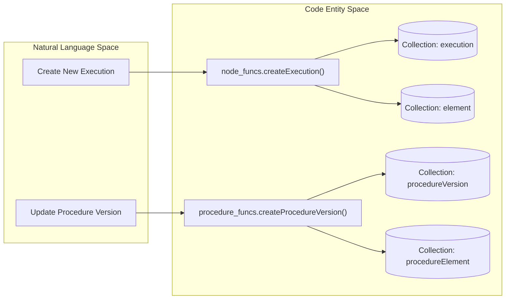

# Page: Ingenium Archive Service — Overview

# Ingenium Archive Service — Overview

<details>
<summary>Relevant source files</summary>

The following files were used as context for generating this wiki page:

- [README.md](README.md)
- [config.js](config.js)
- [definitions.js](definitions.js)
- [index.js](index.js)
- [package.json](package.json)

</details>


The Ingenium Archive Service is a Node.js-based RESTful service designed to manage the structural data of procedures and their executions using a graph database. It serves as a specialized archival and structural management component within the broader Ingenium ecosystem, mirroring the API structure of Ingenium Core while leveraging the relationship-handling capabilities of ArangoDB [README.md:1-5]().

The service provides comprehensive lifecycle management for two primary domains:
1.  **Procedures**: Authoring, versioning, and structural organization of procedure templates.
2.  **Executions**: Real-time tracking of procedure runs, including status updates, step outputs, and redlining/bluelining modifications.

## System Role and Context

The Archive Service acts as the source of truth for the hierarchical structure of procedures (Sections, Steps, Paragraphs) and the historical record of their execution. It facilitates complex operations like tree reconstruction, deep copying of procedure versions, and maintaining referential integrity across execution runs.

### Key Technologies
*   **Runtime**: Node.js [package.json:7-7]()
*   **Web Framework**: Express.js with `swagger-tools` for OpenAPI-driven routing [index.js:3-5]()
*   **Database**: ArangoDB (Multi-model graph database) [README.md:3-3]()
*   **Authentication**: JWT (JSON Web Tokens) with RS256 signature verification [index.js:7-7](), [index.js:168-170]()
*   **Documentation**: Integrated Swagger UI (`/docs`) and ReDoc (`/prettydoc`) [README.md:7-9]()

## High-Level Architecture

The service follows a layered architecture that separates the transport/interface layer from the underlying graph logic and database operations.

### Component Relationship Diagram
This diagram illustrates how a request flows from the external API down to the ArangoDB collections.

```mermaid
graph TD
    subgraph "Interface Layer"
        [Swagger_UI] -->|"/docs"| [Express_App]
        [External_Client] -->|HTTP_Request| [Express_App]
    end

    subgraph "Middleware & Routing"
        [Express_App] --> [JWT_Security_Middleware]
        [JWT_Security_Middleware] --> [Audit_Interceptor]
        [Audit_Interceptor] --> [Swagger_Router]
    end

    subgraph "Controller Layer"
        [Swagger_Router] --> [Resource_Controllers]
        [Resource_Controllers] --> [Service_Wrappers]
    end

    subgraph "Logic Layer (api/)"
        [Service_Wrappers] --> [node_funcs.js]
        [Service_Wrappers] --> [procedure_funcs.js]
        [node_funcs.js] --> [base_funcs.js]
        [procedure_funcs.js] --> [base_funcs.js]
    end

    subgraph "Data Layer (ArangoDB)"
        [base_funcs.js] --> [ArangoJS_Driver]
        [ArangoJS_Driver] --> [Collections_and_Graphs]
    end

    [Collections_and_Graphs] --- [execution_graph]
    [Collections_and_Graphs] --- [procedure_graph]
```
**Sources:** [index.js:144-150](), [index.js:34-40](), [README.md:3-3]()

## Major Subsystems

### 1. API Logic (`/api`)
The core business logic is partitioned into three functional modules:
*   **`base_funcs.js`**: Low-level ArangoDB primitives, database initialization, and generic graph traversal algorithms used to build tree structures [index.js:12-12]().
*   **`node_funcs.js`**: Logic pertaining to active **Executions**, including venue management, step output recording, and execution-specific modifications [index.js:13-13]().
*   **`procedure_funcs.js`**: Logic for **Procedures**, handling versioning pipelines (SUBMIT, RELEASE, OBSOLETE) and structural authoring.

For details, see [Core API Logic](#2).

### 2. HTTP Controllers (`/controllers`)
The service uses a "Controller-Service" pattern where `swagger-tools` routes requests to specific controller files (e.g., `Procedures.js`). These controllers then delegate to corresponding service files (e.g., `ProceduresService.js`) which invoke the logic layer [index.js:135-138]().

For details, see [HTTP Controllers Layer](#3).

### 3. Database Schema
Data is stored in ArangoDB using a combination of document collections (for entities like `execution` or `procedureElement`) and edge collections (for relationships like `stepOrder` or `hasVersion`) [definitions.js:3-28]().

| Category | Key Collections | Named Graphs |
| :--- | :--- | :--- |
| **Execution** | `element`, `execution`, `runRecord`, `venue` | `execution_graph`, `history_graph` |
| **Procedure** | `procedure`, `procedureElement`, `procedureVersion` | `procedure_graph` |

**Sources:** [definitions.js:4-28]()

For details, see [Database Layer](#5).

## Data Flow: Code Entity Mapping

The following diagram maps high-level system operations to the specific code entities and database collections they interact with.


**Sources:** [definitions.js:10-22](), [index.js:12-13]()

## Child Pages
*   [Getting Started](#1.1) — Step-by-step guide for local development setup and Docker configuration.
*   [Architecture Overview](#1.2) — Detailed breakdown of the layered architecture, middleware, and authentication.

---
**Sources:**
*   [README.md:1-58]()
*   [index.js:1-190]()
*   [definitions.js:1-82]()
*   [config.js:1-14]()
*   [package.json:1-30]()
