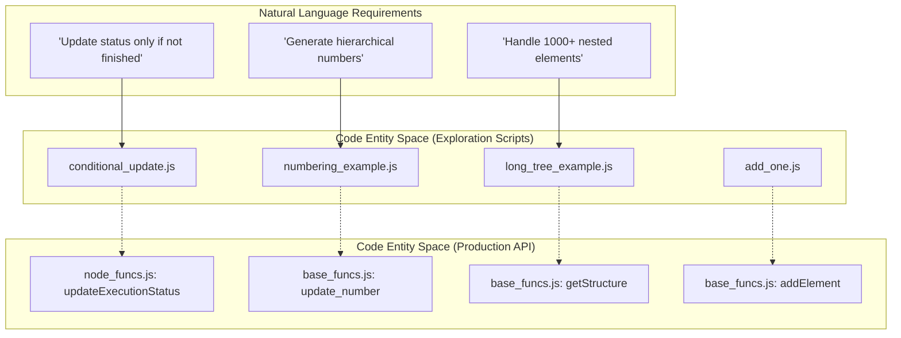
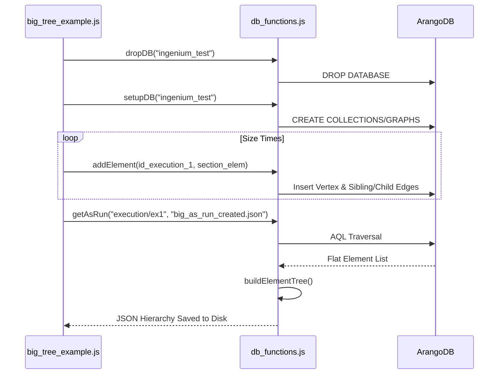

# Page: JavaScript Database Exploration Scripts

# JavaScript Database Exploration Scripts

Relevant source files

The following files were used as context for generating this wiki page:

- [tests/db/add_one.js](tests/db/add_one.js)
- [tests/db/big_tree_example.js](tests/db/big_tree_example.js)
- [tests/db/check_error.js](tests/db/check_error.js)
- [tests/db/collection_example.js](tests/db/collection_example.js)
- [tests/db/conditional_update.js](tests/db/conditional_update.js)
- [tests/db/etest.js](tests/db/etest.js)
- [tests/db/execution.json](tests/db/execution.json)
- [tests/db/execution_numbered.json](tests/db/execution_numbered.json)
- [tests/db/graph_example.js](tests/db/graph_example.js)
- [tests/db/long_tree_example.js](tests/db/long_tree_example.js)
- [tests/db/numbering_example.js](tests/db/numbering_example.js)
- [tests/db/package.json](tests/db/package.json)
- [tests/db/promise_recursive.js](tests/db/promise_recursive.js)
- [tests/db/ptest.js](tests/db/ptest.js)
- [tests/db/set_example.js](tests/db/set_example.js)
- [tests/db/steps_example.js](tests/db/steps_example.js)
- [tests/db/traverse_example.js](tests/db/traverse_example.js)
- [tests/db/traverse_test.js](tests/db/traverse_test.js)
- [tests/db/tree_example.js](tests/db/tree_example.js)
- [tests/db/util_example.js](tests/db/util_example.js)

The `tests/db/` directory contains a collection of standalone Node.js scripts used by developers to explore, validate, and stress-test ArangoDB behavior within the context of the Ingenium Archive Service. Unlike the Python integration tests which validate the HTTP API, these scripts interact directly with the database or local business logic to verify graph traversals, tree construction, and performance under load.

## Purpose and Scope

These scripts serve three primary functions:
1.  **Feature Prototyping**: Testing complex AQL queries or graph operations (e.g., `traverse_example.js`, `conditional_update.js`) before implementing them in the main API.
2.  **Performance Benchmarking**: Stress-testing the database with large or deep hierarchical structures (e.g., `big_tree_example.js`, `long_tree_example.js`).
3.  **Utility and Debugging**: Validating internal logic such as element numbering (`numbering_example.js`) or error object serialization (`check_error.js`, `etest.js`).

### Development Workflow Mapping

The following diagram illustrates how these scripts bridge the gap between abstract requirements and the concrete implementation in the `api/` layer.

**Diagram: Script-to-Logic Association**

Sources: `[tests/db/conditional_update.js:9-35]()`, `[tests/db/numbering_example.js:3-15]()`, `[tests/db/long_tree_example.js:11-59]()`, `[tests/db/add_one.js:10-25]()`

---

## Core Exploration Scripts

### Hierarchical and Tree Testing
The system relies heavily on maintaining an ordered tree structure within a graph database. Several scripts focus on building and exporting these structures.

*   **`tree_example.js`**: Demonstrates basic tree construction.
*   **`big_tree_example.js`**: Creates a wide tree by adding multiple sections and steps using recursive promises `add_section` and `add_step` [tests/db/big_tree_example.js:11-61](). It uses `Promise.all` to parallelize branch creation [tests/db/big_tree_example.js:89-107]().
*   **`long_tree_example.js`**: Tests deep nesting by sequentially adding 1000 sections [tests/db/long_tree_example.js:63-85]().
*   **`numbering_example.js`**: Implements a recursive `setNumbers` function that traverses a JSON tree (from `execution.json`) and assigns hierarchical strings (e.g., "1-2-1") based on sibling index [tests/db/numbering_example.js:3-15]().

### ArangoDB Graph and Collection Behavior
These scripts explore the low-level `arangojs` driver interactions.

*   **`collection_example.js`**: Demonstrates basic collection operations: creating a database, importing vertices/edges, and the effect of removing a vertex on its associated edges [tests/db/collection_example.js:126-158]().
*   **`graph_example.js`**: Similar to the collection example but uses the `db.graph` API to manage named graphs and edge definitions [tests/db/graph_example.js:22-49]().
*   **`conditional_update.js`**: Explores AQL `UPDATE` queries that use ternary operators or filters to perform atomic "check-and-set" operations on element statuses [tests/db/conditional_update.js:12-28]().

### Error Handling and Utilities
*   **`check_error.js`**: Validates the `base_funcs.push_error` logic by intentionally triggering a database timeout and checking the resulting error object [tests/db/check_error.js:18-31]().
*   **`etest.js`**: Tests the robustness of error serialization when dealing with circular references in JavaScript objects [tests/db/etest.js:43-54]().

---

## Data Flow: Tree Construction and Export

The exploration scripts often simulate the lifecycle of an Execution, from element insertion to "As-Run" export.

**Diagram: Data Flow in big_tree_example.js**

Sources: `[tests/db/big_tree_example.js:67-125]()`, `[tests/db/db_functions.js:1-5]()` (implied dependency)

---

## Technical Reference Table

| Script | Key Function/Class | Purpose |
| :--- | :--- | :--- |
| `add_one.js` | `fns.addElement` | Simple test for adding a single `SECTION` element to a specific execution [tests/db/add_one.js:24](). |
| `big_tree_example.js` | `add_section` (recursive) | Benchmarks database performance with wide hierarchical structures [tests/db/big_tree_example.js:11](). |
| `conditional_update.js` | `update_result_2` (AQL) | Tests atomic updates to prevent overwriting `PASS/FAIL` statuses [tests/db/conditional_update.js:25](). |
| `numbering_example.js` | `setNumbers` | Logic for generating "1.1.2" style strings from tree indices [tests/db/numbering_example.js:3](). |
| `check_error.js` | `base_funcs.push_error` | Verifies that database errors are correctly wrapped with context [tests/db/check_error.js:28](). |
| `etest.js` | `push_error` | Localized test for circular reference handling in error logging [tests/db/etest.js:3](). |

Sources: `[tests/db/add_one.js:24]()`, `[tests/db/big_tree_example.js:11]()`, `[tests/db/conditional_update.js:25]()`, `[tests/db/numbering_example.js:3]()`, `[tests/db/check_error.js:28]()`, `[tests/db/etest.js:3]()`

---

## Fixture Files

The directory includes JSON fixtures used as baseline data for the scripts:
*   **`execution.json`**: A raw hierarchical representation of an execution with sections (`s1`, `s2`) and steps (`st1-1`), but without calculated numbers [tests/db/execution.json:1-84]().
*   **`execution_numbered.json`**: The expected output after running `numbering_example.js`, containing the `number` attribute for each element [tests/db/execution_numbered.json:21-90]().

Sources: `[tests/db/execution.json:1-84]()`, `[tests/db/execution_numbered.json:1-93]()`
