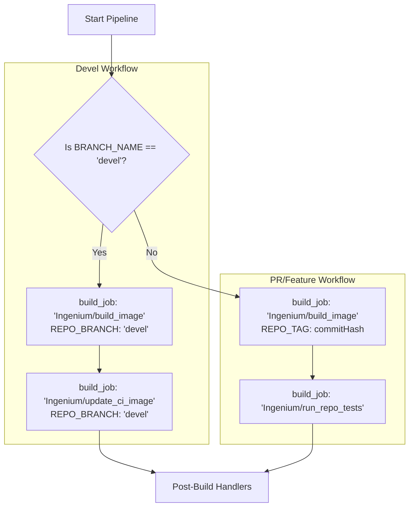
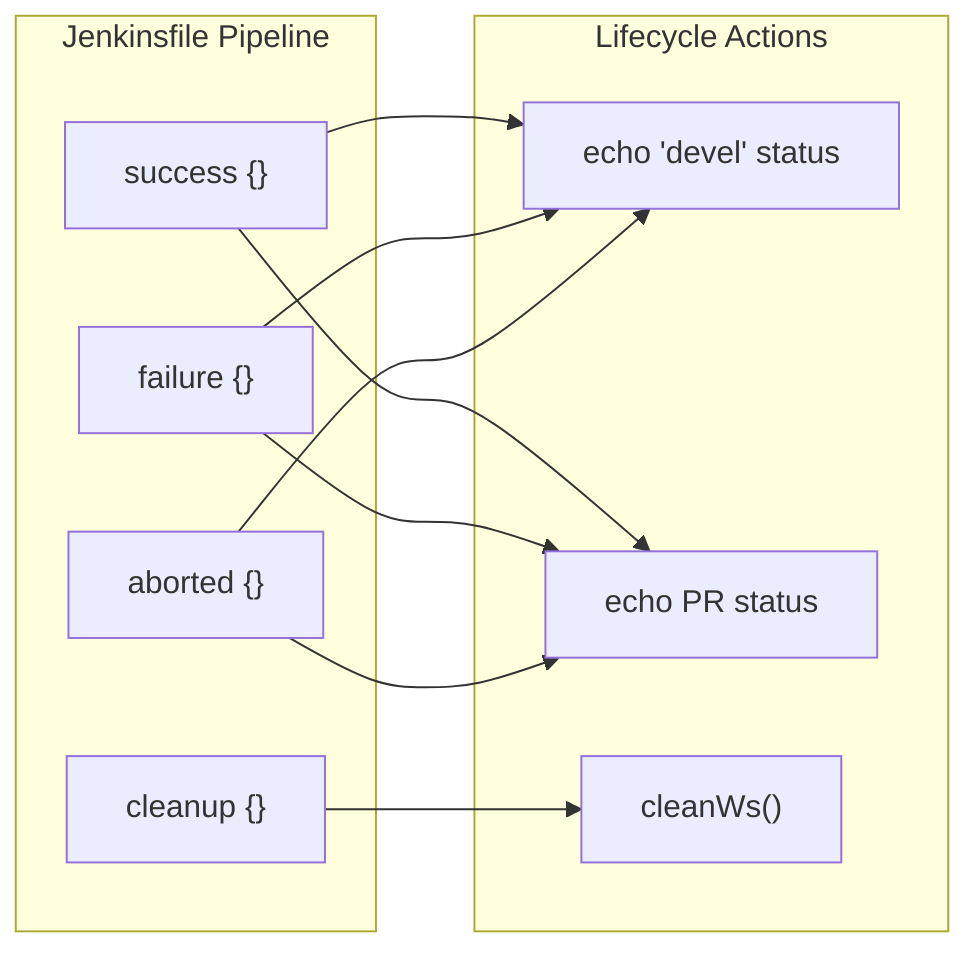

# Page: Jenkins CI/CD Pipeline

# Jenkins CI/CD Pipeline

Relevant source files

The following files were used as context for generating this wiki page:

- [Jenkinsfile](Jenkinsfile)

The Ingenium Archive Service utilizes a Jenkins declarative pipeline to automate the build, containerization, and validation of the codebase. The pipeline is defined in a `Jenkinsfile` located at the repository root and implements a dual-workflow strategy: one for the stable `devel` branch and another for Pull Requests (PRs) or feature branches [Jenkinsfile:1-94]().

## Pipeline Architecture and Workflows

The pipeline logic is encapsulated within a single stage, "Determine Branch and Execute Jobs," which branches execution based on the `env.BRANCH_NAME` environment variable [Jenkinsfile:4-9]().

### 1. Devel Branch Workflow
When changes are merged into the `devel` branch, the pipeline triggers a sequence to update the core service images used by the Ingenium ecosystem [Jenkinsfile:9-11]().

*   **Build Image for Devel**: Invokes the `Ingenium/build_image` job. It passes the repository name (`archive`) and the branch name (`devel`) as parameters [Jenkinsfile:13-20]().
*   **Update CI Image for Devel**: Invokes the `Ingenium/update_ci_image` job. This ensures that the Continuous Integration environment uses the latest `devel` version of the archive service for other dependent services [Jenkinsfile:22-29]().

### 2. PR and Feature Branch Workflow
For any branch other than `devel`, the pipeline focuses on validating the specific commit before it can be merged [Jenkinsfile:31-33]().

*   **Build Image for PR**: Invokes `Ingenium/build_image` using the `GIT_COMMIT` hash as the `REPO_TAG` [Jenkinsfile:35-42](). This creates a unique, immutable container image for that specific code change.
*   **Run Repo Tests**: Invokes `Ingenium/run_repo_tests`. This stage passes the `commitHash` to identify the image to test and sets specific flags to control the test scope [Jenkinsfile:44-53]().

### Pipeline Logic Flow
The following diagram illustrates the decision logic within the `Jenkinsfile`.

**Pipeline Branching Logic**

Sources: [Jenkinsfile:1-58]()

## Parameterized Execution

The pipeline delegates actual work to downstream Jenkins jobs using specific parameters to maintain consistency across the Ingenium project.

| Parameter | Type | Purpose | Workflow |
| :--- | :--- | :--- | :--- |
| `REPO` | String | Identifies the service as `archive` [Jenkinsfile:17](). | Both |
| `REPO_BRANCH` | String | Specifies the git branch to build (e.g., `devel`) [Jenkinsfile:18](). | Devel |
| `REPO_TAG` | String | Specifies the Docker image tag, typically the `commitHash` [Jenkinsfile:40](). | PR/Feature |
| `ONLY_REPO_TESTS` | Boolean | Set to `true` to limit test execution to this repository's scope [Jenkinsfile:49](). | PR/Feature |
| `CLUSTER_BRANCH` | String | Defines which branch of the deployment cluster to use for testing (defaults to `devel`) [Jenkinsfile:51](). | PR/Feature |

Sources: [Jenkinsfile:13-53]()

## Post-Build Lifecycle Handlers

The `post` section manages the final state of the build and workspace cleanup, providing feedback to the Jenkins console based on the branch context [Jenkinsfile:59-93]().

*   **Success**: Logs a completion message. For `devel`, it confirms the update; for PRs, it confirms the tests passed [Jenkinsfile:60-68]().
*   **Failure**: Alerts the user that the build or test suite failed [Jenkinsfile:69-77]().
*   **Aborted**: Logs if the job was manually cancelled or timed out [Jenkinsfile:78-86]().
*   **Cleanup**: Executes the `cleanWs()` function to delete the workspace on the Jenkins agent, ensuring no stale artifacts interfere with subsequent builds [Jenkinsfile:87-92]().

**Post-Build Data Flow**

Sources: [Jenkinsfile:59-93]()

## Integration with Downstream Jobs

The `Jenkinsfile` acts as an orchestrator for the following system-wide Jenkins jobs:

1.  **Ingenium/build_image**: Responsible for executing the Docker build process using the application's Dockerfile and pushing the resulting image to the JPL Artifactory registry.
2.  **Ingenium/update_ci_image**: Updates the pointer for the "latest" CI image to ensure other services (like `venue_config` or `ingenium_client`) are testing against the current `devel` archive service.
3.  **Ingenium/run_repo_tests**: Deploys a transient environment (often using the `CLUSTER_BRANCH` parameter) to execute the Python integration tests defined in the `tests/` directory against the containerized service.

Sources: [Jenkinsfile:15-16](), [Jenkinsfile:24-25](), [Jenkinsfile:46-47]()
