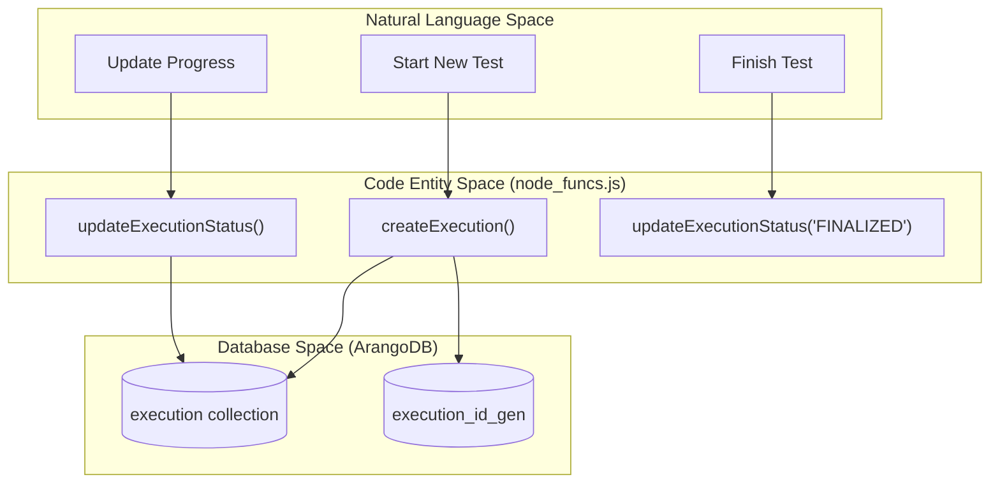
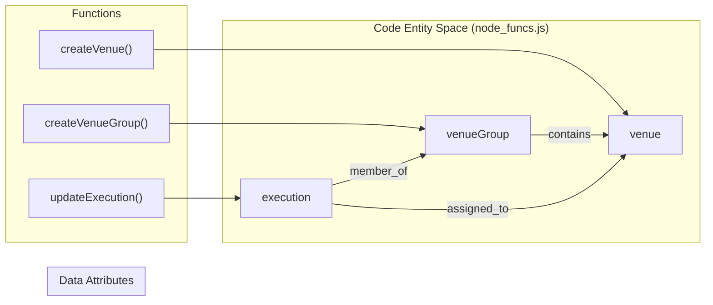

# Page: node_funcs.js — Execution Lifecycle and Venue Management

# node_funcs.js — Execution Lifecycle and Venue Management

Relevant source files

The following files were used as context for generating this wiki page:

- [api/node_funcs.js](api/node_funcs.js)
- [check_elem_order.js](check_elem_order.js)
- [definitions.js](definitions.js)

The `node_funcs.js` module serves as the primary logic layer for managing **Executions** and **Venues** within the Ingenium Archive Service. While `procedure_funcs.js` handles the authoring and versioning of templates, `node_funcs.js` manages the instantiation of those templates into live, executable instances (Executions), tracking their progress, recording step outputs, and handling real-time modifications (redlining/bluelining).

## 1. Execution Lifecycle Management

An Execution is a standalone instance of a procedure (or multiple procedure sections) that can be run against specific hardware or software venues.

### 1.1 Creation and Status
Executions are created via `createExecution`, which initializes the execution record and assigns a unique `execution_id` using an auto-incrementing generator collection `execution_id_gen` [api/node_funcs.js:35, 1140-1175](). The status of an execution is strictly governed by the `EXEC_STATUSES` array: `IDLE`, `RUNNING`, `PAUSED`, `HALTED`, `SUSPENDED`, `CLOSED`, `IN_REVIEW`, `FINALIZED` [api/node_funcs.js:38]().

Status transitions are handled by `updateExecutionStatus`, which validates that the target status is allowed and updates the database record [api/node_funcs.js:1255-1285]().

### 1.2 Execution Hierarchy and "As-Run" Data
The `getAsRun` function retrieves the full hierarchical JSON structure of an execution, including all sections and steps [api/node_funcs.js:46-48](). It leverages `base_funcs.getStructure` to traverse the `execution_graph` starting from the execution root [api/node_funcs.js:47]().

**Execution Lifecycle Flow**
"This diagram maps the logical execution states to the internal function calls and database collections."

Sources: [api/node_funcs.js:38](), [api/node_funcs.js:1140-1175](), [api/node_funcs.js:1255-1285](), [definitions.js:10-11]()

---

## 2. Procedure Import and Step Execution

### 2.1 Importing Procedure Sections
The `importProcedureSection` function is a critical bridge between the Procedure template space and the Execution instance space. It performs the following:
1.  **Validation**: Ensures the target element is a `PROCEDURE_SECTION` and hasn't been imported yet [api/node_funcs.js:86-99]().
2.  **Mapping**: Traverses the source Procedure Version and creates deep copies of all selected elements into the `element` collection [api/node_funcs.js:120-170]().
3.  **Contextualization**: Assigns the `execution_id` and sets the `procedure_modification_status` to `ORIGINAL` [api/node_funcs.js:173-179]().
4.  **Structure Rebuilding**: Recreates the `stepOrder` edges to maintain the hierarchy within the execution [api/node_funcs.js:231-255]().

### 2.2 Step Output and Run Records
When a step is executed, its output is recorded using `setStepOutput`. This function:
*   Updates the step's `execution_user_input` with results [api/node_funcs.js:636-645]().
*   Manages "Run Records" via `createNewRun`, which creates an entry in the `runRecord` collection to track history of attempts for a specific step [api/node_funcs.js:681-715]().

Sources: [api/node_funcs.js:61-110](), [api/node_funcs.js:636-645](), [api/node_funcs.js:681-715](), [definitions.js:8, 12]()

---

## 3. Redlining and Bluelining (Modifications)

Modifications to an execution in progress are categorized as Redlines (permanent changes to the intent) or Bluelines (temporary operational adjustments).

### 3.1 Modification Logic
The `modifyElement` function handles these transitions by updating the `procedure_modification_status` (PMS) and `procedure_modification_type` (PMT) [api/node_funcs.js:1438-1460]().

| Status (PMS) | Description |
| :--- | :--- |
| `ORIGINAL` | Unchanged from the procedure template. |
| `MODIFYING` | Currently being edited by a user. |
| `MODIFIED` | Changes have been saved and applied. |
| `ADDED` | New element created specifically for this execution. |
| `DELETED` | Element marked for removal from the execution flow. |

### 3.2 Discarding Changes
The `discardElements` function allows users to revert `MODIFYING` or `ADDED` elements back to their previous state, effectively cleaning up the execution graph from aborted edits [api/node_funcs.js:1546-1580]().

Sources: [api/node_funcs.js:1438-1460](), [api/node_funcs.js:1546-1580](), [definitions.js:31-46]()

---

## 4. Venue and Venue Group Management

Venues represent the physical or virtual environments where executions occur.

*   **Venue**: A single resource (e.g., a specific lab bench or server). Managed via `createVenue`, `updateVenue`, and `deleteVenue` [api/node_funcs.js:1830-1920]().
*   **Venue Group**: A logical collection of venues. Managed via `createVenueGroup` and `updateVenueGroup` [api/node_funcs.js:1700-1750]().

`node_funcs.js` provides utility functions like `getVenues` and `getVenueGroups` to query these definitions for UI selection during execution setup [api/node_funcs.js:1785-1820]().

**Venue Management Association**
"This diagram shows how venue entities are linked to executions."

Sources: [api/node_funcs.js:1700-1920](), [definitions.js:4-5]()

---

## 5. Graph Import/Export and Boundaries

### 5.1 Full Graph Export
`node_funcs.js` supports exporting an entire execution as a flat list of elements and edges via `exportExecution` [api/node_funcs.js:1610-1640](). This is used for backup or for moving executions between different archive service instances.

### 5.2 Execution Boundaries
The service implements "Boundary Logic" to ensure that operations on one execution do not leak into another. Functions like `getExecutionBoundary` identify all elements belonging to a specific `execution_id` by traversing the graph and filtering by the `execution_id` attribute [api/node_funcs.js:1320-1350]().

Sources: [api/node_funcs.js:1320-1350](), [api/node_funcs.js:1610-1640]()
