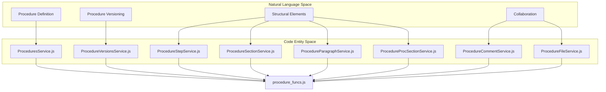
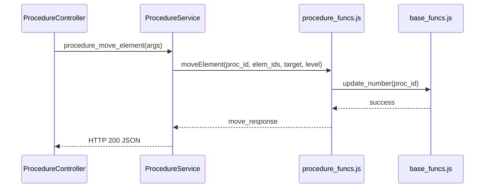

# Page: Procedure Controllers

# Procedure Controllers

Relevant source files

The following files were used as context for generating this wiki page:

- [controllers/Procedure.js](controllers/Procedure.js)
- [controllers/ProcedureComment.js](controllers/ProcedureComment.js)
- [controllers/ProcedureCommentService.js](controllers/ProcedureCommentService.js)
- [controllers/ProcedureFile.js](controllers/ProcedureFile.js)
- [controllers/ProcedureFileService.js](controllers/ProcedureFileService.js)
- [controllers/ProcedureParagraph.js](controllers/ProcedureParagraph.js)
- [controllers/ProcedureParagraphService.js](controllers/ProcedureParagraphService.js)
- [controllers/ProcedureProcSection.js](controllers/ProcedureProcSection.js)
- [controllers/ProcedureProcSectionService.js](controllers/ProcedureProcSectionService.js)
- [controllers/ProcedureSection.js](controllers/ProcedureSection.js)
- [controllers/ProcedureSectionService.js](controllers/ProcedureSectionService.js)
- [controllers/ProcedureService.js](controllers/ProcedureService.js)
- [controllers/ProcedureStep.js](controllers/ProcedureStep.js)
- [controllers/ProcedureStepService.js](controllers/ProcedureStepService.js)
- [controllers/ProcedureVersions.js](controllers/ProcedureVersions.js)
- [controllers/ProcedureVersionsService.js](controllers/ProcedureVersionsService.js)
- [controllers/Procedures.js](controllers/Procedures.js)
- [controllers/ProceduresService.js](controllers/ProceduresService.js)

Procedure Controllers manage the authoring lifecycle of procedures, including versioning, element manipulation (Steps, Sections, Paragraphs), and collaborative features like comments and file attachments. This layer acts as an intermediary between the Swagger-defined HTTP endpoints and the core logic in `procedure_funcs.js` and `base_funcs.js`.

## Overview of Controller Architecture

Each resource in the procedure domain follows a pattern where a `Controller.js` file handles the Express request/response objects and delegates logic to a corresponding `Service.js` file. The Service file then invokes the appropriate business logic from `procedure_funcs.js`.

### Mapping Natural Language to Code Entities

The following diagram illustrates how high-level procedure concepts map to specific controller and service implementations.

**Concept to Code Mapping**

Sources: [controllers/Procedures.js:1-7]() | [controllers/ProcedureVersions.js:1-7]() | [controllers/ProcedureStep.js:1-7]() | [controllers/ProcedureComment.js:1-7]()

---

## Core Procedure Management

The `Procedures.js` and `ProceduresService.js` pair handles the high-level procedure container and generic element operations (move, copy, delete).

### Generic Element Operations
While specific elements like Steps have their own controllers, generic structural changes are routed through `ProceduresService.js`.

| Operation | Service Function | Logic Call |
| :--- | :--- | :--- |
| **Move Element** | `procedure_move_element` | `procedure_funcs.moveElement` |
| **Copy Element** | `procedure_copy_element` | `procedure_funcs.copyElement` |
| **Delete Element** | `procedure_delete_element` | `procedure_funcs.deleteElement` |
| **Get Structure** | `procedure_get_structure` | `procedure_funcs.getProcedureStructure` |

**Data Flow for Element Manipulation**

Sources: [controllers/ProcedureService.js:71-94]() | [controllers/ProcedureService.js:96-127]() | [controllers/ProcedureService.js:173-193]()

---

## Structural Element Controllers

The system distinguishes between several element types. Each has a dedicated service that typically wraps `procedure_funcs.addElement` and `procedure_funcs.updateElement`.

### ProcedureSection and ProcedureParagraph
These controllers manage static content. `ProcedureSection` represents a logical grouping, while `ProcedureParagraph` contains text content.
* **Creation**: Uses `addElement` with `elem_type` set to 'SECTION' or 'PARAGRAPH' [controllers/ProcedureSectionService.js:25-26]() [controllers/ProcedureParagraphService.js:26-27]().
* **Versioning Check**: Before updating or deleting, these services call `procedure_funcs.checkElementVersioned` to ensure modifications only happen on "Working Copies" (Version 0) [controllers/ProcedureSectionService.js:107-108]() [controllers/ProcedureParagraphService.js:110-111]().

### ProcedureProcSection (Reusable Sections)
The `ProcedureProcSection` controller manages `PROCEDURE_SECTION` elements, which are pointers to other procedures.
* **Circular Reference Protection**: `procedure_update_procedure_section_input` validates that a procedure does not include itself or create a loop [controllers/ProcedureProcSectionService.js:188-200]().
* **Structure Resolution**: `procedure_get_procedure_section_structure` uses `procedure_funcs.getProcedureSectionStructure` to resolve the internal tree of the referenced procedure [controllers/ProcedureProcSectionService.js:52-72]().

Sources: [controllers/ProcedureSectionService.js:8-31]() | [controllers/ProcedureParagraphService.js:9-32]() | [controllers/ProcedureProcSectionService.js:17-30]() | [controllers/ProcedureProcSectionService.js:188-200]()

---

## Procedure Versions and Lifecycle

`ProcedureVersionsService.js` manages the state transitions of a procedure from a working copy to a released document.

### Versioning Pipeline
1.  **Create Version**: `procedure_create_version` calls `procedure_funcs.createProcedureVersion`. This creates a snapshot of the working copy (Version 0) and assigns it a new version number [controllers/ProcedureVersionsService.js:7-29]().
2.  **Status Updates**: `procedure_update_version_status` handles transitions (e.g., `SUBMIT` -> `APPROVE` -> `RELEASE`). It invokes `procedure_funcs.updateProcedureVersionStatus` [controllers/ProcedureVersionsService.js:110-132]().

| Endpoint | Logic Function | Description |
| :--- | :--- | :--- |
| `GET /version` | `getProcedureVersions` | Lists all versions of a procedure. |
| `POST /version` | `createProcedureVersion` | Snapshots Version 0 to a new Integer version. |
| `PATCH /version/{v}` | `updateProcedureVersion` | Updates version metadata (e.g., description). |

Sources: [controllers/ProcedureVersionsService.js:7-29]() | [controllers/ProcedureVersionsService.js:110-132]()

---

## Collaboration: Comments and Files

### ProcedureCommentService
Manages "Conversations" (threads) and "Comments" (individual posts).
* **Working Copy Restriction**: `procedure_element_add_conversation` calls `procedure_funcs.checkElementNotVersioned` to ensure comments can be added to any version *except* the working copy in some configurations, or specifically allows them on released versions for feedback [controllers/ProcedureCommentService.js:25-27]().
* **User Tracking**: Extracts `user_name` from the `authorization` header using `base_funcs.getUserName` before passing it to `procedure_funcs.addComment` [controllers/ProcedureCommentService.js:22-27]().

### ProcedureFileService
Handles file attachments for both elements and comments.
* **Element Files**: `procedure_element_upload_file` attaches a file to a specific procedure element [controllers/ProcedureFileService.js:16-29]().
* **Comment Files**: `procedure_element_post_comment_file` attaches files to specific comments within a conversation [controllers/ProcedureFile.js:37-39]().

Sources: [controllers/ProcedureCommentService.js:7-34]() | [controllers/ProcedureCommentService.js:138-162]() | [controllers/ProcedureFileService.js:16-29]() | [controllers/ProcedureFileService.js:190-200]()
