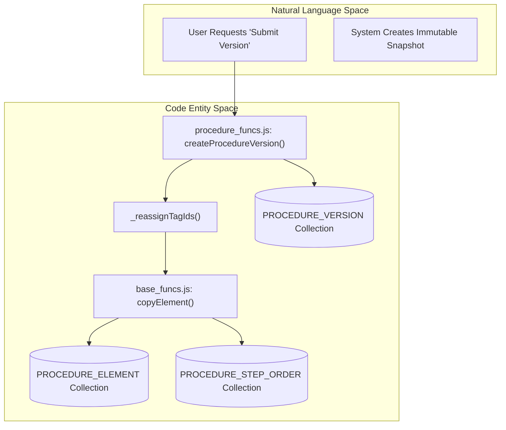
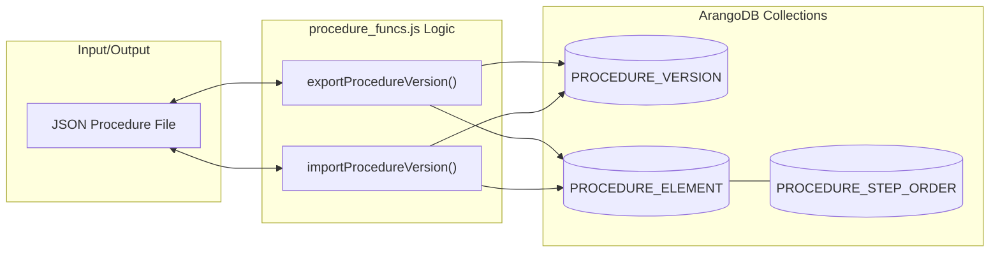

# Page: procedure_funcs.js — Procedure Authoring and Versioning

# procedure_funcs.js — Procedure Authoring and Versioning

Relevant source files

The following files were used as context for generating this wiki page:

- [api/procedure_funcs.js](api/procedure_funcs.js)
- [definitions.js](definitions.js)

The `procedure_funcs.js` module is the primary engine for procedure lifecycle management within the Ingenium Archive Service. It handles the creation of procedures, manages the complex versioning pipeline (including deep-cloning of procedure trees), enforces state transitions for version statuses, and provides mechanisms for tagging and commenting on procedure elements.

## Procedure Creation and Working Copies

Procedures are initialized with a unique ID generated via the `procedure_id_gen` collection [api/procedure_funcs.js:25-25](). When a procedure is created using `createProcedure`, the system automatically generates an initial "Working Copy" (Version 0) [api/procedure_funcs.js:186-186]().

A **Working Copy** is a mutable version where authors can add, move, or delete elements. Once a version is submitted or released, it becomes immutable, and a new working copy must be branched from it to make further changes.

### Procedure Initialization Flow

| Step | Function | Description |
| :--- | :--- | :--- |
| 1 | `createProcedure` | Generates a new `procedure_id` using `config.procedure_id_prefix` [api/procedure_funcs.js:173-175](). |
| 2 | `procedure_collection.save` | Persists the procedure metadata [api/procedure_funcs.js:178-182](). |
| 3 | `createProcedureVersion` | Creates the first version (Version 0) linked to the procedure [api/procedure_funcs.js:186-186](). |

**Sources:** [api/procedure_funcs.js:141-189](), [definitions.js:19-25]()

## The Versioning Pipeline

Versioning in Ingenium is not just a metadata update; it involves a full deep-copy of the procedure's element tree. This ensures that every version is a self-contained snapshot.

### createProcedureVersion and UUID Remapping
When a new version is created (e.g., during a "Submit" or "Branch" operation), `createProcedureVersion` performs the following:
1.  **Metadata Cloning**: It copies the version document, incrementing the version number or setting it to a specific value [api/procedure_funcs.js:333-353]().
2.  **Tag ID Reassignment**: It generates new UUIDs for all tags associated with the version to maintain referential integrity within the new snapshot [api/procedure_funcs.js:196-209]().
3.  **Element Tree Duplication**: If a parent version exists, it recursively copies all `procedureElement` and `procedureStepOrder` documents [api/procedure_funcs.js:364-375]().
4.  **UUID Remapping**: To prevent ID collisions between versions, every element receives a new `_key`. The `_reassignTagIds` and `_updateElementTagIds` functions ensure that internal references (like tags applied to specific paragraphs) are updated to point to the new UUIDs [api/procedure_funcs.js:212-223]().

### Procedure Versioning Logic
The following diagram illustrates the transition from a "Natural Language" versioning request to the "Code Entity" operations in the database.

**Procedure Versioning Data Flow**

**Sources:** [api/procedure_funcs.js:321-411](), [api/procedure_funcs.js:196-223](), [api/base_funcs.js:636-650]()

## Version Status Transitions

Procedure versions follow a strict lifecycle managed by `updateProcedureVersion`. Statuses determine whether a version can be edited or used for execution.

*   **DRAFT**: The default state for a working copy. Mutable.
*   **SUBMITTED**: The version is locked for review.
*   **APPROVED**: Review is complete; ready for release.
*   **RELEASED**: The official version for use in the field. Only one version can be `RELEASED` at a time [api/procedure_funcs.js:523-535]().
*   **OBSOLETE**: The version is no longer valid.

### Circular Reference Protection
The system allows `PROCEDURE_SECTION` elements to reference other procedures. To prevent infinite loops during tree traversals or exports, `procedure_funcs.js` implements checks within the element management logic to ensure a procedure does not include itself as a section [api/procedure_funcs.js:1010-1030]().

**Sources:** [api/procedure_funcs.js:464-550](), [api/procedure_funcs.js:1010-1030]()

## Tagging and Conversations

### Tagging System
Tags are defined at the version level. Each tag has a `tag_id`, `name`, and `color`. Elements within the procedure reference these `tag_id`s. When a version is branched, the `_reassignTagIds` function ensures that the new version has its own unique set of tags, even if the names are identical to the parent [api/procedure_funcs.js:196-209]().

### Procedure Comments
The system supports threaded conversations on any procedure element.
*   **Types**: Comments can be standard `COMMENT`, `ACTIVITY_REPORT_COMMENT`, or `DATA_REVIEW_COMMENT` [definitions.js:48-52]().
*   **Status**: Comments track a `RESOLVED` or `UNRESOLVED` state [definitions.js:54-57]().
*   **Implementation**: Comments are stored as `procedureElement` nodes with a specific `type` and are linked to their parent element via the `procedure_step_order` edge collection.

**Sources:** [api/procedure_funcs.js:196-223](), [definitions.js:48-57]()

## Import and Export

Procedure versions can be exported as JSON files and re-imported into other instances.

### Export Process
The `exportProcedureVersion` function:
1.  Retrieves the version metadata [api/procedure_funcs.js:1155-1160]().
2.  Uses `base_funcs.getStructure` to fetch the entire element tree [api/procedure_funcs.js:1165-1165]().
3.  Sanitizes internal ArangoDB attributes (like `_id`, `_rev`) before packaging into a JSON object [api/procedure_funcs.js:1175-1185]().

### Import Process
The `importProcedureVersion` function:
1.  Creates a new `procedureVersion` document [api/procedure_funcs.js:1230-1240]().
2.  Recursively iterates through the JSON element tree.
3.  Calls `addElement` for every node, rebuilding the `PROCEDURE_STEP_ORDER` edges in the new database context [api/procedure_funcs.js:1250-1270]().

**Entity Mapping: Import/Export**

**Sources:** [api/procedure_funcs.js:1147-1200](), [api/procedure_funcs.js:1210-1280]()
