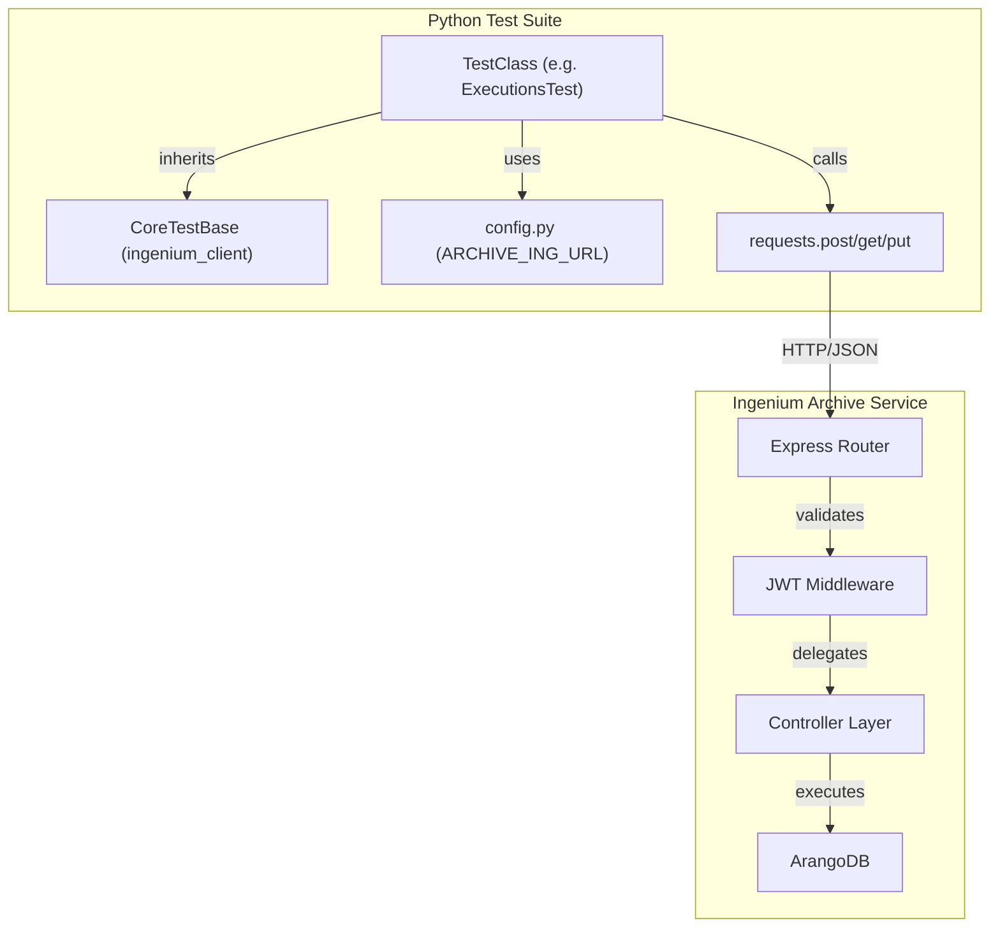
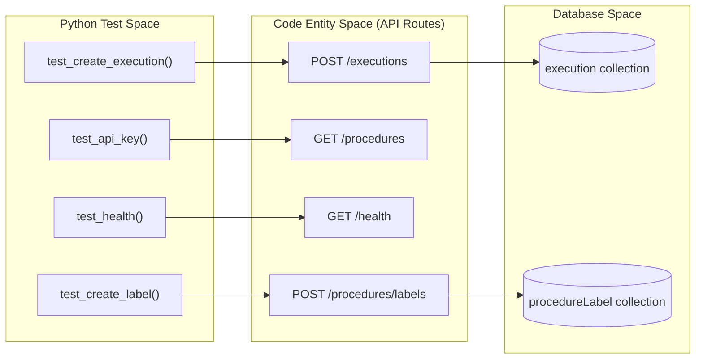

# Page: Python Integration Tests

# Python Integration Tests

<details>
<summary>Relevant source files</summary>

The following files were used as context for generating this wiki page:

- [tests/archive_client_example.py](tests/archive_client_example.py)
- [tests/config.py](tests/config.py)
- [tests/execution_client_example.py](tests/execution_client_example.py)
- [tests/get_queries.py](tests/get_queries.py)
- [tests/requirements.txt](tests/requirements.txt)
- [tests/reset_log_level.py](tests/reset_log_level.py)
- [tests/set_log_level.py](tests/set_log_level.py)
- [tests/test_ci_api_key.py](tests/test_ci_api_key.py)
- [tests/test_ci_executions.py](tests/test_ci_executions.py)
- [tests/test_ci_health.py](tests/test_ci_health.py)
- [tests/test_ci_labels.py](tests/test_ci_labels.py)
- [tests/test_ci_logging.py](tests/test_ci_logging.py)
- [tests/test_ci_procedures.py](tests/test_ci_procedures.py)

</details>


The Ingenium Archive Service includes a comprehensive Python-based integration test suite located in the `tests/` directory. These tests validate the end-to-end functionality of the API, including procedure authoring, execution lifecycles, venue management, and security constraints. The suite is designed to run against a live instance of the service, typically within a CI/CD pipeline or a local Docker Compose environment.

## Test Infrastructure and Configuration

The test suite relies on a shared configuration and a set of utility helpers to interact with the Archive Service API.

### Environment Configuration
The `tests/config.py` file initializes the testing environment by determining the target server URL. It primarily uses the `ARCHIVE_ING_URL` environment variable, defaulting to `http://127.0.0.1:8010` if not set [tests/config.py:10-10](). This URL is then formatted to include the API version path (`/api/v5`) and stored in a `shared_dict` used by the `ingenium_client` [tests/config.py:11-13]().

### Dependencies and Requirements
The suite requires several Python libraries, most notably `ingenium_client`, which provides the `CoreTestBase` class and various constants.
*   **ingenium_client**: Provides high-level abstractions for API interactions [tests/requirements.txt:2-2]().
*   **requests**: Used for low-level HTTP communication [tests/requirements.txt:5-5]().
*   **PyJWT & cryptography**: Used for generating and validating RS256 JWT tokens for security testing [tests/requirements.txt:4-7]().
*   **unittest-xml-reporting**: Generates XML test reports compatible with Jenkins [tests/requirements.txt:8-8]().

### Data Flow: Test Execution to API
The following diagram illustrates how a test class interacts with the system under test.

**Test Interaction Flow**

Sources: [tests/config.py:10-13](), [tests/test_ci_executions.py:31-32](), [tests/test_ci_api_key.py:15-31]()

## Core Test Modules

The suite is partitioned into functional domains, each corresponding to a specific set of API controllers.

### Execution Tests (`test_ci_executions.py`)
This module covers the complex lifecycle of procedure executions. It tests the creation of execution instances, adding steps and sections, moving elements within the execution graph, and recording results [tests/test_ci_executions.py:32-61](). Key capabilities tested include:
*   **Graph Manipulation**: Copying elements within an execution or across different executions [tests/test_ci_executions.py:63-132]().
*   **Status Management**: Updating execution states (e.g., from `CREATED` to `RUNNING`) [tests/execution_client_example.py:39-44]().
*   **Step Outputs**: Recording data against specific steps using the `/result` endpoint [tests/execution_client_example.py:86-90]().

### Security and API Key Tests (`test_ci_api_key.py`)
Security tests verify that the service correctly enforces RBAC (Role-Based Access Control) using JWT tokens.
*   **Token Generation**: The `generate_token` function mocks the behavior of an OIDC provider by signing tokens with a `PRIVATE_PEM` using the `RS256` algorithm [tests/test_ci_api_key.py:15-31]().
*   **Scope Enforcement**: Tests verify that requests with empty scopes return `403 Forbidden`, while unauthenticated requests return `401 Unauthorized` [tests/test_ci_api_key.py:40-51]().
*   **Public Access**: Verifies that the `/health` endpoint remains accessible without a token [tests/test_ci_api_key.py:53-55]().

### Venue and Group Management
*   **`test_ci_venues.py`**: Validates CRUD operations for venues, including location updates and status changes (e.g., `AVAILABLE`) [tests/archive_client_example.py:12-50]().
*   **`test_ci_venue_groups.py`**: Tests the grouping of venues for collective management.

### System Health and Logging
*   **`test_ci_health.py`**: Performs a simple GET request to `/health` to ensure the service and its database connection are operational [tests/test_ci_health.py:19-31]().
*   **`test_ci_logging.py`**: Tests the dynamic log-level adjustment API, verifying that the service can switch between `DEBUG`, `INFO`, and `ERROR` at runtime [tests/test_ci_logging.py:21-49]().

## Database Utility Scripts

In addition to formal integration tests, the `tests/` directory contains utility scripts for direct ArangoDB interaction and log management.

| Script | Purpose |
| :--- | :--- |
| `get_queries.py` | Retrieves current and slow AQL queries from ArangoDB for performance debugging [tests/get_queries.py:14-23](). |
| `set_log_level.py` | Directly interfaces with ArangoDB's `_admin/log/level` API to enable verbose debugging [tests/set_log_level.py:54-59](). |
| `reset_log_level.py` | Reverts ArangoDB logging to default system levels [tests/reset_log_level.py:19-54](). |

Sources: [tests/get_queries.py:1-33](), [tests/set_log_level.py:1-60](), [tests/reset_log_level.py:1-58]()

## Running the Tests

Tests are written using the standard Python `unittest` framework. They can be executed at various granularities.

### Command Line Execution
Users can run the entire suite, a specific class, or a single test method:
```bash
# Run all tests in a file
python test_ci_executions.py

# Run a specific test class
python test_ci_executions.py ExecutionsTest

# Run a specific test method
python test_ci_executions.py ExecutionsTest.test_create_execution
```
Sources: [tests/test_ci_executions.py:1-12]()

### CI Integration
In the Jenkins pipeline, tests are typically executed with the `XMLTestRunner` to generate reports for the Jenkins UI:
```python
if __name__ == '__main__':
    unittest.main(testRunner=xmlrunner.XMLTestRunner(output="./test-reports/"))
```
Sources: [tests/test_ci_health.py:33-35](), [tests/test_ci_labels.py:68-70]()

## Code Entity Mapping

The following diagram maps Python test entities to the corresponding API routes and logic they validate.

**Test to API Mapping**

Sources: [tests/test_ci_executions.py:32-35](), [tests/test_ci_api_key.py:40-43](), [tests/test_ci_health.py:19-20](), [tests/test_ci_labels.py:20-22]()
