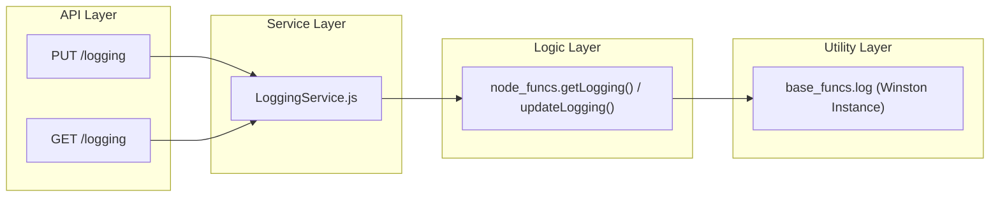

# Page: Venue, Health, and Logging Controllers

# Venue, Health, and Logging Controllers

<details>
<summary>Relevant source files</summary>

The following files were used as context for generating this wiki page:

- [controllers/Health.js](controllers/Health.js)
- [controllers/HealthService.js](controllers/HealthService.js)
- [controllers/Logging.js](controllers/Logging.js)
- [controllers/LoggingService.js](controllers/LoggingService.js)
- [controllers/Venue.js](controllers/Venue.js)
- [controllers/VenueGroup.js](controllers/VenueGroup.js)
- [controllers/VenueGroupService.js](controllers/VenueGroupService.js)
- [controllers/VenueService.js](controllers/VenueService.js)

</details>


This section covers the controllers responsible for system-wide utility functions: venue registration and lifecycle management, health monitoring, and runtime configuration of the service's logging levels.

## Venue and Venue Group Management

The Venue subsystem manages the registration and status of physical or logical locations where procedure executions take place. Venues can be organized into Venue Groups for collective status management and filtering.

### Implementation Details
The implementation follows the standard pattern:
1.  **Controller Layer**: `Venue.js` and `VenueGroup.js` act as the entry points for Swagger-routed requests [controllers/Venue.js:1-31](), [controllers/VenueGroup.js:1-19]().
2.  **Service Layer**: `VenueService.js` and `VenueGroupService.js` extract parameters from the `req.swagger.params` object and handle the HTTP response lifecycle (status codes and headers) [controllers/VenueService.js:7-154](), [controllers/VenueGroupService.js:7-93]().
3.  **Logic Layer**: All business logic and database interactions are delegated to `node_funcs.js` [controllers/VenueService.js:4-4](), [controllers/VenueGroupService.js:4-4]().

### Data Flow: Venue Registration and Status
When a venue is updated or queried, the service layer maps the request to specific `node_funcs` methods.

| Operation | Controller Method | Service Method | Logic Function |
| :--- | :--- | :--- | :--- |
| Create Venue | `create_venue` | `create_venue` | `node_funcs.createVenue` |
| Get Venue Status | `get_venue_status` | `get_venue_status` | `node_funcs.getVenue` |
| Update Status | `set_venue_status` | `set_venue_status` | `node_funcs.updateVenueStatus` |
| List Venues | `get_venues` | `get_venues` | `node_funcs.getVenues` |

**Sources:** [controllers/VenueService.js:7-134](), [controllers/VenueGroupService.js:7-93]()

### Venue Logic Architecture
The following diagram illustrates the relationship between the HTTP endpoints and the underlying logic entities.

**Venue System Mapping**
```mermaid
graph TD
    subgraph "Natural Language Space"
        "Venue Registry"
        "Status Monitor"
        "Grouping"
    end

    subgraph "Code Entity Space (Controllers & Services)"
        VC["Venue.js (Controller)"]
        VS["VenueService.js"]
        VGC["VenueGroup.js (Controller)"]
        VGS["VenueGroupService.js"]
    end

    subgraph "Logic & Persistence"
        NF["node_funcs.js"]
        DB[("ArangoDB: venue & venueGroup")]
    end

    VC --> VS
    VGC --> VGS
    VS -- "createVenue()" --> NF
    VS -- "updateVenueStatus()" --> NF
    VGS -- "createVenueGroup()" --> NF
    NF -- "AQL Queries" --> DB
```
**Sources:** [controllers/Venue.js:5-31](), [controllers/VenueService.js:17-153](), [controllers/VenueGroupService.js:17-89]()

---

## Health Check System

The Health controller provides a simple endpoint used by load balancers and container orchestrators (like Kubernetes or Docker Compose) to verify that the service is responsive.

### Implementation
The `Health.js` controller exposes a single `GET /health` endpoint. Unlike other services, it does not interact with the database; it simply returns a static JSON object to confirm the Node.js event loop is running and the Express application is capable of handling requests.

*   **Endpoint**: `GET /health`
*   **Success Response**: `200 OK` with body `{"status": "OK", "message": ""}` [controllers/HealthService.js:8-15]().

**Sources:** [controllers/Health.js:7-9](), [controllers/HealthService.js:3-16]()

---

## Runtime Logging Control

The Logging API allows administrators to inspect and modify the service's log level at runtime without restarting the process. This is particularly useful for debugging production issues by temporarily enabling `DEBUG` or `VERBOSE` logging.

### Logic Flow
The service interacts with the `node_funcs` module to retrieve or update the configuration of the Winston-based logger defined in `base_funcs`.

1.  **Get Logging**: Calls `node_funcs.getLogging()` which returns the current log level and transport configuration [controllers/LoggingService.js:14-15]().
2.  **Update Logging**: Takes a `LoggingInfo` object and passes it to `node_funcs.updateLogging(logging_info)`. This dynamically changes the threshold of the active Winston logger [controllers/LoggingService.js:26-30]().

### Logging Control Flow

**Sources:** [controllers/LoggingService.js:4-34](), [controllers/Logging.js:7-13]()

### Error Handling in Logging
If an invalid log level is provided, the `update_logging` service catches the exception and returns a `400 Bad Request` with the error message [controllers/LoggingService.js:31-33]().

---

## Summary of Endpoints

| Resource | File | Key Functions | Role |
| :--- | :--- | :--- | :--- |
| **Health** | `HealthService.js` | `health_get` | Basic heartbeat for the service [controllers/HealthService.js:3-16](). |
| **Logging** | `LoggingService.js` | `get_logging`, `update_logging` | Runtime log level adjustment [controllers/LoggingService.js:8-34](). |
| **Venue** | `VenueService.js` | `create_venue`, `update_venue`, `set_venue_status` | Management of execution locations [controllers/VenueService.js:7-154](). |
| **VenueGroup** | `VenueGroupService.js` | `create_venue_group`, `get_venue_groups` | Organizational containers for venues [controllers/VenueGroupService.js:7-93](). |

**Sources:** [controllers/HealthService.js:1-17](), [controllers/LoggingService.js:1-35](), [controllers/VenueService.js:1-155](), [controllers/VenueGroupService.js:1-94]()
