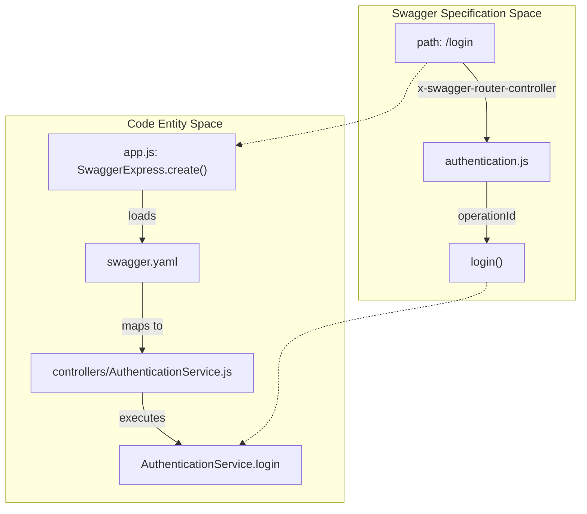
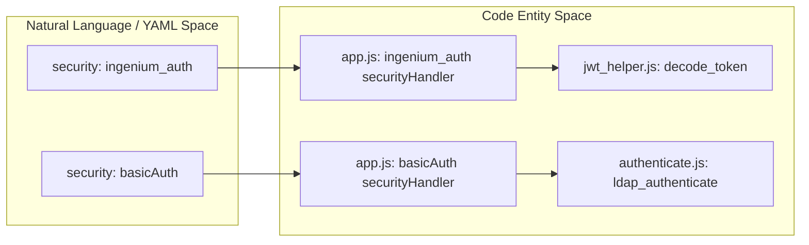

# API Reference — Swagger Specification

Relevant source files

The following files were used as context for generating this wiki page:

- [auth_service/api/mocks/README.md](auth_service/api/mocks/README.md)
- [auth_service/api/swagger/swagger.yaml](auth_service/api/swagger/swagger.yaml)

This page provides a technical overview of the Ingenium Auth Service API contract. The service utilizes a "Design-First" approach where the API is defined in an OpenAPI/Swagger 2.0 specification file, which subsequently drives the routing and validation logic of the Express application.

The full API is exposed under the `/api/v2` base path [auth_service/api/swagger/swagger.yaml:9]().

## Specification Overview

The API contract is defined in `auth_service/api/swagger/swagger.yaml`. This file serves as the single source of truth for:
*   **Resource Paths**: Mapping URI patterns to controller logic via `x-swagger-router-controller` [auth_service/api/swagger/swagger.yaml:46]().
*   **Security Schemes**: Defining how endpoints are protected (OAuth2 vs. Basic Auth).
*   **Data Models**: Defining request and response schemas using JSON Schema definitions [auth_service/api/swagger/swagger.yaml:174]().

### Base Configuration
| Property | Value | Source |
| :--- | :--- | :--- |
| **Swagger Version** | 2.0 | [auth_service/api/swagger/swagger.yaml:1]() |
| **Base Path** | `/api/v2` | [auth_service/api/swagger/swagger.yaml:9]() |
| **Schemes** | `https` | [auth_service/api/swagger/swagger.yaml:13]() |
| **Consumes/Produces** | `application/json` | [auth_service/api/swagger/swagger.yaml:15-19]() |

### Interactive Documentation
The service provides a built-in Swagger UI for interactive API exploration and testing. This is rendered by the `swagger-express-mw` middleware initialized in `app.js` [auth_service/app.js:60-80](). While the specification defines the contract, the actual implementation logic resides in the `controllers/` directory, which is mapped by the Swagger pipe [auth_service/config/default.yaml:20]().

---

## Security Definitions

The API employs two primary security definitions to gate access to resources. These are checked by the `ingenium_auth` and `basicAuth` handlers configured in the request pipeline [auth_service/app.js:68-74]().

### 1. basicAuth
Used exclusively for the initial login process at `/login` [auth_service/api/swagger/swagger.yaml:49](). It expects standard HTTP Basic Authentication headers (Base64 encoded `username:password`) [auth_service/api/swagger/swagger.yaml:36-38](). Depending on system configuration, this triggers either LDAP or RSA SecurID verification [auth_service/api/helpers/authenticate.js:18-40]().

### 2. ingenium_auth (OAuth2)
An implicit OAuth2 flow used for all subsequent requests after login, including token refresh and RBAC management [auth_service/api/swagger/swagger.yaml:22-25](). It validates the JWT provided in the `Authorization: Bearer <token>` header.

#### Scopes
The specification defines several granular scopes that control access to different functional areas of the Ingenium platform:
*   `admin`: Full administrative access [auth_service/api/swagger/swagger.yaml:27]().
*   `execute:[venue]`: Permission to run procedures on specific venue types (wsts, testbed, sit, other) [auth_service/api/swagger/swagger.yaml:28-31]().
*   `config_mgmt`: Configuration changes [auth_service/api/swagger/swagger.yaml:32]().
*   `author`: Procedure creation and updates [auth_service/api/swagger/swagger.yaml:34]().
*   `basic`: Minimum level for watching and commenting [auth_service/api/swagger/swagger.yaml:35]().

---

## Resource Categories

The API is logically divided into two main functional areas.

### Authentication and Session Management
These endpoints handle the lifecycle of a user session, including credential verification, JWT issuance, and token invalidation.

*   `GET /login`: Authenticates credentials and returns an `access_token` and `access_token_timeout` [auth_service/api/swagger/swagger.yaml:45-63]().
*   `POST /refresh_token`: Exchanges a valid token for a new one to extend the session [auth_service/api/swagger/swagger.yaml:77-83]().
*   `POST /logout`: Blacklists the current token in Redis to prevent further use [auth_service/api/swagger/swagger.yaml:110-114]().

For detailed request/response schemas and error codes, see **[Authentication Endpoints (/login, /logout, /refresh_token)](#6.1)**.

### RBAC Management
These endpoints provide CRUD operations for the Role-Based Access Control system. They allow administrators to manage the relationships between users, groups, roles, and permissions.

*   `/roles`: Manage roles and their associations with users, groups, and permissions [auth_service/api/swagger/swagger.yaml:131-221]().
*   `/users`: List and manage user metadata, assigned roles, and login status.
*   `/groups`: Manage LDAP-synced groups and their role assignments.
*   `/permissions`: View available system permissions and their assignments via roles.
*   `/ldap`: Interface for searching LDAP users and groups directly to facilitate DB provisioning.

For details on filtering, pagination, and nested sub-resources, see **[RBAC Management Endpoints (/roles, /users, /groups, /permissions, /ldap)](#6.2)**.

---

## Architectural Mapping

The following diagrams illustrate how the Swagger specification bridges the gap between external API definitions and internal code execution.

### Request Routing Architecture
This diagram shows how a request defined in `swagger.yaml` is routed through the system to a specific controller function.

**Sources:** [auth_service/api/swagger/swagger.yaml:45-53](), [auth_service/app.js:60-65](), [auth_service/api/controllers/AuthenticationService.js:12](), [auth_service/config/default.yaml:20]()

### Security Enforcement Flow
This diagram maps the security definitions in the Swagger file to the internal security handlers that process them in the Express pipeline.

**Sources:** [auth_service/api/swagger/swagger.yaml:36-43](), [auth_service/app.js:68-74](), [auth_service/api/helpers/jwt_helper.js:46](), [auth_service/api/helpers/authenticate.js:18]()
