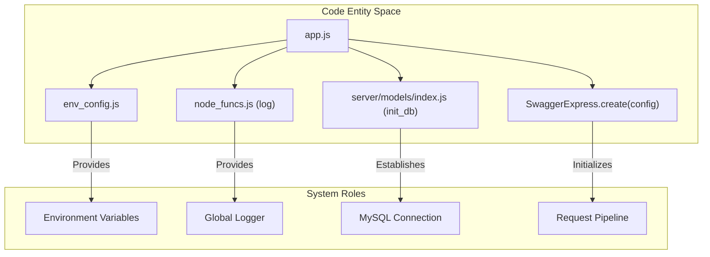
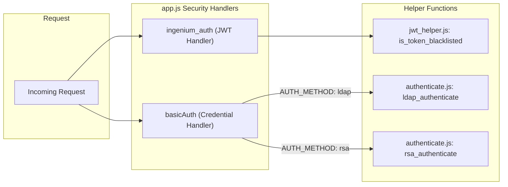

# Application Entry Point and Request Pipeline

Relevant source files

The following files were used as context for generating this wiki page:

- [auth_service/app.js](auth_service/app.js)
- [auth_service/config/README.md](auth_service/config/README.md)
- [auth_service/config/default.yaml](auth_service/config/default.yaml)

This page provides a deep dive into the initialization and request lifecycle of the Ingenium Auth Service (IAS). The service is built on Express and utilizes `swagger-express-mw` to orchestrate a middleware pipeline that handles security, validation, and routing based on an OpenAPI 2.0 specification.

## Application Initialization

The entry point of the application is `app.js`. It initializes global configurations, sets up logging, connects to the persistence layer, and configures the Swagger middleware.

### Database and Environment Setup
Before starting the server, the application performs several critical setup steps:
1.  **Environment Configuration**: Loads variables from `env_config.js`, including the `PUBLIC_PEM` used for JWT verification and the server `PORT` [auth_service/app.js:6-22]().
2.  **Logging**: Initializes a global `LogLevel` and a Winston-based logger via `node_funcs.js` [auth_service/app.js:25-28]().
3.  **Database Connection**: Executes an asynchronous IIFE to call `index.init_db(10)`, which attempts to establish a connection to MySQL with a retry limit of 10 [auth_service/app.js:87-93]().

### SwaggerExpress Configuration
The service uses `SwaggerExpress.create` to wrap the Express `app` instance. The configuration object defines `appRoot` and, crucially, the `swaggerSecurityHandlers` which map security definitions in `swagger.yaml` to JavaScript logic [auth_service/app.js:95-98]().

**Entity Mapping: Initialization Flow**

Sources: [auth_service/app.js:1-98](), [auth_service/server/models/index.js:89-93]()

---

## Request Pipeline and Middleware

The request pipeline is composed of standard Express middleware and a specialized Swagger "bagpipe" pipeline defined in `config/default.yaml`.

### Middleware Chain
1.  **CORS**: Enabled for all routes and options via `cors()` to support cross-origin API requests [auth_service/app.js:31-32]().
2.  **Audit Logging (Interceptor)**: Uses `express-interceptor` to capture outgoing responses. It checks `isInterceptable` by verifying if `req.swagger` exists, ensuring only API-managed paths are logged [auth_service/app.js:34-47](). The `intercept` function extracts the username from the `Authorization` header (JWT `bearer` or `basic`) and logs the operation's success or failure based on the `res.statusCode` [auth_service/app.js:49-84]().
3.  **Swagger UI**: Serves the API documentation at the `/docs` endpoint, which is registered before the main swaggerExpress middleware [auth_service/app.js:186-191]().
4.  **Swagger Router**: Registered to handle routing to controllers based on the OpenAPI specification [auth_service/app.js:193]().

### The Bagpipe Pipeline
The `config/default.yaml` file defines the `swagger_controllers` pipe, which dictates the order of operations for every API request:
*   `json_error_handler`: Catches errors and formats them as JSON [auth_service/config/default.yaml:26]().
*   `cors`: Handles Cross-Origin Resource Sharing [auth_service/config/default.yaml:27]().
*   `swagger_security`: Executes the handlers defined in `app.js` [auth_service/config/default.yaml:28]().
*   `_swagger_validate`: Validates request parameters and body against the schema [auth_service/config/default.yaml:29]().
*   `_router`: Dispatches the request to the appropriate controller file in `api/controllers/` [auth_service/config/default.yaml:31]().

Sources: [auth_service/app.js:31-85](), [auth_service/config/default.yaml:12-31]()

---

## Security Handlers

The `swaggerSecurityHandlers` object in `app.js` implements the logic for the two primary security schemes defined in the API specification.

### 1. ingenium_auth (JWT Handler)
This handler manages OAuth2-style token validation for all protected RBAC and session endpoints [auth_service/app.js:99-126]().
*   **Extraction**: Retrieves the token using `jwtHelper.get_jwt_from_header(req)` [auth_service/app.js:100]().
*   **Verification**: Uses `jwt.verify` with the `PUBLIC_PEM` and `RS256` algorithm [auth_service/app.js:106]().
*   **Blacklist Check**: Calls `jwtHelper.is_token_blacklisted(decoded.jti)` to ensure the token has not been revoked (e.g., via a previous `/logout`) [auth_service/app.js:111]().
*   **Scope Validation**: Compares the scopes required by the endpoint (passed as `scopesOrApiKey`) against the `decoded.scopes` in the token using `_.intersection` [auth_service/app.js:114]().

### 2. basicAuth (LDAP and RSA)
Used primarily for the `/login` endpoint to verify user credentials before issuing a JWT [auth_service/app.js:127-179]().
*   **Test Account Bypass**: If the credentials match `env_config.test_user` and `test_pass`, authentication is granted immediately to facilitate automated testing [auth_service/app.js:138-141]().
*   **Method Selection**: Checks the `X-AUTH-METHOD` header. It must match the configured `env_config.AUTH_METHOD` (e.g., "ldap" or "rsa") [auth_service/app.js:144-153]().
*   **RSA Path**: If `authMethod` is 'rsa', it calls `authentication.rsa_authenticate(user.name, user.pass)` [auth_service/app.js:156]().
*   **LDAP Path**: Otherwise, it defaults to `authentication.ldap_authenticate(user.name, user.pass)` [auth_service/app.js:167]().

**Entity Mapping: Security Flow**

Sources: [auth_service/app.js:99-179](), [auth_service/api/helpers/jwt_helper.js:111](), [auth_service/api/helpers/authenticate.js:11-12]()

---

## Data Flow Summary

| Component | Responsibility | Key Code Reference |
| :--- | :--- | :--- |
| **Interceptor** | Audit logging of all API calls (user, event, status) | [auth_service/app.js:34-85]() |
| **ingenium_auth** | JWT verification, Blacklist check (Redis), & scope intersection | [auth_service/app.js:99-126]() |
| **basicAuth** | Credential verification via LDAP or RSA SecurID | [auth_service/app.js:127-179]() |
| **Swagger UI** | Hosting interactive API documentation at `/docs` | [auth_service/app.js:186-191]() |
| **Bagpipe Pipeline** | Request validation, security execution, and controller routing | [auth_service/config/default.yaml:25-31]() |

Sources: [auth_service/app.js:1-193](), [auth_service/config/default.yaml:1-37]()
