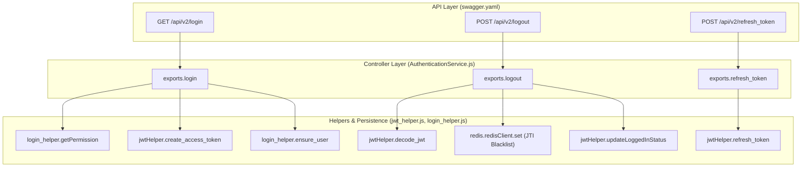
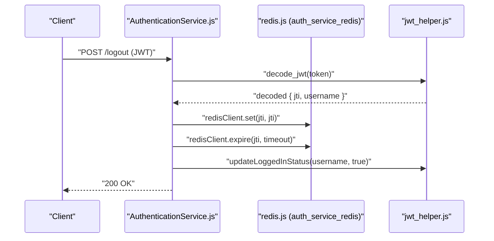

# Authentication Endpoints (/login, /logout, /refresh_token)

<details>
<summary>Relevant source files</summary>

The following files were used as context for generating this wiki page:

- [auth_service/api/controllers/AuthenticationService.js](auth_service/api/controllers/AuthenticationService.js)
- [auth_service/api/swagger/swagger.yaml](auth_service/api/swagger/swagger.yaml)

</details>


This page provides a detailed technical reference for the session management endpoints of the Ingenium Auth Service. These endpoints handle the transition from primary credentials (LDAP/RSA) to JSON Web Tokens (JWT) and manage the lifecycle of those tokens, including revocation via blacklisting and renewal.

## Overview of Session Management

The service exposes three primary endpoints for session management. The routing is defined in the Swagger specification and mapped to the `authentication.js` controller stub, which delegates logic to `AuthenticationService.js`.

| Endpoint | Method | Security Scheme | Purpose |
| :--- | :--- | :--- | :--- |
| `/login` | `GET` | `basicAuth` | Validates credentials and issues a new JWT. |
| `/logout` | `POST` | `ingenium_auth` | Revokes the current JWT by blacklisting its JTI in Redis. |
| `/refresh_token` | `POST` | `ingenium_auth` | Issues a new JWT if the current one is valid and not "long expired". |

**Sources:** [auth_service/api/swagger/swagger.yaml:45-126](), [auth_service/api/controllers/AuthenticationService.js:11-78]()

## Data Flow and Code Entity Mapping

The following diagram illustrates how a request flows from the API definition through the controller layer to the helper logic and persistence layers.

### Authentication Control Flow

**Sources:** [auth_service/api/controllers/AuthenticationService.js:11-78](), [auth_service/api/swagger/swagger.yaml:45-126]()

## Detailed Endpoint Reference

### 1. Login (`GET /login`)
The login endpoint uses HTTP Basic Authentication. The actual credential verification (LDAP or RSA) is handled by the `basicAuth` security handler in the request pipeline before reaching the controller.

*   **Logic:**
    1.  Retrieves the authenticated username from the request parameters [auth_service/api/controllers/AuthenticationService.js:17]().
    2.  Calls `login_helper.getPermission(username)` to aggregate roles and scopes from both LDAP groups and the local MySQL database [auth_service/api/controllers/AuthenticationService.js:18]().
    3.  If the user has valid scopes (length > 0), it generates a JWT via `jwtHelper.create_access_token` [auth_service/api/controllers/AuthenticationService.js:22-23]().
    4.  Triggers `login_helper.ensure_user(username)` to ensure the user exists in the local database (Just-In-Time provisioning) [auth_service/api/controllers/AuthenticationService.js:26]().
*   **Response Schema:**
    *   `access_token`: The signed RS256 JWT.
    *   `access_token_timeout`: Human-readable timeout string (e.g., from `env_config.ACCESS_TOKEN_TIMEOUT`) [auth_service/api/controllers/AuthenticationService.js:24]().
*   **Status Codes:**
    *   `200 OK`: Successful authentication [auth_service/api/controllers/AuthenticationService.js:24]().
    *   `401 Unauthorized`: No scopes found for user or invalid credentials [auth_service/api/controllers/AuthenticationService.js:28]().

**Sources:** [auth_service/api/controllers/AuthenticationService.js:11-30](), [auth_service/api/swagger/swagger.yaml:45-76]()

### 2. Logout (`POST /logout`)
Logout invalidates the current session. Since JWTs are stateless, the service implements a "blacklist" strategy using Redis.

*   **Logic:**
    1.  Decodes the provided token to retrieve the Unique Token Identifier (`jti`) [auth_service/api/controllers/AuthenticationService.js:45-49]().
    2.  Stores the `jti` in Redis using `redisClient.set` [auth_service/api/controllers/AuthenticationService.js:50]().
    3.  Sets an expiration on the Redis key equal to the `ACCESS_TOKEN_TIMEOUT` to ensure the blacklist doesn't grow indefinitely [auth_service/api/controllers/AuthenticationService.js:55]().
    4.  Updates the user's `loggedIn` status in the database to `true` (indicating a logout event occurred/status change) via `jwtHelper.updateLoggedInStatus` [auth_service/api/controllers/AuthenticationService.js:57]().
*   **Status Codes:**
    *   `200 OK`: Token successfully blacklisted [auth_service/api/controllers/AuthenticationService.js:58]().
    *   `401 Unauthorized`: No token provided [auth_service/api/controllers/AuthenticationService.js:47]().

**Sources:** [auth_service/api/controllers/AuthenticationService.js:33-60](), [auth_service/redis.js:1-20]()

### 3. Token Refresh (`POST /refresh_token`)
Allows a client to obtain a new token before the current one expires, provided the current token is still valid and has not exceeded the "long expire" threshold.

*   **Logic:**
    1.  Passes the current JWT to `jwtHelper.refresh_token(token)` [auth_service/api/controllers/AuthenticationService.js:70]().
    2.  The helper verifies the signature and checks if the token is blacklisted.
    3.  If the token is valid, a new token is returned with updated expiry [auth_service/api/controllers/AuthenticationService.js:76]().
    4.  If the token has reached "Long expire" (typically 12 hours), it returns a 403 error to force a full re-login [auth_service/api/controllers/AuthenticationService.js:73-74]().
*   **Status Codes:**
    *   `200 OK`: Returns new `access_token` and `access_token_timeout` [auth_service/api/controllers/AuthenticationService.js:76]().
    *   `401 Unauthorized`: Token is invalid or blacklisted [auth_service/api/controllers/AuthenticationService.js:72]().
    *   `403 Forbidden`: Token has exceeded the maximum refresh duration ("Long expire") [auth_service/api/controllers/AuthenticationService.js:74]().

**Sources:** [auth_service/api/controllers/AuthenticationService.js:62-78](), [auth_service/api/swagger/swagger.yaml:77-109]()

## Security and Implementation Details

### Token Structure
The tokens issued by these endpoints are signed using **RS256**. The payload typically contains:
*   `username`: The LDAP/system username.
*   `scopes`: Flattened list of permissions.
*   `roles`: List of assigned RBAC roles.
*   `jti`: Unique identifier for blacklisting.
*   `oit`: Original Issued Time (used to calculate "long expire" for refresh).

### Redis Interaction
The service relies on a Redis instance (`auth_service_redis`) to maintain the state of revoked tokens.


**Sources:** [auth_service/api/controllers/AuthenticationService.js:45-58](), [auth_service/redis.js:4-20]()

### Error Responses
All endpoints return a standard `ErrorResponse` object on failure, as defined in the Swagger schema:
```json
{
  "message": "String describing the error"
}
```
**Sources:** [auth_service/api/swagger/swagger.yaml:65-75]()
