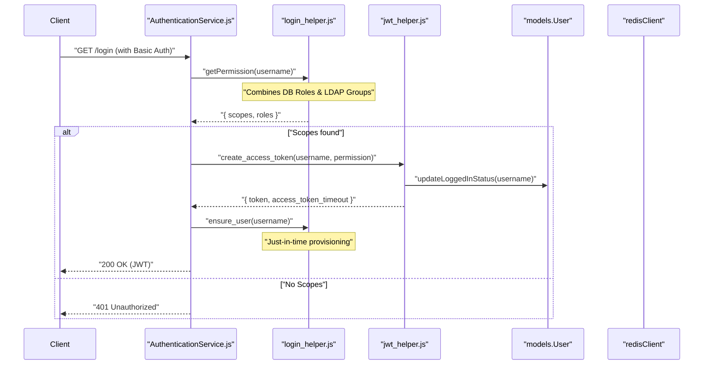
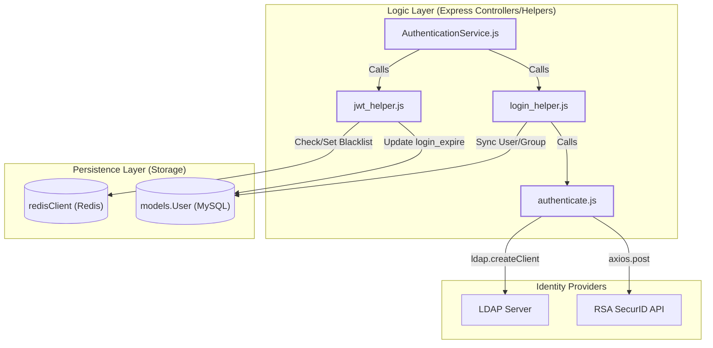

# Authentication and Token Management

Relevant source files

The following files were used as context for generating this wiki page:

- [auth_service/api/controllers/AuthenticationService.js](auth_service/api/controllers/AuthenticationService.js)
- [auth_service/api/controllers/authentication.js](auth_service/api/controllers/authentication.js)
- [auth_service/api/helpers/authenticate.js](auth_service/api/helpers/authenticate.js)
- [auth_service/api/helpers/jwt_helper.js](auth_service/api/helpers/jwt_helper.js)
- [auth_service/api/helpers/login_helper.js](auth_service/api/helpers/login_helper.js)

The Authentication and Token Management system provides a secure, stateless lifecycle for user sessions within the Ingenium platform. It leverages **JSON Web Tokens (JWT)** for session state, **LDAP/RSA** for identity verification, **MySQL** for persistent user/role data, and **Redis** for token revocation (blacklisting).

## Authentication Lifecycle Overview

The lifecycle consists of three primary phases: credential verification, token issuance, and session termination/extension.

1.  **Verification**: The system verifies user identity using external providers (LDAP or RSA SecurID) via `authenticate.js` [auth_service/api/helpers/authenticate.js:13-111]().
2.  **Authorization & Provisioning**: Upon successful login, `login_helper.js` aggregates permissions from the local database and LDAP groups [auth_service/api/helpers/login_helper.js:13-101](), and ensures the user exists in the local `User` table via `ensure_user` [auth_service/api/helpers/login_helper.js:103-124]().
3.  **Issuance**: A JWT is signed using `RS256` containing the user's scopes and roles by the `encode_token` function [auth_service/api/helpers/jwt_helper.js:21-36]().
4.  **Maintenance**: Users can refresh their access tokens via `refresh_token` before they expire, provided the `long_expire` window (typically 12 hours) has not passed [auth_service/api/helpers/jwt_helper.js:61-92]().
5.  **Revocation**: Logging out adds the token's unique identifier (`jti`) to a Redis blacklist until the token's natural expiry [auth_service/api/controllers/AuthenticationService.js:49-55]().

### High-Level Authentication Flow

The following diagram illustrates the interaction between the controllers, helpers, and external stores during a login request.

**Authentication Sequence: Login Flow**

**Sources:** [auth_service/api/controllers/AuthenticationService.js:11-30](), [auth_service/api/helpers/jwt_helper.js:52-59](), [auth_service/api/helpers/login_helper.js:13-101]()

---

## 3.1 Login, Logout, and Token Refresh Endpoints
The service exposes three main endpoints via the `AuthenticationService.js` controller. These endpoints manage the entry and exit points of the authentication lifecycle.

*   **GET /login**: Validates credentials (handled by the security handler) and returns a new JWT and its timeout. It also triggers just-in-time provisioning of the user record via `ensure_user` [auth_service/api/controllers/AuthenticationService.js:26-26]().
*   **POST /logout**: Invalidates the current JWT by extracting the `jti` (JWT ID) and storing it in Redis using `redisClient.set` and `redisClient.expire` [auth_service/api/controllers/AuthenticationService.js:49-55]().
*   **POST /refresh_token**: Issues a new JWT with a fresh expiry via `jwtHelper.refresh_token`, provided the original token is valid and hasn't exceeded the `long_expire` limit [auth_service/api/controllers/AuthenticationService.js:62-78]().

For details, see [Login, Logout, and Token Refresh Endpoints](#3.1).

**Sources:** [auth_service/api/controllers/AuthenticationService.js:11-78](), [auth_service/api/controllers/authentication.js:8-18](), [auth_service/api/helpers/jwt_helper.js:61-92]()

---

## 3.2 JWT Helper — Token Encoding, Decoding, and Blacklisting
The `jwt_helper.js` module is the engine for token operations. It uses asymmetric encryption (RS256) with `PUBLIC_PEM` and `PRIVATE_PEM` keys [auth_service/api/helpers/jwt_helper.js:14-17]().

*   **Payload Structure**: Tokens include `username`, `scopes`, `roles`, `jti` (unique ID), `iat` (issued at), and `oit` (original issued time) [auth_service/api/helpers/jwt_helper.js:22-28]().
*   **Blacklisting**: The `is_token_blacklisted` function performs an async lookup in Redis using `getAsync(jti)` to see if a token's `jti` has been revoked [auth_service/api/helpers/jwt_helper.js:103-119]().
*   **Session Tracking**: The `updateLoggedInStatus` function updates the `login_expire` timestamp in the MySQL `models.User` table to track active sessions [auth_service/api/helpers/jwt_helper.js:121-155]().

For details, see [JWT Helper — Token Encoding, Decoding, and Blacklisting](#3.2).

**Sources:** [auth_service/api/helpers/jwt_helper.js:21-49](), [auth_service/api/helpers/jwt_helper.js:103-119](), [auth_service/api/helpers/jwt_helper.js:121-155]()

---

## 3.3 LDAP and RSA Authentication Helpers
Identity verification is abstracted into `authenticate.js` and `ldap_helper.js`. These modules interface with external identity providers.

*   **LDAP**: `ldap_authenticate` handles TLS-secured binds to verify passwords [auth_service/api/helpers/authenticate.js:13-53]().
*   **RSA SecurID**: `rsa_authenticate` provides a two-step verification path (initialize and verify) for environments requiring multi-factor authentication [auth_service/api/helpers/authenticate.js:55-111]().
*   **User Info**: `ldap_helper.js` functions like `get_user_info` fetch detailed metadata (email, display name) from LDAP to populate the local database [auth_service/api/helpers/login_helper.js:114-116]().

For details, see [LDAP and RSA Authentication Helpers](#3.3).

**Sources:** [auth_service/api/helpers/authenticate.js:13-111](), [auth_service/api/helpers/login_helper.js:114-116]()

---

## 3.4 Login Helper — Permission Aggregation
The `login_helper.js` module bridges the gap between raw authentication and the RBAC system.

*   **Aggregation**: `getPermission` combines roles assigned directly to a user in the MySQL database via `user.getRoles()` [auth_service/api/helpers/login_helper.js:35-35]() with roles derived from their LDAP group memberships via `ldap_helper.getGroupsForUser(username)` [auth_service/api/helpers/login_helper.js:42-42]().
*   **Provisioning**: `ensure_user` ensures that every successfully authenticated user has a corresponding record in the local `models.User` table [auth_service/api/helpers/login_helper.js:103-124]().

For details, see [Login Helper — Permission Aggregation](#3.4).

**Sources:** [auth_service/api/helpers/login_helper.js:13-124](), [auth_service/api/controllers/AuthenticationService.js:18-26]()

---

## Data Entity Mapping

This diagram maps the logical authentication concepts to the specific code entities and storage locations used in the implementation.

**Code Entity Mapping: Authentication Components**

**Sources:** [auth_service/api/helpers/jwt_helper.js:4-9](), [auth_service/redis.js:1-10](), [auth_service/api/controllers/AuthenticationService.js:2-7](), [auth_service/api/helpers/authenticate.js:25-28](), [auth_service/api/helpers/authenticate.js:98-99]()
