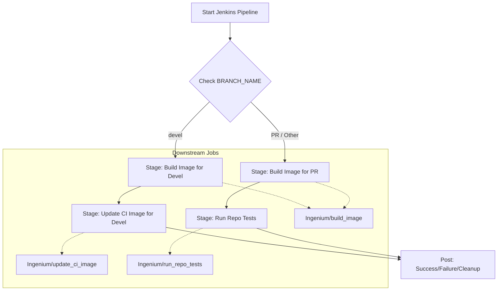

# CI/CD and Infrastructure

<details>
<summary>Relevant source files</summary>

The following files were used as context for generating this wiki page:

- [Jenkinsfile](Jenkinsfile)
- [Makefile](Makefile)
- [docker-compose.yml](docker-compose.yml)

</details>


This section provides a high-level overview of the build automation and deployment infrastructure for the Ingenium Auth Service (IAS). The service utilizes a Jenkins-based CI/CD pipeline for automated testing and image building, while the runtime environment is orchestrated using Docker Compose.

### CI/CD Pipeline Overview

The Ingenium Auth Service uses a `Jenkinsfile` [Jenkinsfile:1-94]() to define its continuous integration and delivery logic. The pipeline is designed to handle different workflows based on the branch being built: the stable `devel` branch and feature/pull-request (PR) branches.

For `devel` branch updates, the pipeline focuses on building and updating the primary service images used by the broader Ingenium platform. For PRs and other branches, the pipeline emphasizes validation by building ephemeral images tagged with the specific `GIT_COMMIT` [Jenkinsfile:7-7]() and running the repository's test suite to ensure no regressions are introduced.

**CI/CD Workflow Logic**


Sources: [Jenkinsfile:1-58](), [Jenkinsfile:59-94]()

For more details on the tagging strategy and downstream job parameters, see **[Jenkins CI/CD Pipeline](#8.1)**.

### Infrastructure and Service Stack

The infrastructure is defined as a multi-container stack using `docker-compose.yml` [docker-compose.yml:1-73](). This configuration ensures that the Node.js application has all necessary backing services (MySQL and Redis) and a secure entry point (Apache) available in a consistent environment.

**System Component Mapping**

| Component | Code Entity / Image | Purpose |
| :--- | :--- | :--- |
| **Auth Service** | `auth_service` [docker-compose.yml:4-5]() | The Node.js application container built from `./auth_service/`. |
| **Database** | `auth_service_mysql` [docker-compose.yml:31-32]() | Persistence layer (MySQL 5.6) for RBAC data. |
| **Cache/Session** | `auth_service_redis` [docker-compose.yml:55-56]() | Redis 3.2 for token blacklisting. |
| **Reverse Proxy** | `apache` [docker-compose.yml:42-43]() | HTTPS termination (httpd:2.4) and LDAP configuration. |
| **Network** | `auth` [docker-compose.yml:71-72]() | Isolated bridge network for inter-service communication. |

**Service Interconnectivity**

```mermaid
graph LR
    subgraph "External Access"
        HTTPS["Port 443"]
    end

    subgraph "Docker Compose Stack"
        "apache"["apache (httpd:2.4)"]
        "auth_service"["auth_service (Node.js)"]
        "auth_service_mysql"["auth_service_mysql (MySQL 5.6)"]
        "auth_service_redis"["auth_service_redis (Redis 3.2)"]
    end

    HTTPS --> "apache"
    "apache" -- "Proxy" --> "auth_service"
    "auth_service" -- "Sequelize" --> "auth_service_mysql"
    "auth_service" -- "redis-client" --> "auth_service_redis"

    class "auth_service" codeEntity
```
Sources: [docker-compose.yml:1-73](), [Makefile:1-12]()

The stack is managed locally via a `Makefile` which provides shorthand targets for `build`, `run`, and `stop` [Makefile:4-11]().

For details on environment variable wiring (such as `PUBLIC_PEM`, `PRIVATE_PEM`, and `MYSQL_HOST` [docker-compose.yml:21-29]()), TLS certificate mounting, and networking, see **[Docker Compose Stack](#8.2)**.

### Related Pages
*   **[Jenkins CI/CD Pipeline](#8.1)**: Deep dive into the `Jenkinsfile` stages, downstream job triggers (like `Ingenium/run_repo_tests` [Jenkinsfile:46-46]()), and workspace cleanup via `cleanWs()` [Jenkinsfile:90-90]().
*   **[Docker Compose Stack](#8.2)**: Detailed breakdown of service configurations, volume persistence (e.g., `/var/lib/mysql` [docker-compose.yml:41-41]()), and the Apache proxy setup.
