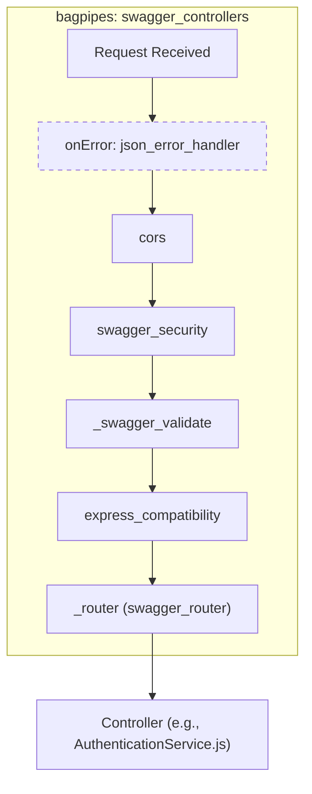
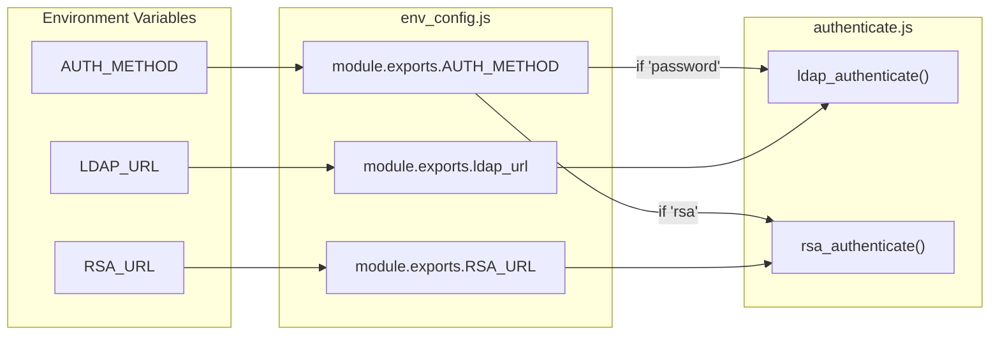

# Configuration and Environment Variables

Relevant source files

The following files were used as context for generating this wiki page:

- [auth_service/config/README.md](auth_service/config/README.md)
- [auth_service/config/default.yaml](auth_service/config/default.yaml)
- [auth_service/env_config.js](auth_service/env_config.js)
- [auth_service/package-lock.json](auth_service/package-lock.json)
- [auth_service/package.json](auth_service/package.json)

The Ingenium Auth Service (IAS) utilizes a multi-layered configuration strategy that combines hardcoded defaults, environment variable overrides, and a Swagger-node `bagpipes` pipeline definition. This ensures the service can be easily ported between development, CI, and production environments by simply modifying the environment context.

## Environment Configuration (`env_config.js`)

The primary entry point for application-level configuration is `env_config.js`. This module exports a set of constants used across the service, primarily by the database initializer, the JWT helper, and the authentication logic.

### Configuration Resolution Logic
The service follows a "Environment Variable First" pattern. If an environment variable is not provided, it falls back to a default value suitable for a local Docker-based development environment.

| Variable | Env Override | Default Value | Description |
| :--- | :--- | :--- | :--- |
| `db_username` | `MYSQL_USERNAME` | `'root'` | Username for MySQL connection. |
| `db_password` | `MYSQL_ROOT_PASSWORD` | `''` | Password for MySQL connection. |
| `db_name` | `MYSQL_DATABASE` | `'auth'` | The target MySQL database schema. |
| `db_host` | `MYSQL_HOST` | `'auth_service_mysql'` | Hostname of the MySQL container/server. |
| `PUBLIC_PEM` | `PUBLIC_PEM` | `''` | RSA Public Key for JWT verification. |
| `PRIVATE_PEM` | `PRIVATE_PEM` | `''` | RSA Private Key for JWT signing. |
| `AUTH_METHOD` | `AUTH_METHOD` | `'password'` | Toggle between `password` (LDAP) and `rsa` (MFA). |
| `ldap_url` | `LDAP_URL` | `''` | The URL for the LDAP server. |
| `RSA_URL` | `RSA_URL` | `https://jpltfa-primary.jpl.nasa.gov:5555/mfa/v1_1/authn` | Endpoint for RSA SecurID verification. |
| `RSA_CLIENT_ID` | `RSA_CLIENT_ID` | `'jw1'` | Client identifier for RSA authentication. |
| `RSA_CLIENT_KEY`| `RSA_CLIENT_KEY` | `''` | Secret key for RSA authentication. |
| `long_expire` | `LONG_EXPIRE` | `43200` | Expiration for refresh tokens (seconds). |

**Sources:** [auth_service/env_config.js:3-17](), [auth_service/env_config.js:19-33]()

### Static Constants
Some values are defined as static constants within `env_config.js` and are not currently exposed via environment variables:
*   `PORT`: Fixed at `8080` [auth_service/env_config.js:37-37]().
*   `ACCESS_TOKEN_TIMEOUT`: Set to `'3410s'` [auth_service/env_config.js:35-35]().
*   `LOG_LEVEL`: Defaulted to `'DEBUG'` [auth_service/env_config.js:38-38]().
*   `TEN_SEC_OFFSET`: Set to `10` [auth_service/env_config.js:36-36]().

## Swagger Bagpipes Pipeline

The service uses `swagger-node` with the `bagpipes` library to define the request processing pipeline. This is configured in `auth_service/config/default.yaml`. This file dictates how every incoming request is handled before it reaches the controller logic.

### The `swagger_controllers` Pipe
The `swagger_controllers` pipe is the standard processing sequence for all API endpoints.

**Data Flow: Request Pipeline**

### Key Fittings
*   **`swagger_security`**: Intercepts requests to check for security definitions (e.g., `ingenium_auth` or `basicAuth`) defined in the Swagger spec [auth_service/config/default.yaml:28-28]().
*   **`_swagger_validate`**: Uses the `swagger_validator` name to ensure incoming request bodies and parameters match the OpenAPI schema [auth_service/config/default.yaml:20-23]().
*   **`_router`**: The `swagger_router` fitting which maps the request to the appropriate controller file in `api/controllers` [auth_service/config/default.yaml:14-18]().

**Sources:** [auth_service/config/default.yaml:12-31]()

## Authentication & Security Configuration

The service's security posture is heavily dependent on the RSA key pair and the authentication method selected.

### JWT Key Management
The `PUBLIC_PEM` and `PRIVATE_PEM` variables are critical for the `jwt_helper.js` module. These keys must be provided as strings in the environment. If they are missing, the service will fail to sign or verify tokens using the `RS256` algorithm.

**Sources:** [auth_service/env_config.js:8-9](), [auth_service/env_config.js:32-33]()

### Auth Method Selection
The `AUTH_METHOD` variable in `env_config.js` determines the logic branch taken during the login process:
1.  **`password`**: The service uses `ldap_authenticate` within `authenticate.js` to bind against the `LDAP_URL` [auth_service/env_config.js:13-14]().
2.  **`rsa`**: The service uses `rsa_authenticate` to validate credentials against the `RSA_URL` using `RSA_CLIENT_ID` and `RSA_CLIENT_KEY` [auth_service/env_config.js:15-17]().

**Entity Mapping: Auth Configuration to Code**

**Sources:** [auth_service/env_config.js:13-17](), [auth_service/env_config.js:27-31]()

## Project Metadata and Dependencies

The project's environment is also defined by its `package.json` and `package-lock.json`, which specify the runtime engine requirements and library versions.

### Core Dependencies
*   **Web Framework**: `express` (^4.12.3) and `swagger-express-mw` (0.1.0) [auth_service/package.json:16-29]().
*   **Database**: `mysql` (^2.13.0) and `sequelize` (^3.31.2) [auth_service/package.json:24-26]().
*   **Security**: `jsonwebtoken` (^7.3.0), `express-jwt` (^5.1.0), and `ldapjs` (^1.0.1) [auth_service/package.json:18-21]().
*   **Utilities**: `winston` (3.1.0) for logging and `redis` (^2.7.1) for session management [auth_service/package.json:25-32]().

**Sources:** [auth_service/package.json:10-33]()
