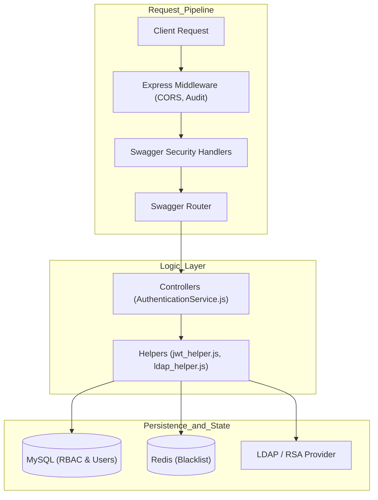
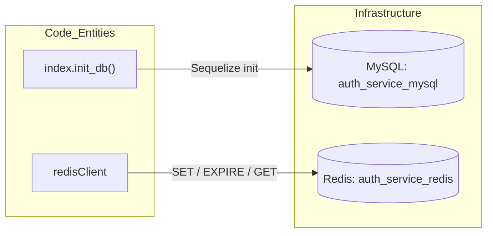

# Core Architecture

Relevant source files

The following files were used as context for generating this wiki page:

- [auth_service/app.js](auth_service/app.js)
- [auth_service/env_config.js](auth_service/env_config.js)
- [auth_service/node_funcs.js](auth_service/node_funcs.js)
- [auth_service/redis.js](auth_service/redis.js)

This page provides a high-level overview of the **Ingenium Auth Service (IAS)** internal structure. The service is built on Node.js using the Express framework and the `swagger-node` (Bagpipes) pipeline. It coordinates between an LDAP/RSA provider for identity, a MySQL database for Role-Based Access Control (RBAC) persistence, and a Redis instance for session-state management (token blacklisting).

## System Component Overview

The architecture follows a layered approach where requests pass through a security and validation pipeline before reaching the controller logic.

Title: System Component Interaction

**Sources:** [auth_service/app.js:3-21](), [auth_service/app.js:183-186]()

---

## Request Pipeline and Security

The service entry point is `app.js`, which initializes `SwaggerExpress` and configures the Express middleware chain. 

### 1. Middleware Stack
Every request is processed by:
*   **CORS:** Standard cross-origin resource sharing enabled for all routes [auth_service/app.js:31-32]().
*   **Audit Interceptor:** A custom `express-interceptor` that captures request metadata like `user_name`, `operation_id`, and `statusCode` for structured logging [auth_service/app.js:34-85]().
*   **Swagger Pipeline:** Created via `SwaggerExpress.create`, managing validation and routing [auth_service/app.js:183-186]().

### 2. Security Handlers
The `swaggerSecurityHandlers` object in `app.js` defines the logic for protecting endpoints:
*   **`ingenium_auth`:** Validates JWTs using the `RS256` algorithm with `PUBLIC_PEM` and performs a `is_token_blacklisted` check against Redis [auth_service/app.js:99-126]().
*   **`basicAuth`:** Handles initial login. It supports a local `test_user` for development and routes production requests to `ldap_authenticate` or `rsa_authenticate` based on the `AUTH_METHOD` configuration [auth_service/app.js:127-180]().

For details, see [Application Entry Point and Request Pipeline](#2.1).

**Sources:** [auth_service/app.js:98-180](), [auth_service/env_config.js:13-13]()

---

## Configuration and Environment

The service relies on `env_config.js` to aggregate environment variables and provide defaults. These settings control database connections (`MYSQL_HOST`), security keys (`PUBLIC_PEM`/`PRIVATE_PEM`), and the authentication provider (LDAP vs. RSA).

*   **Defaults:** Provides fallbacks for critical values like `db_host` ("auth_service_mysql") and `PORT` (8080) [auth_service/env_config.js:7-37]().
*   **Security:** Loads the RSA keys required for JWT signing and verification [auth_service/env_config.js:8-9]().

For details, see [Configuration and Environment Variables](#2.2).

**Sources:** [auth_service/env_config.js:1-39](), [auth_service/app.js:6-7]()

---

## Logging and Utilities

IAS uses a custom Winston-based logger defined in `node_funcs.js`. It supports standard levels (critical to trace) and outputs logs in a structured JSON format via the `json_formatter` [auth_service/node_funcs.js:25-55]().

*   **Logger:** Configured with `Console` and optional `File` transports based on the `LOG_FILE_PATH` environment variable [auth_service/node_funcs.js:57-74]().
*   **Helpers:** Includes a `String.prototype.format` extension and a `parse_username` utility to extract identities from JWT headers [auth_service/node_funcs.js:13-16](), [auth_service/node_funcs.js:76-83]().

For details, see [Logging and Utility Functions](#2.3).

**Sources:** [auth_service/node_funcs.js:19-74]()

---

## Data Persistence and Session State

The service uses two distinct data stores to balance persistence and performance.

### 1. MySQL (Persistence)
Managed via the Sequelize ORM, MySQL stores the source of truth for Users, Roles, Permissions, and Groups. The connection is initialized in `app.js` using `index.init_db(10)`, which includes retry logic to handle container startup delays [auth_service/app.js:87-93]().

### 2. Redis (Session State)
Redis is used exclusively for the token blacklist. The `redis.js` module initializes a client connecting to `auth_service_redis` on port `6379` [auth_service/redis.js:6-6](). When a user logs out, their token's unique identifier (`jti`) is stored in Redis. Every authenticated request using the `ingenium_auth` handler checks this store to ensure the token has not been revoked [auth_service/app.js:111-120]().

Title: Data Layer Architecture

For details, see [Redis Session Store](#2.4).

**Sources:** [auth_service/redis.js:1-17](), [auth_service/app.js:89-89](), [auth_service/app.js:15-15]()
