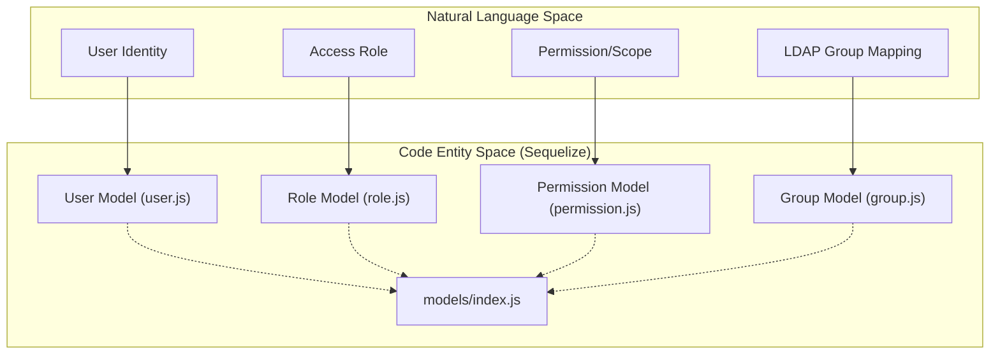
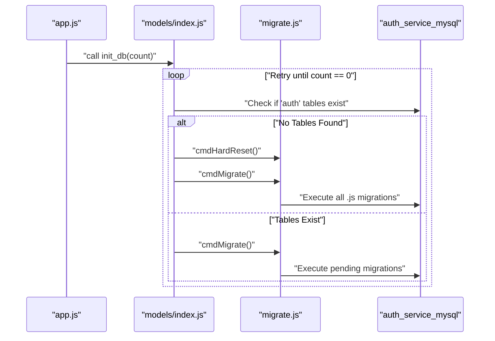

# Data Layer — Models and Migrations

Relevant source files

The following files were used as context for generating this wiki page:

- [auth_service/.sequelizerc](auth_service/.sequelizerc)
- [auth_service/server/config.json](auth_service/server/config.json)
- [auth_service/server/migrate.js](auth_service/server/migrate.js)
- [auth_service/server/models/index.js](auth_service/server/models/index.js)

The **Ingenium Auth Service (IAS)** uses **Sequelize** as its Object-Relational Mapper (ORM) to manage persistence in a MySQL database. The data layer is responsible for defining the RBAC schema (Users, Roles, Permissions, and Groups), handling many-to-many associations, and managing the database lifecycle through automated migrations and seeding.

### Core Data Architecture

The data layer is centered around the `sequelize` instance configured in the models directory. It utilizes a dynamic loading mechanism to initialize all models and their associations automatically.

Database connection parameters (host, username, password) are pulled from `env_config.js` [auth_service/server/models/index.js:11-24](), allowing the service to adapt to different environments (local, Docker, or production) as defined in `config.json` [auth_service/server/config.json:1-23]().

#### Data Entity Mapping
The following diagram bridges the logical RBAC concepts to the specific Sequelize code entities and files.

**Concept to Code Mapping**

Sources: [auth_service/server/models/index.js:70-78](), [auth_service/.sequelizerc:6-6]()

---

### Database Lifecycle and Initialization

The service implements a self-healing database initialization strategy. Upon startup, the `init_db` function attempts to connect to MySQL and verify the existence of the `auth` schema.

1.  **Schema Creation**: If the `auth` database does not exist, it is created using a raw SQL query [auth_service/server/models/index.js:30-43]().
2.  **Retry Logic**: The `init_db` function uses a recursive retry mechanism (with a 5-second sleep interval) to wait for the MySQL container to become ready [auth_service/server/models/index.js:45-68]().
3.  **Migration Execution**: If no tables are found, a hard reset and full migration are triggered via `migrate.js`. If tables exist, it runs any pending incremental migrations [auth_service/server/models/index.js:53-62]().

**Database Initialization Flow**

Sources: [auth_service/server/models/index.js:45-68](), [auth_service/server/models/index.js:9-13]()

---

### Detailed Components

#### Sequelize Models and Associations
The service defines several core models and their join tables (e.g., `RoleUser`, `RolePermission`). The `models/index.js` file uses `fs.readdirSync` to import every file in the directory and then invokes the `associate` method on each model to establish foreign key relationships [auth_service/server/models/index.js:70-84]().

For a deep dive into specific model definitions and the many-to-many relationship graph, see:
**[Sequelize Models and Associations](#5.1)**

#### Database Migrations and Seeding
IAS uses **Umzug** (a framework-agnostic migration tool for Node) rather than the standard Sequelize CLI to handle migrations programmatically [auth_service/server/migrate.js:18-38](). The `migrate.js` utility provides commands for migrating "up", "down", and performing "hard resets" which wipe and re-seed the database [auth_service/server/migrate.js:82-118](). This includes the initial seeding of the `admin` user and default roles.

For details on the migration files, seeding logic, and CLI commands, see:
**[Database Migrations and Seeding](#5.2)**

---

### Configuration Summary

The Sequelize environment is governed by the `.sequelizerc` file, which maps logical paths to physical directories in the repository:

| Path Type | Physical Location |
| :--- | :--- |
| **Config** | `auth_service/server/config.json` |
| **Migrations** | `auth_service/server/migrations` |
| **Models** | `auth_service/server/models` |
| **Seeders** | `auth_service/server/seeders` |

Sources: [auth_service/.sequelizerc:3-8](), [auth_service/server/config.json:1-23]()
