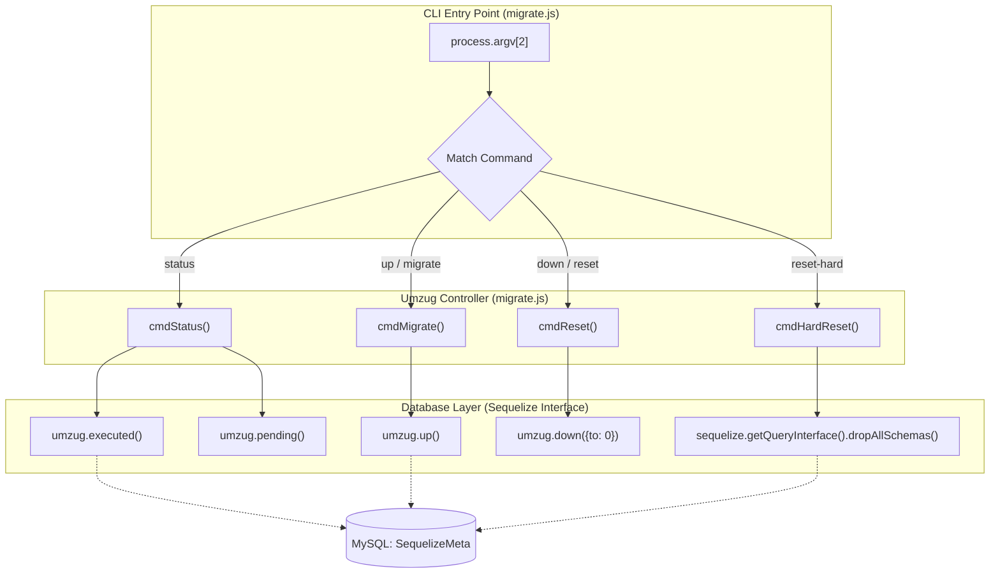
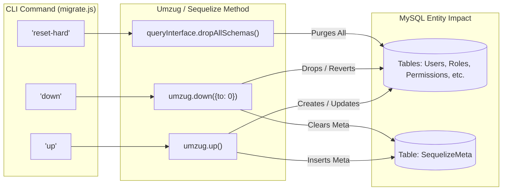

# Database Migrations and Seeding

Relevant source files

The following files were used as context for generating this wiki page:

- [auth_service/server/migrate.js](auth_service/server/migrate.js)
- [auth_service/server/migrations/20170215223647-create-role-permission.js](auth_service/server/migrations/20170215223647-create-role-permission.js)
- [auth_service/server/migrations/20170215223648-create-user.js](auth_service/server/migrations/20170215223648-create-user.js)
- [auth_service/server/migrations/20170215230216-create-user-group.js](auth_service/server/migrations/20170215230216-create-user-group.js)
- [auth_service/server/migrations/20170215230217-create-group.js](auth_service/server/migrations/20170215230217-create-group.js)
- [auth_service/server/migrations/20170215230218-create-role-group.js](auth_service/server/migrations/20170215230218-create-role-group.js)
- [auth_service/server/migrations/20170215233859-create-permission.js](auth_service/server/migrations/20170215233859-create-permission.js)
- [auth_service/server/migrations/20170215234148-create-role.js](auth_service/server/migrations/20170215234148-create-role.js)
- [auth_service/server/migrations/20170221201537-create-role-user.js](auth_service/server/migrations/20170221201537-create-role-user.js)
- [auth_service/server/migrations/20170221201538-create-user-permission.js](auth_service/server/migrations/20170221201538-create-user-permission.js)
- [auth_service/server/migrations/20170221201539-permissions.js](auth_service/server/migrations/20170221201539-permissions.js)
- [auth_service/server/migrations/20170519012825-admin_account.js](auth_service/server/migrations/20170519012825-admin_account.js)
- [auth_service/server/migrations/20170519012826-test_account.js](auth_service/server/migrations/20170519012826-test_account.js)
- [auth_service/server/migrations/20170607154708-rolepermissions.js](auth_service/server/migrations/20170607154708-rolepermissions.js)
- [auth_service/server/migrations/20170607164120-rolegroup.js](auth_service/server/migrations/20170607164120-rolegroup.js)
- [auth_service/server/migrations/20240930000000-venuegroup.js](auth_service/server/migrations/20240930000000-venuegroup.js)

This section describes the database lifecycle management for the Ingenium Auth Service (IAS). The service uses a migration-based approach to evolve the MySQL schema and seed initial data, ensuring consistency across development, test, and production environments.

## Migration Engine: migrate.js

The IAS utilizes [Umzug](https://github.com/sequelize/umzug), a framework-agnostic migration tool for Node.js, to handle Sequelize-based migrations. The core logic is encapsulated in `auth_service/server/migrate.js`.

### Implementation Details
The `migrate.js` script initializes an `Umzug` instance configured to store migration state within the MySQL database itself using a table named `SequelizeMeta` [auth_service/server/migrate.js:18-22](). It dynamically loads all `.js` files from the `auth_service/server/migrations` directory [auth_service/server/migrate.js:33-34]().

**Key Components:**
*   **Sequelize Instance**: Configured using `env_config.js` parameters (`db_name`, `db_host`, etc.) [auth_service/server/migrate.js:11-16]().
*   **Logging**: Migration events (`migrating`, `migrated`, `reverting`, `reverted`) are hooked into the system logger [auth_service/server/migrate.js:40-48]().
*   **Parameters**: Each migration's `up` and `down` functions receive the `queryInterface` and `Sequelize` (DataTypes) as arguments [auth_service/server/migrate.js:25-32]().

### Migration Execution Flow
The following diagram illustrates how the `migrate.js` CLI interacts with Umzug and the MySQL database.

**Migration CLI Logic Flow**

Sources: [auth_service/server/migrate.js:50-118](), [auth_service/server/migrate.js:127-159]()

---

## Migration Chronology

Migrations are executed in alphabetical/chronological order based on their filenames. The schema evolution follows a pattern of creating entity tables, followed by association tables, and finally seeding data.

### 1. Schema Creation (Core Entities)
These migrations define the primary tables for the RBAC system.
*   **Users**: Creates the `Users` table with `username`, `display_name`, and `login_expire` [auth_service/server/migrations/20170215223648-create-user.js:4-29]().
*   **Groups**: Creates the `Groups` table [auth_service/server/migrations/20170215230217-create-group.js:4-23]().
*   **Roles**: Creates the `Roles` table with `name` and `description` [auth_service/server/migrations/20170215234148-create-role.js:4-25]().
*   **Permissions**: Creates the `Permissions` table [auth_service/server/migrations/20170215233859-create-permission.js:4-22]().

### 2. Association Tables (Many-to-Many)
These migrations create the join tables that facilitate the RBAC relationships.
*   **RolePermissions**: Links Roles to Permissions [auth_service/server/migrations/20170215223647-create-role-permission.js:4-23]().
*   **UserGroups**: Links Users to Groups [auth_service/server/migrations/20170215230216-create-user-group.js:4-23]().
*   **RoleGroups**: Links Roles to Groups [auth_service/server/migrations/20170215230218-create-role-group.js:4-23]().
*   **RoleUsers**: Links Roles to Users [auth_service/server/migrations/20170221201537-create-role-user.js:4-23]().
*   **UserPermissions**: Direct link for Users to Permissions [auth_service/server/migrations/20170221201538-create-user-permission.js:4-23]().

### 3. Data Seeding and Schema Updates
Initial system state is established through `bulkInsert` commands, and the schema is updated for multi-tenancy.
*   **Initial Permissions**: Seeds standard permissions such as `admin`, `execute:wsts`, `config_mgmt`, and `redline` [auth_service/server/migrations/20170221201539-permissions.js:15-64]().
*   **Admin Account**: Seeds the `ingenium-dev` group and the `Admin` role [auth_service/server/migrations/20170519012825-admin_account.js:17-28]().
*   **Test Account**: Seeds initial test users and group associations [auth_service/server/migrations/20170519012826-test_account.js:1-40]().
*   **Venue Grouping**: Migration `20240930000000-venuegroup.js` adds `venue_group_id` columns to `Roles` and `Permissions` tables to support multi-tenant filtering [auth_service/server/migrations/20240930000000-venuegroup.js:1-50]().

Sources: [auth_service/server/migrations/]() (All files in directory)

---

## CLI Usage and Commands

The `migrate.js` script can be executed via the command line to manage the database state.

| Command | Function Name | Description |
| :--- | :--- | :--- |
| `status` | `cmdStatus` | Returns a list of executed and pending migrations [auth_service/server/migrate.js:50-80](). |
| `up` / `migrate` | `cmdMigrate` | Runs all pending migrations [auth_service/server/migrate.js:82-85](). |
| `next` | `cmdMigrateNext` | Runs exactly one pending migration [auth_service/server/migrate.js:87-96](). |
| `down` / `reset` | `cmdReset` | Reverts all migrations (down to state 0) [auth_service/server/migrate.js:98-101](). |
| `prev` | `cmdResetPrev` | Reverts the last executed migration [auth_service/server/migrate.js:103-112](). |
| `reset-hard` | `cmdHardReset` | **Destructive**: Drops all tables in the schema using `interface.dropAllSchemas()` [auth_service/server/migrate.js:114-118](). |

### Code-to-Entity Mapping
The following diagram maps the CLI commands to the underlying Umzug methods and the resulting database impact.

**CLI to Database Mapping**

Sources: [auth_service/server/migrate.js:127-159](), [auth_service/server/migrate.js:18-38]()

---

## Seeding Strategy

Seeding is handled as standard migrations to ensure that every environment (including CI) starts with the same base configuration.

### Administrative Bootstrap
The `20170519012825-admin_account.js` migration is critical for initial access. It:
1.  Inserts the `ingenium-dev` group into the `Groups` table [auth_service/server/migrations/20170519012825-admin_account.js:17-21]().
2.  Inserts the `Admin` role into the `Roles` table [auth_service/server/migrations/20170519012825-admin_account.js:22-28]().

This allows users who are members of the `ingenium-dev` LDAP group to automatically inherit the `Admin` role upon their first login.

### Permission Definitions
Permissions are seeded as a flat list in `20170221201539-permissions.js`. These names (e.g., `admin`, `execute:wsts`, `config_mgmt`) are the strings that eventually appear in the `scopes` array of the issued JWT [auth_service/server/migrations/20170221201539-permissions.js:15-64]().

### Role-Permission Mapping
Initial mappings between Roles and Permissions (and Roles and Groups) are established in dedicated migrations like `20170607154708-rolepermissions.js` and `20170607164120-rolegroup.js`, which use `bulkInsert` to populate the association tables [auth_service/server/migrations/20170607154708-rolepermissions.js:1-30](), [auth_service/server/migrations/20170607164120-rolegroup.js:1-30]().

Sources: [auth_service/server/migrations/20170519012825-admin_account.js:4-41](), [auth_service/server/migrations/20170221201539-permissions.js:3-77](), [auth_service/server/migrations/20170607154708-rolepermissions.js:1-30]()
