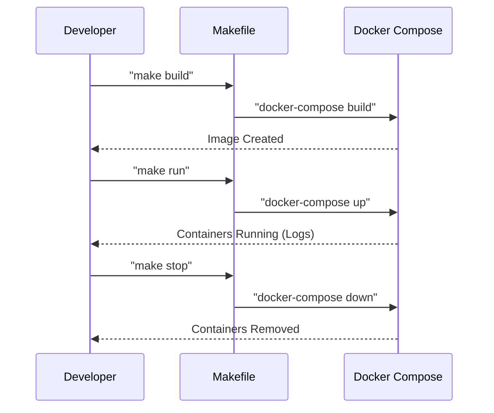

# Docker Compose Stack

<details>
<summary>Relevant source files</summary>

The following files were used as context for generating this wiki page:

- [Makefile](Makefile)
- [auth_service/.dockerignore](auth_service/.dockerignore)
- [auth_service/Dockerfile](auth_service/Dockerfile)
- [docker-compose.yml](docker-compose.yml)

</details>


The Ingenium Auth Service is deployed as a multi-container architecture using Docker Compose. This stack orchestrates the Node.js application, its persistence layers (MySQL and Redis), and an Apache reverse proxy to handle HTTPS termination. The infrastructure is defined to ensure consistent environments across development, CI, and production deployments.

### Stack Overview and Service Definitions

The `docker-compose.yml` file defines four primary services connected via a dedicated bridge network named `auth` [docker-compose.yml:71-72]().

| Service | Image / Build Source | Port(s) | Role |
| :--- | :--- | :--- | :--- |
| `auth_service` | `./auth_service/` | 8080 | The core Node.js application logic. |
| `auth_service_mysql` | `mysql:5.6` | 3306 | Persistent relational storage for RBAC data. |
| `auth_service_redis` | `redis:3.2` | 6379 | In-memory store for token blacklisting. |
| `apache` | `httpd:2.4` | 443 | HTTPS reverse proxy and TLS termination. |

#### Service Topology
The following diagram illustrates the connectivity and dependency flow between the containers in the stack.

**Service Dependency and Network Diagram**
```mermaid
graph TD
    subgraph "External Network"
        ["User/Client"]
    end

    subgraph "Auth Bridge Network"
        ["apache (httpd:2.4)"] -- "ProxyPass" --> ["auth_service (Node.js)"]
        ["auth_service (Node.js)"] -- "Sequelize" --> ["auth_service_mysql (MySQL 5.6)"]
        ["auth_service (Node.js)"] -- "Redis Client" --> ["auth_service_redis (Redis 3.2)"]
    end

    ["User/Client"] -- "HTTPS (443)" --> ["apache (httpd:2.4)"]
    ["auth_service (Node.js)"] -- "Depends On" --> ["auth_service_mysql (MySQL 5.6)"]
    ["auth_service (Node.js)"] -- "Depends On" --> ["auth_service_redis (Redis 3.2)"]
```
**Sources:** [docker-compose.yml:3-72]()

---

### Container Implementation Details

#### 1. auth_service (Node.js)
This container encapsulates the application logic. It is built from a custom Dockerfile based on `node:8.6.0` [auth_service/Dockerfile:1]().
*   **Build Process**: The `WORKDIR` is set to `/auth_service`, where the source code is copied and `npm install` is executed [auth_service/Dockerfile:4-8]().
*   **Runtime**: The container starts by executing `node app.js` [auth_service/Dockerfile:9]().
*   **Exclusion**: To keep the image lightweight, `node_modules` and the `Dockerfile` itself are ignored during the build context transfer [auth_service/.dockerignore:1-2]().
*   **Dependencies**: It explicitly depends on `auth_service_mysql` and `auth_service_redis` to ensure the data layers are available before the application starts [docker-compose.yml:17-19]().

#### 2. auth_service_mysql (MySQL 5.6)
Provides the relational database for the Sequelize ORM.
*   **Data Persistence**: A host volume mapping is used (`/data/auth/db:/var/lib/mysql`) to ensure database records survive container restarts or removals [docker-compose.yml:41]().
*   **Initialization**: The `MYSQL_DATABASE` environment variable is used to automatically create the required schema on startup [docker-compose.yml:37]().

#### 3. apache (HTTPS Proxy)
Acts as the secure entry point for the service.
*   **TLS Configuration**: It mounts local certificates and configuration files into the container:
    *   `server.crt` and `server.key` for TLS [docker-compose.yml:45-46]().
    *   `httpd-ssl.conf` for SSL termination logic [docker-compose.yml:49]().
*   **LDAP Integration**: It also mounts `ldap.conf` to support underlying LDAP communication requirements [docker-compose.yml:50]().

#### 4. auth_service_redis (Redis 3.2)
Used for high-performance session management and token blacklisting.
*   **Networking**: Operates within the `auth` bridge network, allowing `auth_service` to connect via the hostname `auth_service_redis` [docker-compose.yml:55-58]().

**Sources:** [auth_service/Dockerfile:1-10](), [auth_service/.dockerignore:1-3](), [docker-compose.yml:4-58]()

---

### Environment Variable Wiring

The `auth_service` container relies on environment variables injected via Docker Compose to configure its security and database connections. These variables often map to host environment variables (using the `${VAR}` syntax).

| Environment Variable | Source (docker-compose) | Purpose |
| :--- | :--- | :--- |
| `PUBLIC_PEM` | `${PUBLIC_PEM}` | RSA Public key for JWT verification [docker-compose.yml:21](). |
| `PRIVATE_PEM` | `${PRIVATE_PEM}` | RSA Private key for JWT signing [docker-compose.yml:22](). |
| `LONG_EXPIRE` | `${LONG_EXPIRE}` | Refresh token expiration duration [docker-compose.yml:23](). |
| `USERNAME` | `${TEST_USER}` | Default test user for initialization [docker-compose.yml:24](). |
| `PASSWORD` | `${TEST_PASS}` | Default test password for initialization [docker-compose.yml:25](). |
| `MYSQL_HOST` | `${MYSQL_HOST}` | Hostname for DB connection [docker-compose.yml:29](). |
| `MYSQL_DATABASE` | `${AUTH_DB_MYSQL_DATABASE}` | The name of the MySQL schema [docker-compose.yml:28](). |
| `MYSQL_USERNAME` | `${MYSQL_USERNAME}` | DB user for the Node application [docker-compose.yml:27](). |
| `MYSQL_ROOT_PASSWORD`| `${AUTH_DB_MYSQL_ROOT_PASSWORD}`| Root password for DB initialization [docker-compose.yml:26](). |

**Sources:** [docker-compose.yml:20-29]()

---

### Operational Commands

The project includes a `Makefile` to simplify the management of the Docker Compose stack.

**Stack Management Workflow**


*   **Build**: `make build` triggers `docker-compose build`. This is necessary when `auth_service` source code or dependencies change [Makefile:4-5]().
*   **Run**: `make run` (or `make all`) triggers `docker-compose up`, which starts all services in the order defined by `depends_on` [Makefile:7-8]().
*   **Stop**: `make stop` triggers `docker-compose down`, which stops and removes the containers and the `auth` network [Makefile:10-11]().

**Sources:** [Makefile:1-12]()
