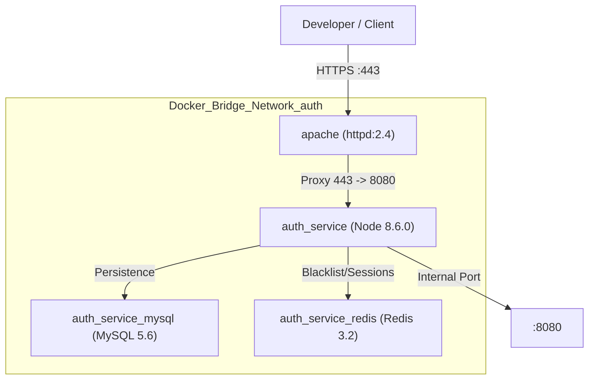
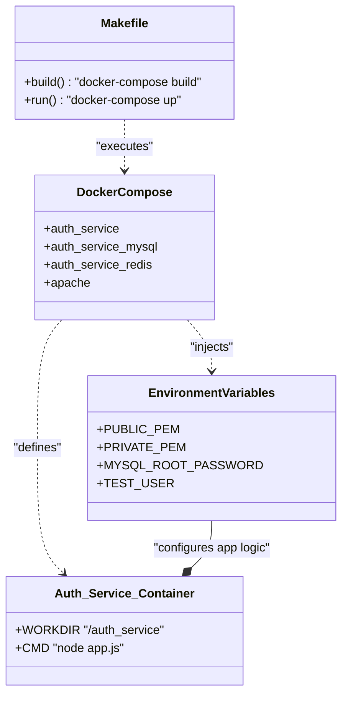

# Getting Started — Local Development Setup

<details>
<summary>Relevant source files</summary>

The following files were used as context for generating this wiki page:

- [.gitignore](.gitignore)
- [Makefile](Makefile)
- [auth_service/.dockerignore](auth_service/.dockerignore)
- [auth_service/Dockerfile](auth_service/Dockerfile)
- [docker-compose.yml](docker-compose.yml)

</details>


This page provides a comprehensive guide for setting up and running the Ingenium Auth Service (IAS) in a local development environment. The service is containerized using Docker and managed via a `Makefile` to simplify the build and deployment lifecycle.

## Prerequisites

Before starting, ensure the following software is installed on your host machine:
*   **Docker & Docker Compose**: Used to orchestrate the Node.js application, MySQL database, Redis session store, and Apache reverse proxy [docker-compose.yml:1-73]().
*   **Make**: Used to execute build and run targets defined in the project root [Makefile:1-12]().
*   **OpenSSL**: Required to generate the RSA key pair used for JWT signing and verification.

## Environment Configuration (.env)

The service relies on environment variables for configuration. These should be defined in a `.env` file in the root directory (as `.env` is excluded from version control [ .gitignore:2-2]()). These variables are injected into the containers via `docker-compose.yml` [docker-compose.yml:20-29]().

### Key Environment Variables

| Variable | Description | Source Mapping |
| :--- | :--- | :--- |
| `PUBLIC_PEM` | RSA Public Key (String) used for JWT verification | `${PUBLIC_PEM}` |
| `PRIVATE_PEM` | RSA Private Key (String) used for JWT signing | `${PRIVATE_PEM}` |
| `AUTH_DB_MYSQL_ROOT_PASSWORD` | Root password for the MySQL container | `MYSQL_ROOT_PASSWORD` |
| `AUTH_DB_MYSQL_DATABASE` | Name of the authentication database | `MYSQL_DATABASE` |
| `MYSQL_USERNAME` | Username for DB connections | `MYSQL_USERNAME` |
| `MYSQL_HOST` | Hostname of the MySQL container | `MYSQL_HOST` |
| `TEST_USER` | Username for the local test account | `USERNAME` |
| `TEST_PASS` | Password for the local test account | `PASSWORD` |
| `LONG_EXPIRE` | Refresh token expiration duration | `LONG_EXPIRE` |

**Sources:** [docker-compose.yml:20-29](), [auth_service/Dockerfile:1-10]()

### Generating JWT Keys
The service uses RS256 signing. You must generate a 2048-bit RSA key pair and provide the strings in the `PUBLIC_PEM` and `PRIVATE_PEM` variables within your `.env` file.
```bash
# Generate private key
openssl genrsa -out private.pem 2048
# Extract public key
openssl rsa -in private.pem -outform PEM -pubout -out public.pem
```

## Local Development Stack

The local environment is composed of four primary containers networked together via a bridge network named `auth` [docker-compose.yml:71-72]().

### Service Architecture Diagram

This diagram maps the logical components of the stack to their specific Docker service names and port configurations defined in `docker-compose.yml`.


**Sources:** [docker-compose.yml:1-73](), [auth_service/Dockerfile:1-9]()

## Build and Run Commands

The project includes a `Makefile` to standardize the setup process.

### Makefile Targets
*   **`make build`**: Triggers `docker-compose build`. This builds the `auth_service` image using the `Dockerfile` located in `./auth_service/` [Makefile:4-5]().
*   **`make run`**: Triggers `docker-compose up`. This starts all services in the foreground [Makefile:7-8]().
*   **`make stop`**: Triggers `docker-compose down`. This stops and removes the containers [Makefile:10-11]().
*   **`make all`**: Sequential execution of `build` and `run` [Makefile:2-2]().

### Application Entry Flow
When the `auth_service` container starts, it executes the following sequence:
1.  **Workdir**: Sets context to `/auth_service` [auth_service/Dockerfile:4-4]().
2.  **Copy**: Transfers source code to the container, excluding items in `.dockerignore` like `node_modules` [auth_service/Dockerfile:5-5](), [auth_service/.dockerignore:1-3]().
3.  **Install**: Runs `npm install` to fetch dependencies [auth_service/Dockerfile:8-8]().
4.  **Start**: Executes `node app.js` [auth_service/Dockerfile:9-9]().

## Test User Account

For local development and CI testing, the service supports a "test user" flow. 
1.  Credentials are provided via `TEST_USER` and `TEST_PASS` in the environment [docker-compose.yml:24-25]().
2.  These are mapped to `USERNAME` and `PASSWORD` inside the `auth_service` container [docker-compose.yml:24-25]().
3.  The database is initialized with these credentials via migrations/seeds to allow immediate login for testing purposes.

## Code Entity Mapping

The following diagram illustrates how the local setup files and environment variables relate to the initialization of the system.



**Sources:** [Makefile:1-12](), [docker-compose.yml:1-73](), [auth_service/Dockerfile:1-10]()
