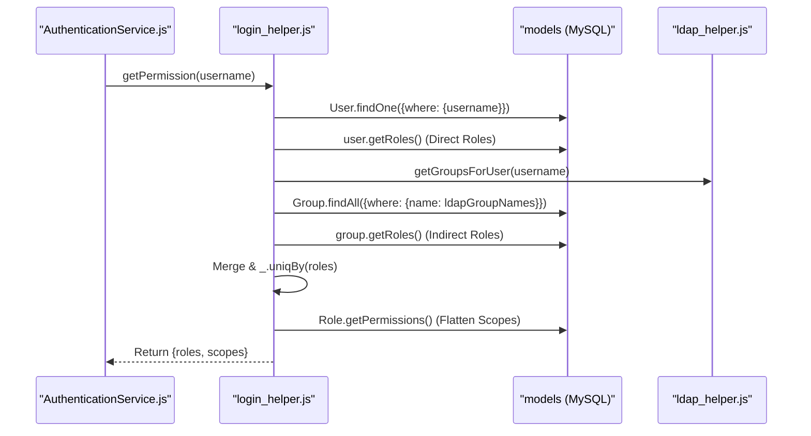

# Glossary

<details>
<summary>Relevant source files</summary>

The following files were used as context for generating this wiki page:

- [README.md](README.md)
- [auth_service/api/controllers/AuthenticationService.js](auth_service/api/controllers/AuthenticationService.js)
- [auth_service/api/helpers/authenticate.js](auth_service/api/helpers/authenticate.js)
- [auth_service/api/helpers/jwt_helper.js](auth_service/api/helpers/jwt_helper.js)
- [auth_service/api/helpers/ldap_helper.js](auth_service/api/helpers/ldap_helper.js)
- [auth_service/api/helpers/login_helper.js](auth_service/api/helpers/login_helper.js)
- [auth_service/api/swagger/swagger.yaml](auth_service/api/swagger/swagger.yaml)
- [auth_service/env_config.js](auth_service/env_config.js)
- [auth_service/redis.js](auth_service/redis.js)
- [auth_service/server/models/index.js](auth_service/server/models/index.js)

</details>


This page provides definitions for codebase-specific terms, domain concepts, and technical abbreviations used within the Ingenium Auth Service.

## Core Concepts

### Authentication & Authorization
| Term | Definition |
|:---|:---|
| **LDAP Bind** | The process of authenticating a user against the JPL directory service using `uid` and password. Implemented in `ldap_authenticate` [auth_service/api/helpers/authenticate.js:13-53]() and supported by `ldap_helper.js` [auth_service/api/helpers/ldap_helper.js:15-25](). |
| **RSA SecurID (TFA)** | Two-factor authentication path using the `jpltfa-primary` service. It involves an `initialize` call followed by a `verify` call with a passcode [auth_service/api/helpers/authenticate.js:55-111](). |
| **JWT (JSON Web Token)** | A signed token used for session persistence. The service uses the `RS256` algorithm (asymmetric) with a Public/Private key pair defined in `env_config.js` [auth_service/api/helpers/jwt_helper.js:30-33](), [auth_service/env_config.js:32-33](). |
| **JTI (JWT ID)** | A unique identifier for a specific JWT, generated using `uuid.v4()`. It is used as the key in Redis for blacklisting [auth_service/api/helpers/jwt_helper.js:55-56](). |
| **OIT (Original Issued Time)** | A custom claim in the JWT payload used to track the very first time a session started, allowing the system to enforce a `long_expire` (max session duration, default 12 hours) regardless of token refreshes [auth_service/api/helpers/jwt_helper.js:28-28](), [auth_service/env_config.js:12-12](). |
| **Blacklist** | A mechanism to invalidate tokens before their natural expiry (e.g., on logout). JTIs are stored in Redis with an expiration matching `ACCESS_TOKEN_TIMEOUT` [auth_service/api/controllers/AuthenticationService.js:49-55](). |

### RBAC (Role-Based Access Control)
| Term | Definition |
|:---|:---|
| **Permission / Scope** | The smallest unit of access control (e.g., `admin`, `author`). These are mapped to specific API endpoints in `swagger.yaml` [auth_service/api/swagger/swagger.yaml:26-35](). |
| **Role** | A collection of permissions. Roles can be assigned directly to `Users` or to `Groups` [README.md:9-15](). |
| **Group** | An entity representing an LDAP group (`jplgroup`). If a user belongs to an LDAP group that is registered in the Auth Service, they inherit the roles associated with that group [auth_service/api/helpers/login_helper.js:41-51](), [auth_service/api/helpers/ldap_helper.js:180-182](). |
| **Venue Group ID** | A filter used to scope roles and permissions to specific mission venues or environments, stored in the `Role` model [auth_service/api/helpers/login_helper.js:85-87](). |

**Sources:** [auth_service/api/helpers/authenticate.js:13-111](), [auth_service/api/helpers/jwt_helper.js:21-59](), [auth_service/api/helpers/login_helper.js:13-101](), [auth_service/env_config.js:1-39]().

---

## System Architecture Entities

The following diagram maps high-level system components to their specific implementation files and classes.

### Component to Code Mapping
```mermaid
graph TD
    subgraph "Request Pipeline"
        [Express_App] -- "app.js" --> [Swagger_Router]
        [Swagger_Router] -- "swagger.yaml" --> [Auth_Controller]
    end

    subgraph "Logic Layer"
        [Auth_Controller] -- "AuthenticationService.js" --> [JWT_Helper]
        [Auth_Controller] -- "AuthenticationService.js" --> [Login_Helper]
        [Login_Helper] -- "login_helper.js" --> [LDAP_Helper]
        [Login_Helper] -- "login_helper.js" --> [Authenticate_Module]
    end

    subgraph "Persistence Layer"
        [JWT_Helper] -- "jwt_helper.js" --> [Redis_Client]
        [Login_Helper] -- "login_helper.js" --> [Sequelize_Models]
        [Sequelize_Models] -- "models/index.js" --> [MySQL_DB]
    end

    [Redis_Client] --- [redis.js]
    [Authenticate_Module] --- [authenticate.js]
    [LDAP_Helper] --- [ldap_helper.js]
```
**Sources:** [auth_service/api/swagger/swagger.yaml:45-47](), [auth_service/api/controllers/AuthenticationService.js:1-10](), [auth_service/api/helpers/jwt_helper.js:1-12](), [auth_service/api/helpers/login_helper.js:1-10](), [auth_service/redis.js:1-6](), [auth_service/server/models/index.js:1-20]().

---

## Data Flow: Permission Aggregation

When a user logs in via `AuthenticationService.login`, the system aggregates permissions from multiple sources. This process is primarily handled by `getPermission` in `login_helper.js` [auth_service/api/helpers/login_helper.js:13-101]().

### Permission Resolution Flow

**Sources:** [auth_service/api/helpers/login_helper.js:13-101](), [auth_service/api/controllers/AuthenticationService.js:11-30](), [auth_service/api/helpers/ldap_helper.js:165-171]().

---

## Technical Abbreviations

*   **ACE**: Access Control Entry (implied by RBAC structure).
*   **IAT**: Issued At (standard JWT claim representing token creation time) [auth_service/api/helpers/jwt_helper.js:27-27]().
*   **JIT Provisioning**: "Just-In-Time" user creation. The service calls `ensure_user` to create a local `User` record in MySQL the first time a user successfully authenticates via LDAP [auth_service/api/helpers/login_helper.js:103-124](), [auth_service/api/controllers/AuthenticationService.js:26-26]().
*   **ORM**: Object-Relational Mapping, implemented via `Sequelize` [auth_service/server/models/index.js:5-24]().
*   **TTL**: Time To Live, used for Redis key expiration during token blacklisting via `redisClient.expire` [auth_service/api/controllers/AuthenticationService.js:55-55]().
*   **Umzug**: The framework used for handling database migrations and seeding [auth_service/server/models/index.js:8-9]().

---

## Code Pointer Reference

| File Path | Purpose |
|:---|:---|
| `auth_service/env_config.js` | Centralized configuration and environment variable defaults (DB, LDAP, RSA, JWT) [auth_service/env_config.js:1-39](). |
| `auth_service/node_funcs.js` | Custom Winston logger with levels (CRITICAL to TRACE) and shared utility functions [auth_service/node_funcs.js:1-98](). |
| `auth_service/server/models/index.js` | Entry point for Sequelize models, handles DB creation and migration triggers via `init_db` [auth_service/server/models/index.js:1-98](). |
| `auth_service/api/helpers/jwt_helper.js` | Core logic for encoding, decoding, blacklisting, and `updateLoggedInStatus` [auth_service/api/helpers/jwt_helper.js:1-159](). |
| `auth_service/api/helpers/authenticate.js` | Implementation of `ldap_authenticate` and `rsa_authenticate` [auth_service/api/helpers/authenticate.js:1-111](). |
| `auth_service/redis.js` | Initialization of the Redis client for the `auth_service_redis` container [auth_service/redis.js:1-17](). |

**Sources:** [auth_service/env_config.js:1-39](), [auth_service/node_funcs.js:1-98](), [auth_service/api/helpers/jwt_helper.js:1-159](), [auth_service/server/models/index.js:1-98](), [auth_service/redis.js:1-17]().
