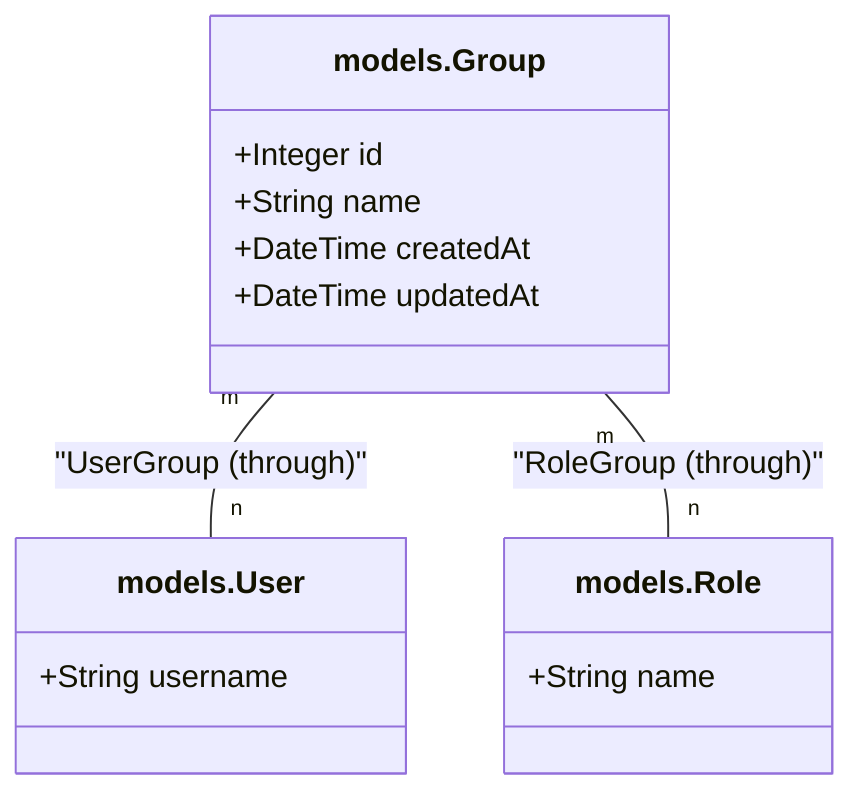
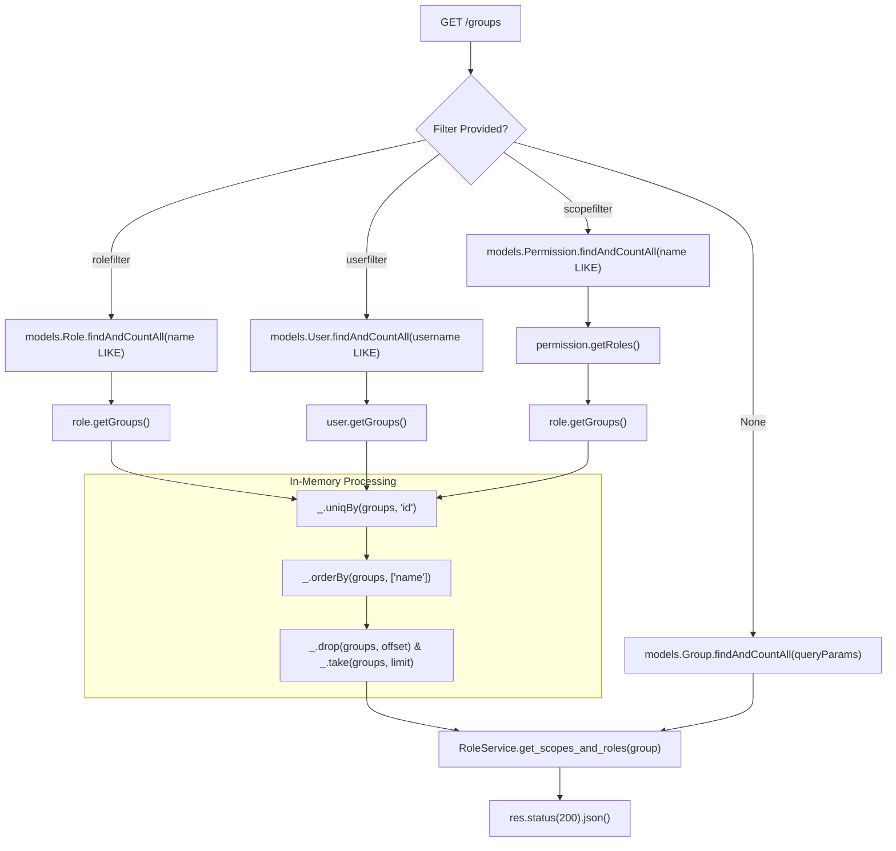

# Group Service

Relevant source files

The following files were used as context for generating this wiki page:

- [auth_service/api/controllers/GroupService.js](auth_service/api/controllers/GroupService.js)
- [auth_service/api/controllers/group.js](auth_service/api/controllers/group.js)

The Group Service manages the lifecycle and associations of LDAP groups within the Ingenium Auth Service. It provides functionality for listing groups with complex filtering, retrieving individual group details, and managing group deletions. It acts as a bridge between the physical LDAP groups and the internal Role-Based Access Control (RBAC) system.

## Overview and Controller Mapping

The Group Service is implemented across two primary files: `group.js`, which serves as the Swagger-node entry point, and `GroupService.js`, which contains the business logic and database interactions using Sequelize models.

| Swagger Operation | Controller Function | Service Implementation |
|:---|:---|:---|
| `GET /groups` | `get_all_groups` [auth_service/api/controllers/group.js:7-9]() | `get_all_groups` [auth_service/api/controllers/GroupService.js:10-210]() |
| `GET /groups/{group_id}` | `get_group` [auth_service/api/controllers/group.js:11-13]() | `get_group` [auth_service/api/controllers/GroupService.js:212-228]() |
| `POST /groups` | `create_group` [auth_service/api/controllers/group.js:19-21]() | `create_group` [auth_service/api/controllers/GroupService.js:19-21]() |
| `DELETE /groups/{id}` | `delete_group` [auth_service/api/controllers/group.js:15-17]() | `delete_group` [auth_service/api/controllers/GroupService.js:230-244]() |

**Sources:** [auth_service/api/controllers/group.js:1-22](), [auth_service/api/controllers/GroupService.js:1-244]()

## Group Model and Associations

The `Group` model represents a collection of users often synchronized from LDAP. It maintains many-to-many relationships with both `User` and `Role` entities.

### Data Model Entity Map
The following diagram maps the logical Group entity to the Sequelize code definitions.

"Group Model Associations"

The model defines specific aliases for associations to facilitate Sequelize's eager loading and helper methods (e.g., `group.getRoles()`):
*   **Roles**: `belongsToMany` through `models.RoleGroup`.
*   **Users**: `belongsToMany` through `models.UserGroup`.

**Sources:** [auth_service/api/controllers/GroupService.js:3-4](), [auth_service/api/controllers/GroupService.js:52-54]()

## Advanced Filtering and Manual Pagination

The `get_all_groups` function implements a "manual" pagination and deduplication pattern when filters are applied. Unlike standard database queries, filters for `rolefilter`, `userfilter`, or `scopefilter` require traversing associations, which can lead to duplicate results and incorrect counts if handled purely via SQL joins.

### Multi-Step Association Traversal
When a filter is applied, the service performs a multi-step retrieval:
1.  **Find Target Entity**: Locate the User, Role, or Permission matching the filter string using a `$like` query [auth_service/api/controllers/GroupService.js:46-50]().
2.  **Traverse Associations**: Use Sequelize getters (e.g., `role.getGroups()`) to find related groups [auth_service/api/controllers/GroupService.js:52-54]().
3.  **In-Memory Deduplication**: Use `_.uniqBy(groups, 'id')` to ensure each group appears once [auth_service/api/controllers/GroupService.js:57]().
4.  **Manual Pagination**: Apply `_.orderBy`, `_.drop` (offset), and `_.take` (limit) on the resulting JavaScript array [auth_service/api/controllers/GroupService.js:62-76]().

### Filter Logic Flow
"Group List Filtering Logic"

**Sources:** [auth_service/api/controllers/GroupService.js:41-85]() (Role Filter), [auth_service/api/controllers/GroupService.js:87-130]() (User Filter), [auth_service/api/controllers/GroupService.js:132-186]() (Scope Filter).

## Permission Enrichment

For every group returned (whether in a list or single retrieval), the service calls `RoleService.get_scopes_and_roles(group)` [auth_service/api/controllers/GroupService.js:79](). 

This helper function performs the following:
1.  Retrieves all `Roles` associated with the group.
2.  Retrieves all `Permissions` associated with those roles.
3.  Flattens and returns the group object enriched with a `roles` array and a `scopes` (permissions) array.

**Sources:** [auth_service/api/controllers/GroupService.js:216-218](), [auth_service/api/controllers/GroupService.js:180-181](), [auth_service/api/controllers/GroupService.js:7]()

## Error Handling and Logging

The service utilizes a consistent logging pattern via `node_funcs.js`:
*   **Trace**: Used for tracking which filter branch was taken [auth_service/api/controllers/GroupService.js:43](), [auth_service/api/controllers/GroupService.js:89](), [auth_service/api/controllers/GroupService.js:134]().
*   **Warning**: Used when a resource is not found (404) [auth_service/api/controllers/GroupService.js:198]().
*   **Error/Critical**: Used for database failures or unexpected exceptions [auth_service/api/controllers/GroupService.js:206](), [auth_service/api/controllers/GroupService.js:221](), [auth_service/api/controllers/GroupService.js:239]().

**Sources:** [auth_service/api/controllers/GroupService.js:6-8](), [auth_service/api/controllers/GroupService.js:204-208]()
