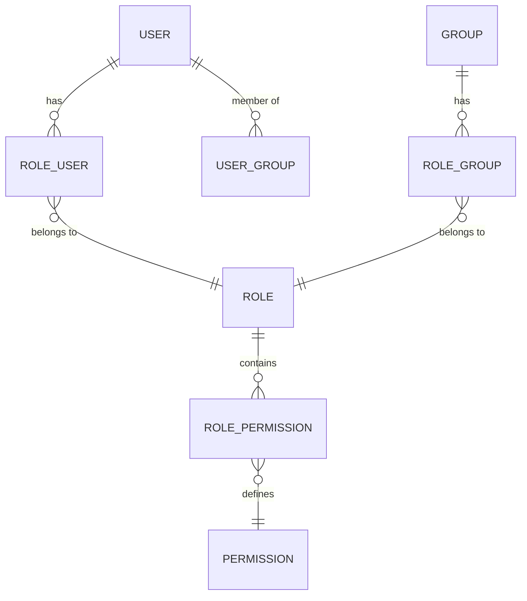

# Ingenium Auth Service — Overview

<details>
<summary>Relevant source files</summary>

The following files were used as context for generating this wiki page:

- [.gitignore](.gitignore)
- [LICENSE](LICENSE)
- [README.md](README.md)
- [auth_service/README.md](auth_service/README.md)

</details>


The Ingenium Auth Service (IAS) is a centralized authentication and authorization component for the Ingenium platform. It provides a RESTful API built on Node.js and Swagger to manage user sessions via JSON Web Tokens (JWT), verify identities against LDAP or RSA SecurID, and enforce Role-Based Access Control (RBAC) [README.md:1-5]().

The service acts as a gatekeeper, issuing signed tokens to clients upon successful authentication and maintaining a blacklist of revoked tokens in Redis to ensure platform security [README.md:3-4]().

### System Role and Data Flow

The IAS sits between client applications and identity providers (LDAP/RSA). It persists platform-specific RBAC data (Roles, Permissions, and Groups) in a MySQL database while delegating primary credential verification to external enterprise systems [README.md:3-5]().

#### Conceptual Logic to Code Entity Map

The following diagram maps high-level authentication concepts to the specific code entities that implement them.

**Authentication Entity Mapping**
```mermaid
graph TD
    subgraph "ExternalProviders"
        ["LDAP Server"]
        ["RSA SecurID (jpltfa-primary)"]
    end

    subgraph "AuthServiceLogic"
        ["basicAuth Handler (app.js)"]
        ["ldap_authenticate (authenticate.js)"]
        ["rsa_authenticate (authenticate.js)"]
        ["jwt_helper.js"]
    end

    subgraph "Persistence"
        MySQL[("MySQL (Users/Roles)")]
        Redis[("Redis (Blacklist)")]
    end

    ["basicAuth Handler (app.js)"] --> ["ldap_authenticate (authenticate.js)"]
    ["basicAuth Handler (app.js)"] --> ["rsa_authenticate (authenticate.js)"]
    ["ldap_authenticate (authenticate.js)"] -.-> ["LDAP Server"]
    ["rsa_authenticate (authenticate.js)"] -.-> ["RSA SecurID (jpltfa-primary)"]
    ["basicAuth Handler (app.js)"] --> ["jwt_helper.js"]
    ["jwt_helper.js"] --> Redis
    ["jwt_helper.js"] --> MySQL
```
Sources: [auth_service/app.js:127-179](), [auth_service/api/helpers/authenticate.js:1-20](), [auth_service/api/helpers/jwt_helper.js:1-15]()

### Key Technologies

The service leverages a modern Node.js stack designed for high availability and security:

| Component | Technology | Role |
| :--- | :--- | :--- |
| **Runtime** | Node.js | Core application execution environment. |
| **API Framework** | Swagger / Express | Defines the API contract and handles routing [auth_service/app.js:3-4](). |
| **Database** | MySQL (Sequelize ORM) | Stores RBAC entities: Users, Roles, Permissions, and Groups [README.md:11-15](). |
| **Session Cache** | Redis | Stores blacklisted JWT identifiers (`jti`) for immediate revocation [README.md:3-4](). |
| **Identity** | LDAP / RSA | External sources for primary user authentication [auth_service/app.js:155-175](). |
| **Security** | JWT (RS256) | Asymmetric signing of session tokens using RSA private/public keys [auth_service/app.js:106](). |

### RBAC Model

The service implements a many-to-many relationship model to determine user access levels. Permissions are not assigned to users directly; instead, they are aggregated through Roles and Groups [README.md:7-15]().

**RBAC Schema Relationships**

Sources: [README.md:11-15](), [auth_service/server/models/index.js:1-20]()

### Child Pages

For detailed technical information, refer to the following sub-pages:

*   **[Getting Started — Local Development Setup](#1.1)**
    Step-by-step guide for running the service locally: prerequisites, environment variables (`.env`), Docker Compose stack, Makefile targets, generating JWT keys, and the test user account [README.md:17-40]().
*   **[System Requirements and Functional Specifications](#1.2)**
    Documents the formal IAS requirements (IAS-1 through IAS-9) that govern the service: LDAP authentication, JWT issuance, RBAC, token blacklisting, scope definitions, and logout behavior.

---
**Sources:**
- [README.md:1-15]()
- [README.md:17-40]()
- [auth_service/app.js:1-180]()
- [auth_service/env_config.js:1-50]()
- [auth_service/api/helpers/authenticate.js:1-20]()
- [auth_service/api/helpers/jwt_helper.js:1-15]()
- [auth_service/server/models/index.js:1-20]()
