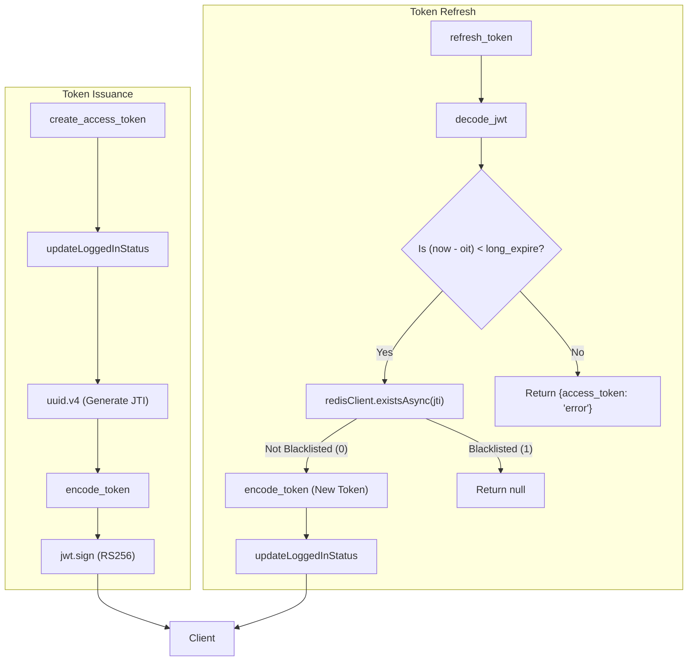

# JWT Helper — Token Encoding, Decoding, and Blacklisting

<details>
<summary>Relevant source files</summary>

The following files were used as context for generating this wiki page:

- [auth_service/api/helpers/jwt_helper.js](auth_service/api/helpers/jwt_helper.js)
- [auth_service/redis.js](auth_service/redis.js)

</details>


The `jwt_helper.js` module is the central component for managing the lifecycle of JSON Web Tokens (JWT) within the Ingenium Auth Service. It handles the generation of cryptographically signed tokens using the RS256 algorithm, facilitates token refresh logic, manages a Redis-based blacklist for invalidated tokens, and tracks user activity status in the database.

### Token Signing and Payload Structure

Tokens are signed using an RSA Private Key (`PRIVATE_PEM`) and verified using a corresponding Public Key (`PUBLIC_PEM`). This asymmetric signing ensures that while any service with the public key can verify a token, only the Auth Service can issue one.

#### The `encode_token` Function
The `encode_token` function constructs the JWT payload and signs it using `RS256` [auth_service/api/helpers/jwt_helper.js:21-36](). The payload contains the following claims:

| Claim | Name | Description |
| :--- | :--- | :--- |
| `username` | Subject | The unique identifier for the user [auth_service/api/helpers/jwt_helper.js:23](). |
| `scopes` | Scopes | A list of permissions granted to the user [auth_service/api/helpers/jwt_helper.js:24](). |
| `roles` | Roles | A list of roles assigned to the user [auth_service/api/helpers/jwt_helper.js:25](). |
| `jti` | JWT ID | A unique UUID v4 string used to identify the specific token instance, primarily for blacklisting [auth_service/api/helpers/jwt_helper.js:26](). |
| `iat` | Issued At | The time the token was issued, adjusted by `TEN_SEC_OFFSET` to account for clock skew [auth_service/api/helpers/jwt_helper.js:27](). |
| `oit` | Original Issued Time | A persistent timestamp representing when the initial login occurred, used to enforce the maximum refresh window (`long_expire`) [auth_service/api/helpers/jwt_helper.js:28](). |

#### Token Configuration
*   **Algorithm**: RS256 [auth_service/api/helpers/jwt_helper.js:31]().
*   **Timeout**: The `ACCESS_TOKEN_TIMEOUT` (sourced from `env_config.js`) defines the `expiresIn` property [auth_service/api/helpers/jwt_helper.js:32]().

**Sources:** [auth_service/api/helpers/jwt_helper.js:14-36](), [auth_service/env_config.js:1-20]()

### Token Lifecycle Flow

The following diagram illustrates how `jwt_helper.js` interacts with external components to issue and refresh tokens.

**JWT Issuance and Refresh Flow**

**Sources:** [auth_service/api/helpers/jwt_helper.js:52-92]()

### Token Refresh Logic

The `refresh_token` function allows a client to obtain a new access token without re-authenticating, provided the session has not exceeded the global maximum duration.

1.  **Decoding**: The existing token is decoded using `decode_jwt` [auth_service/api/helpers/jwt_helper.js:62]().
2.  **Expiration Check**: The function calculates the difference between current time and the Original Issued Time (`oit`). If this exceeds `env_config.long_expire` (typically 12 hours), the refresh is denied and returns an error object [auth_service/api/helpers/jwt_helper.js:72-89]().
3.  **Blacklist Check**: It checks if the `jti` of the current token exists in the Redis blacklist via `redisClient.existsAsync(jti)` [auth_service/api/helpers/jwt_helper.js:73]().
4.  **Re-encoding**: If valid, a new token is generated using the same `jti` and `oit` to maintain the session chain, but with a fresh `iat` and expiration [auth_service/api/helpers/jwt_helper.js:78]().

**Sources:** [auth_service/api/helpers/jwt_helper.js:61-92](), [auth_service/env_config.js:1-20]()

### Blacklisting and Security

The system uses Redis to track revoked tokens. This is primarily triggered during logout, where the `jti` is stored in Redis.

#### `is_token_blacklisted`
This function performs an asynchronous lookup in Redis using the token's `jti` [auth_service/api/helpers/jwt_helper.js:103-119]().
*   It uses `redisClient.getAsync(jti)` to check for the presence of the token ID [auth_service/api/helpers/jwt_helper.js:105]().
*   If a value is found for the `jti`, the token is considered invalid even if its cryptographic signature and expiration time are otherwise valid [auth_service/api/helpers/jwt_helper.js:108-109]().
*   This check is a critical part of the security handler middleware used in every authenticated request.

**Blacklisting Logic Space**
```mermaid
classDiagram
    class jwt_helper {
        +decode_jwt(token)
        +is_token_blacklisted(jti)
        +refresh_token(access_token)
        +get_jwt_from_header(req)
    }
    class redis_js {
        +redisClient
        +getAsync(key)
        +existsAsync(key)
    }
    class SecurityHandler {
        +ingenium_auth(req, authOrSecDef, scopesOrApiKey)
    }

    SecurityHandler --> jwt_helper : "Calls is_token_blacklisted"
    jwt_helper --> redis_js : "Checks JTI via existsAsync/getAsync"
    redis_js --> "auth_service_redis" : "Redis Port 6379"
```
**Sources:** [auth_service/api/helpers/jwt_helper.js:103-119](), [auth_service/redis.js:1-17]()

### User Activity Tracking: `updateLoggedInStatus`

The `updateLoggedInStatus` function synchronizes the user's "last seen" status with the MySQL database. It updates the `login_expire` column in the `Users` table [auth_service/api/helpers/jwt_helper.js:121-155]().

*   **Logic**: By default, it sets the `login_expire` timestamp to one hour in the future from the current time [auth_service/api/helpers/jwt_helper.js:135]().
*   **Edge Case**: If the current hour is 23, it wraps around to "00" [auth_service/api/helpers/jwt_helper.js:130-132]().
*   **Logout Override**: If the `logout` parameter is true, it sets the `login_expire` to the current time (not advancing the hour), effectively making the session expire sooner relative to an active user [auth_service/api/helpers/jwt_helper.js:128]().
*   **Persistence**: It uses the Sequelize `models.User.update` method to persist the change [auth_service/api/helpers/jwt_helper.js:147-153]().

**Sources:** [auth_service/api/helpers/jwt_helper.js:121-157](), [auth_service/server/models/index.js:1-20]()
