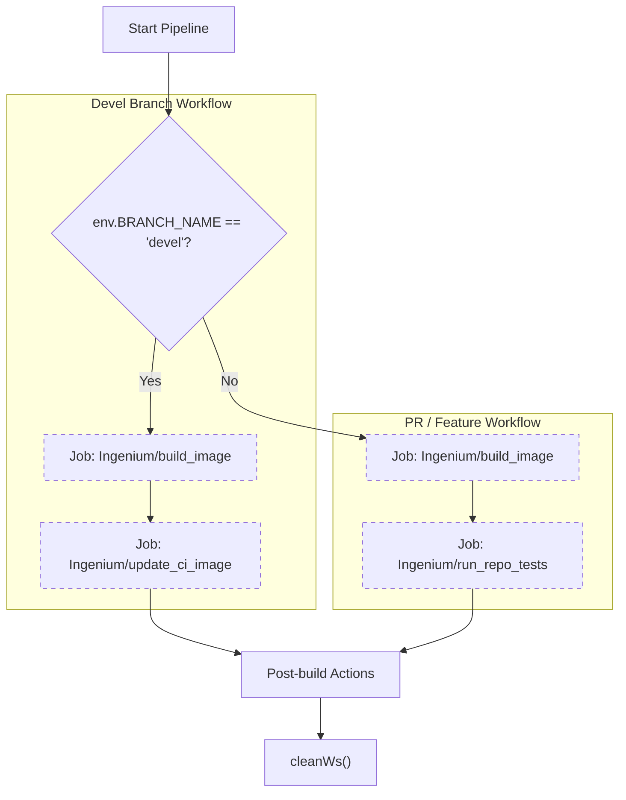
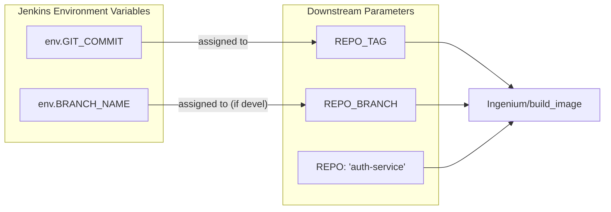

# Jenkins CI/CD Pipeline

Relevant source files

The following files were used as context for generating this wiki page:

- [Jenkinsfile](Jenkinsfile)

The Ingenium Auth Service utilizes a Jenkins-based CI/CD pipeline defined in a declarative `Jenkinsfile` [Jenkinsfile:1-94](). The pipeline is designed to handle two primary workflows: continuous integration for Pull Requests (PRs) and continuous deployment/image updates for the main development branch (`devel`).

## Pipeline Structure and Logic

The pipeline execution is encapsulated within a single stage named `Determine Branch and Execute Jobs` [Jenkinsfile:4-57](). It uses conditional logic to branch its behavior based on the `env.BRANCH_NAME` variable [Jenkinsfile:9]().

### Workflow Comparison

| Feature | `devel` Branch Workflow | PR / Other Branch Workflow |
| :--- | :--- | :--- |
| **Primary Goal** | Update stable images and CI environment. | Validate changes via builds and tests. |
| **Tagging Strategy** | Uses branch name (`devel`) [Jenkinsfile:18](). | Uses specific `GIT_COMMIT` hash [Jenkinsfile:40](). |
| **Downstream Jobs** | `build_image`, `update_ci_image` | `build_image`, `run_repo_tests` |

### Logic Flow Diagram

This diagram illustrates how the `Jenkinsfile` routes execution based on the branch context.

**Title: Jenkinsfile Branch Routing Logic**

**Sources:** [Jenkinsfile:1-94]()

---

## Downstream Jobs Implementation

The pipeline acts as an orchestrator, triggering specialized downstream jobs within the `Ingenium/` Jenkins folder using the `build job` syntax [Jenkinsfile:15,24,37,46]().

### 1. Build Image (`Ingenium/build_image`)
This job is responsible for creating the Docker container for the `auth-service`.
*   **For `devel`**: Triggered with `REPO_BRANCH` set to `devel` [Jenkinsfile:15-19]().
*   **For PRs**: Triggered with `REPO_TAG` set to the `commitHash` (extracted from `env.GIT_COMMIT` [Jenkinsfile:7]()) [Jenkinsfile:37-41](). This ensures that PR builds are immutable and tied to a specific code state.

### 2. Update CI Image (`Ingenium/update_ci_image`)
Only executed on the `devel` branch [Jenkinsfile:22-29](). This job promotes the newly built `devel` image to the shared Continuous Integration environment, ensuring other services in the Ingenium ecosystem are testing against the latest stable Auth Service code.

### 3. Run Repo Tests (`Ingenium/run_repo_tests`)
Only executed for PRs and non-devel branches [Jenkinsfile:44-53](). 
*   **Parameters**:
    *   `ONLY_REPO_TESTS`: Set to `true` to limit scope to the repository's internal tests [Jenkinsfile:49]().
    *   `REPO_TAG`: Uses the `commitHash` to pull the specific image built in the previous step [Jenkinsfile:50]().
    *   `CLUSTER_BRANCH`: Points to `devel` to provide the surrounding infrastructure context [Jenkinsfile:51]().

**Sources:** [Jenkinsfile:7-53]()

---

## Tagging and Data Flow

The pipeline maps Jenkins environment variables to specific parameters required by the downstream Ingenium build system.

**Title: Variable Mapping to Downstream Jobs**

**Sources:** [Jenkinsfile:7-53]()

---

## Post-Build Operations and Cleanup

The pipeline utilizes the `post` block to handle reporting and workspace maintenance regardless of the build outcome [Jenkinsfile:59-93]().

### Status Reporting
The pipeline prints specific console messages based on the branch and the final state:
*   **Success**: Reports completion for either `devel` or PR workflows [Jenkinsfile:60-68]().
*   **Failure**: Alerts if the build or update failed [Jenkinsfile:69-77]().
*   **Aborted**: Logs if the job was manually stopped [Jenkinsfile:78-86]().

### Workspace Cleanup
A `cleanup` block is defined to run after every execution [Jenkinsfile:87-92]().
*   **Function**: `cleanWs()` [Jenkinsfile:90]().
*   **Purpose**: Deletes the local Jenkins workspace on the agent to prevent disk space exhaustion and ensure subsequent builds start from a pristine state without artifacts from previous runs.

**Sources:** [Jenkinsfile:59-92]()
